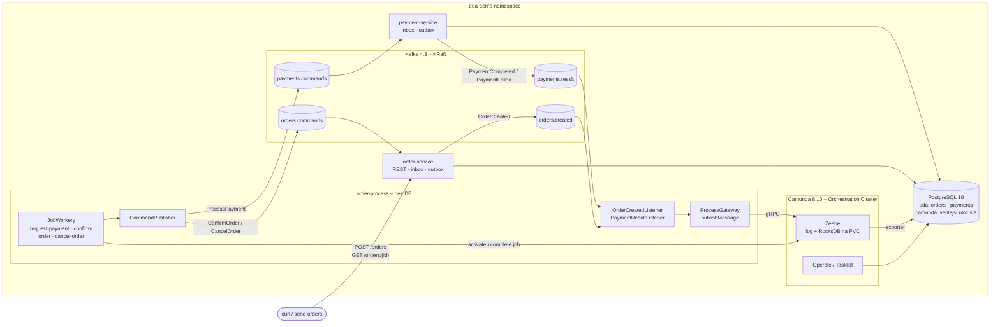

### Task 9: README

**Files:**
- Modify: `README.md`

- [ ] **Step 1: Aktualizovat README**

Změny (styl a jazyk jako stávající README – česky, tabulky, mermaid):

1. **Úvod**: „Cvičný projekt: dvě doménové Spring Boot mikroslužby a orchestrátor `order-process`, který tok objednávky řídí BPMN procesem v **Camundě 8**. Veškerá komunikace služeb jde přes Kafku…“
2. **Architektura** – mermaid diagram nahradit (ponechat inbox/outbox detail doménových služeb, přidat `order-process` a `Camunda`):

3. **Tok objednávky** – přepsat na orchestraci (kroky 1–5): `POST /orders` → outbox → `orders.created` → `OrderCreatedListener` publikuje zprávu `OrderCreated` (message start event, `messageId = eventId`) → service task `Request payment` → worker pošle `ProcessPayment` do `payments.commands` → payment-service (inbox, simulace, poison 666 → DLT `payments.commands.DLT`, outbox) → `payments.result` → `PaymentResultListener` koreluje zprávu `PaymentResult` (`correlationKey = orderId`) → gateway → `Confirm order` / `Cancel order` → `orders.commands` → order-service nastaví `PAID` / `PAYMENT_FAILED`.
4. **Nová sekce „Proces v Camundě“**:
   - obrázek tokenu: tabulka elementů BPMN (ID, typ, co dělá) podle Task 7,
   - „Zeebe nikoho nevolá“ – workery si joby vyzvedávají (pull/streaming), listenery zprávy publikují,
   - **Idempotence**: tabulka ze specu (sekce Spolehlivost a idempotence),
   - **Úložiště stavu**: primární (log + RocksDB na PVC, zdroj pravdy) vs. vedlejší (PostgreSQL DB `camunda`, plní exportér, eventual consistency),
   - **Operate**: `scripts/port-forward.*` → `http://localhost:8088/operate`, přihlášení `demo/demo`; kde vidět tokeny, proměnné, incidenty,
   - **Modelování**: BPMN je v `order-process/src/main/resources/bpmn/order-fulfillment.bpmn`, otevřít v Camunda Desktop Modeleru; služba ho nasazuje sama (`@Deployment`),
   - **Známé chování dema**: poison částka 666 → instance zůstane čekat na `Payment result` (proces nemá timeout – ukázka, proč by se hodil timer boundary event).
5. **Tabulka „Kontrakt zpráv“** – nahradit příklady JSON podle specu (sekce Kafka kontrakt), tabulka topiců (producent → konzument).
6. **Tabulka „Co projekt demonstruje“** – přidat řádky: „Orchestrace BPMN procesem“ → `order-process/…/bpmn/order-fulfillment.bpmn`; „Most Zeebe ↔ Kafka“ → `ProcessGateway`, `*Listener`, `worker/*`, `CommandPublisher`; „Idempotentní příkazy z jobů“ → `CommandPublisher.commandId`; „Deduplikace zpráv v Zeebe“ → `ProcessGateway` (`messageId`, `ALREADY_EXISTS`); upravit řádek „Consumer groups“ na `order-service`, `payment-service`, `payment-service-dlt`, `order-process`.
7. **Databáze** – tabulka doplnit řádek `camunda` (databáze, uživatel `camunda`, tabulky spravuje Camunda) a poznámku o nutném teardownu při upgradu existujícího prostředí.
8. **Verze** – přidat řádek `Camunda | 8.10.2 (image camunda/camunda:8.10.2, camunda-spring-boot-starter, camunda-process-test-spring)`.
9. **Předpoklady** – navýšit požadavek na RAM o ~1,5 GiB (Camunda) a uvést port-forward porty 8082 (order-process) a 8088 (Operate).
10. Odstranit/přepsat zmínky o choreografii (`payment-service` konzumuje `orders.created`, order-service konzumuje `payments.result`, `orders.created.DLT` v payment-service).

Run: `grep -n "orders.created.DLT\|PaymentResultListener\|OrderCreatedListener" README.md`
Expected: zmínky jen v kontextu order-process (`OrderCreatedListener`, `PaymentResultListener` v order-process; `orders.created.DLT` jako DLT order-process).

- [ ] **Step 2: Závěrečná kontrola**

Run (z kořene): `mvn -q test`
Expected: PASS ve všech modulech.
