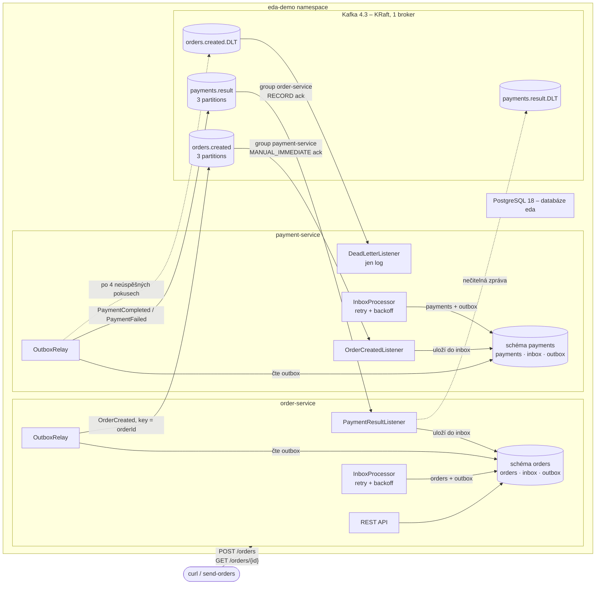

# Event-driven demo: Spring Boot + Kafka + PostgreSQL na lokálním Kubernetes

Cvičný projekt: dvě Spring Boot mikroslužby komunikují výhradně přes Kafku (události v JSON).
Každá služba má vlastní schéma v PostgreSQL a spolehlivé doručování řeší vzory **transactional
outbox** a **transactional inbox**. Základní deploy obsahuje jen služby, Kafku a DB; observabilita
(Prometheus/Grafana, Elasticsearch/Kibana/Fluent Bit) se přidává volitelně.

## Architektura



### Tok objednávky

1. `POST /orders` v **jedné DB transakci** uloží objednávku (`PENDING_PAYMENT`) a řádek do
   `orders.outbox`. `OutboxRelay` ho do 0.5 s pošle jako `OrderCreated` do `orders.created`.
2. payment-service zprávu **jen uloží do `payments.inbox`** a potvrdí offset. `InboxProcessor` ji
   v transakci zpracuje – simulace platby, zápis do `payments.payments` a výsledku do `payments.outbox`:
   - s pravděpodobností `PAYMENT_FAILURE_RATE` (výchozí 0.2) platbu **zamítne** → `PaymentFailed`
     (business výsledek, žádný retry),
   - jinak → `PaymentCompleted`,
   - částka `PAYMENT_POISON_AMOUNT` (výchozí **666**) vyvolá **technickou chybu** → inbox retry
     s backoffem 0.5 s → 1 s → 2 s, po 4. pokusu stav `FAILED` a zpráva do `orders.created.DLT`.
3. order-service uloží výsledek do `orders.inbox`, `InboxProcessor` nastaví `PAID` / `PAYMENT_FAILED`.

### Proč inbox + outbox

| Problém | Řešení |
|---|---|
| Uložení do DB a odeslání do Kafky nejde udělat atomicky („dual write“) | **Outbox**: zpráva se zapíše do tabulky ve stejné transakci jako doménová změna; `OutboxRelay` ji odešle a označí `published_at`. Při pádu se pošle znovu (at-least-once). |
| Kafka doručuje „at least once“ – stejná zpráva může přijít vícekrát | **Inbox**: PK `event_id` – duplicita se pozná při `INSERT … ON CONFLICT DO NOTHING`. |
| Dlouhé/opakované zpracování blokuje partition a hrozí rebalance | Listener jen uloží zprávu do inboxu a hned potvrdí offset; zpracování s retry běží mimo poll loop. |
| Retry s backoffem musí přežít restart podu | Stav retry (`attempts`, `next_attempt_at`, `last_error`) je v DB. |
| Při chybě se nesmí zapsat „půlka“ změn | `InboxProcessor` spouští handler v savepointu (`PROPAGATION_NESTED`) – při chybě se vrátí jen jeho změny a ve stejné transakci se zapíše plán dalšího pokusu nebo DLT. |

Relay i processor zamykají řádky přes `SELECT … FOR UPDATE SKIP LOCKED`, takže služby lze škálovat
na víc replik bez dvojího zpracování.

**Úklid:** `cleanup/RetentionCleanup` (v každé službě nad jejím schématem) jednou denně smaže
dokončené zprávy z inboxu (`PROCESSED`, `FAILED`) a publikované zprávy z outboxu starší než
`EDA_CLEANUP_RETENTION_DAYS` (výchozí 7). Čekající a nepublikované zprávy nemaže nikdy. Maže po
dávkách, metrika `eda_cleanup_deleted_total{table}`. Po smazání už inbox nerozpozná duplicitu takto
staré zprávy – retence musí být delší než nejdelší možné opakované doručení.

### Databáze

Jedna instance PostgreSQL (`StatefulSet`, PVC 1 Gi), databáze `eda`. Každá služba má **vlastní schéma
a vlastního DB uživatele** bez přístupu k cizímu schématu – nic se nesdílí kromě serveru:

| Schéma | Uživatel | Tabulky | Migrace |
|---|---|---|---|
| `orders` | `order_service` | `orders`, `inbox`, `outbox` | `order-service/src/main/resources/db/migration` (Flyway) |
| `payments` | `payment_service` | `payments`, `inbox`, `outbox` | `payment-service/src/main/resources/db/migration` (Flyway) |

Uživatele a schémata zakládá init skript v `k8s/base/postgres/postgres.yaml`; hesla jsou ve třech
oddělených Secretech (admin, order-service, payment-service) – každá služba vidí jen svoje.

### Kontrakt zpráv

Služby záměrně **nesdílí žádný kód** (žádný `common` modul) – každá má vlastní kopii tříd událostí
i infrastruktury inbox/outbox. Kontraktem je pouze JSON formát zpráv:

```json
// orders.created  (key = orderId)
{"eventId":"5b7c…","timestamp":"2026-10-07T08:31:31.70Z","correlationId":"demo-1","orderId":"9543…",
 "customerId":"c1","amount":10.5,"currency":"CZK"}

// payments.result (key = orderId) – podtyp určuje pole "type"
{"type":"PaymentCompleted","eventId":"…","timestamp":"…","correlationId":"demo-1","orderId":"9543…",
 "paymentId":"…","amount":10.5}
{"type":"PaymentFailed","eventId":"…","timestamp":"…","correlationId":"demo-1","orderId":"9543…",
 "reason":"Payment declined by simulated gateway"}
```

Spring type hlavičky (`__TypeId__`) jsou vypnuté, takže konzument nezávisí na Java třídách producenta.
CorrelationId se přenáší v těle i v Kafka hlavičce `X-Correlation-Id`.

### Co projekt demonstruje (a kde to najít)

| Téma | Kde |
|---|---|
| Explicitní topicy s partitions | `config/KafkaConfig#edaTopics` (`KafkaAdmin.NewTopics`), na brokeru `auto.create.topics.enable=false` |
| Klíč = orderId (pořadí v rámci objednávky) | `OutboxPublisher` (klíč) → `OutboxRelay` |
| Consumer groups | `order-service`, `payment-service`, `payment-service-dlt` |
| Potvrzování | order-service `AckMode.RECORD`, payment-service `MANUAL_IMMEDIATE` (`Acknowledgment`) |
| Transactional outbox | `outbox/OutboxPublisher`, `outbox/OutboxRelay`, tabulka `outbox` |
| Transactional inbox + idempotence | `inbox/InboxRepository`, `inbox/InboxProcessor`, tabulka `inbox` |
| Retry s exponenciálním backoffem + DLT | `InboxProcessor` (`eda.inbox.*`); pro nečitelné zprávy a výpadek DB `KafkaConfig#kafkaErrorHandler` (`DefaultErrorHandler` + `DeadLetterPublishingRecoverer`, `eda.kafka.retry.*`) |
| CorrelationId v MDC | `CorrelationIdFilter` (HTTP), `CorrelationIdRecordInterceptor` (Kafka), inbox/outbox ho ukládají |
| Strukturované JSON logy | `logging.structured.format.console=ecs` (vestavěné ve Spring Boot) |

## Verze

Ověřené jako aktuální stabilní k 2026-10-07:

| Komponenta | Verze |
|---|---|
| Java | 21 (image `eclipse-temurin:21-jre-noble`) |
| Spring Boot | 4.1.1 (Spring Kafka 4.1.1, Kafka klient 4.2.1, Flyway 12.4, PostgreSQL JDBC 42.7.13) |
| Apache Kafka | `apache/kafka:4.3.1` (KRaft) |
| PostgreSQL | `postgres:18.6-alpine` |
| Testcontainers | 2.0.5 |
| Elasticsearch / Kibana | 9.5.5 (volitelné) |
| Prometheus | v3.15.0 (volitelné) |
| Grafana | 13.2.3 (volitelné) |
| Fluent Bit | 5.1.3 (volitelné) |

## Předpoklady

- Docker Desktop (Windows/macOS)
- `kubectl`
- minikube s driverem docker – **nebo** Kubernetes zapnutý v Docker Desktopu (viz níže)
- Pro build a testy mimo Docker: JDK 21 a Maven 3.9+ (testy potřebují běžící Docker – Testcontainers)

## Spuštění krok za krokem

### 1. Cluster

**minikube** (doporučeno 4 CPU / 8 GB):

```bash
minikube start --driver=docker --cpus=4 --memory=8192
kubectl config use-context minikube
```

**Alternativa – Docker Desktop Kubernetes:** Settings → Kubernetes → Enable, pak
`kubectl config use-context docker-desktop`. Skripty to poznají a image do minikube nenahrávají
(Docker Desktop vidí lokální image přímo).

### 2. Build a testy (volitelné, image se buildí i bez toho)

```bash
mvn verify          # unit testy, repository testy proti PostgreSQL a integrační testy s Kafkou (Testcontainers)
```

### 3. Image

```bash
./scripts/build-images.sh          # bash / macOS / Git Bash
.\scripts\build-images.ps1         # PowerShell
```

Multi-stage Dockerfile (Maven build → `jarmode=tools extract --layers` → JRE runtime, non-root).
Image jsou otagované `:dev` a nahrané přes `minikube image load` (žádná registry).

### 4. Deploy

| Profil | Obsah | Příkaz |
|---|---|---|
| `base` (výchozí) | Kafka, PostgreSQL, order-service, payment-service | `./scripts/deploy.sh` · `.\scripts\deploy.ps1` |
| `monitoring` | base + Prometheus, Grafana | `./scripts/deploy.sh monitoring` · `.\scripts\deploy.ps1 -Stack monitoring` |
| `logging` | base + Elasticsearch, Kibana, Fluent Bit | `./scripts/deploy.sh logging` · `.\scripts\deploy.ps1 -Stack logging` |
| `full` | vše | `./scripts/deploy.sh full` · `.\scripts\deploy.ps1 -Stack full` |

Profily jsou Kustomize overlaye (`k8s/overlays/*`) skládající `k8s/base` a komponenty
`k8s/components/{monitoring,logging}` – observabilitu lze kdykoli přidat dalším `deploy` s jiným
profilem. Skript čeká na rollout všech workloadů.

Paměť: base potřebuje ~1 GB (Kafka ~0.4 GB, PostgreSQL ~50 MB, každá služba ~0.25 GB);
`full` navíc ~2 GB (ES ~1 GB, Kibana ~0.8 GB, Grafana ~0.4 GB).

> **Windows/WSL2:** Docker Desktop VM (`vmmemWSL`) si drží page cache z buildů a stahování image
> a paměť Windows nevrací – proces může ukazovat i 12+ GB, i když kontejnery berou ~3 GB.
> Jednorázové uvolnění: `wsl -d docker-desktop sh -c "echo 3 > /proc/sys/vm/drop_caches"`;
> trvale `memory=10GB` a `[experimental] autoMemoryReclaim=dropcache` v `%UserProfile%\.wslconfig`
> (pak `wsl --shutdown` a restart Docker Desktopu).
> **Nepoužívej `autoMemoryReclaim=gradual`** – přepne cgroup v2 bez delegovaného controlleru `cpuset`
> a kubelet Docker Desktop Kubernetes pak nenastartuje (`cgroup ["kubepods"] has some missing controllers: cpuset`).

### 5. Port-forwardy

```bash
./scripts/port-forward.sh          # nebo .\scripts\port-forward.ps1, Ctrl+C ukončí
```

Skript přesměruje jen služby, které jsou nasazené:

| Služba | URL | Profil |
|---|---|---|
| order-service | http://localhost:8080/orders | base |
| payment-service | http://localhost:8081/actuator/health | base |
| PostgreSQL | `jdbc:postgresql://localhost:5432/eda` (např. `order_service` / `order-service-demo`) | base |
| Grafana | http://localhost:3000 – `admin` / `admin`, dashboard **EDA demo – overview** | monitoring |
| Prometheus | http://localhost:9090 | monitoring |
| Kibana | http://localhost:5601 – Discover → data view **EDA logs** | logging |
| Elasticsearch | http://localhost:9200 | logging |

### 6. Posílání objednávek

```bash
./scripts/send-orders.sh 20              # 20 objednávek s náhodnou částkou
.\scripts\send-orders.ps1 -Count 20

curl -s localhost:8080/orders/<id>       # stav: PENDING_PAYMENT → PAID / PAYMENT_FAILED
```

Ručně:

```bash
curl -i -X POST localhost:8080/orders -H 'Content-Type: application/json' \
  -H 'X-Correlation-Id: my-test-1' -d '{"customerId":"c1","amount":99.90,"currency":"CZK"}'
```

## Demo: selhání → retry → DLT

1. **Vyvolej technickou chybu** – pošli objednávku s poison částkou:
   ```bash
   ./scripts/send-orders.sh 1 666             # nebo .\scripts\send-orders.ps1 -Count 1 -Amount 666
   ```
   Objednávka zůstane `PENDING_PAYMENT` (výsledek platby nikdy nevznikne).
2. **Retry a DLT v logu payment-service:**
   ```bash
   kubectl -n eda-demo logs deploy/payment-service | grep -E 'Delivery attempt|Dead letter'
   ```
   Uvidíš 3× `retry in 500/1000/2000 ms`, pak `giving up and moving it to orders.created.DLT`
   a `Dead letter received` z DLT listeneru (důvod chyby v hlavičkách `eda-dlt-*`).
3. **Stav v DB** (inbox si pamatuje pokusy i chybu):
   ```bash
   kubectl -n eda-demo exec statefulset/postgres -- psql -U postgres -d eda -c \
     "SELECT event_id, status, attempts, left(last_error, 60) FROM payments.inbox WHERE status <> 'PROCESSED';"
   ```
4. **Obsah DLT přímo v Kafce** (v Git Bash na Windows předřaď `MSYS_NO_PATHCONV=1`, jinak se
   `/opt/...` přepíše na Windows cestu):
   ```bash
   kubectl -n eda-demo exec deploy/kafka -- /opt/kafka/bin/kafka-console-consumer.sh \
     --bootstrap-server localhost:9092 --topic orders.created.DLT --from-beginning \
     --formatter-property print.key=true --formatter-property print.headers=true --timeout-ms 5000
   ```
   Consumer lag všech skupin je 0 – offset se potvrdí hned po uložení do inboxu:
   ```bash
   kubectl -n eda-demo exec deploy/kafka -- /opt/kafka/bin/kafka-consumer-groups.sh \
     --bootstrap-server localhost:9092 --describe --all-groups
   ```
5. **S profilem logging** – Kibana (Discover, data view *EDA logs*), dotazy KQL:
   `correlationId : "demo-…"` (celá cesta objednávky přes obě služby), `log.level : "ERROR"`.
6. **S profilem monitoring** – Grafana: panel **Dead-lettered messages**, produced/consumed msg/s,
   consumer lag, HTTP rate/latence, JVM paměť.
7. **Business selhání** (bez DLT) – nastav 100% zamítání a pošli objednávky:
   ```bash
   kubectl -n eda-demo set env deploy/payment-service PAYMENT_FAILURE_RATE=1.0
   ./scripts/send-orders.sh 5      # všechny skončí PAYMENT_FAILED
   ```

## Konfigurace

| Proměnná / property | Služba | Výchozí | Význam |
|---|---|---|---|
| `KAFKA_BOOTSTRAP_SERVERS` | obě | `localhost:9092` | adresa brokeru (v K8s `kafka:9092`) |
| `DB_URL` / `DB_USERNAME` / `DB_PASSWORD` | obě | `jdbc:postgresql://localhost:5432/eda`, `<služba>_service` | připojení k DB (heslo v K8s ze Secretu služby) |
| `PAYMENT_FAILURE_RATE` | payment | `0.2` | pravděpodobnost zamítnutí platby (0–1) |
| `PAYMENT_POISON_AMOUNT` | payment | `666` | částka vyvolávající technickou chybu → retry → DLT |
| `eda.inbox.max-attempts` | obě | `4` | pokusů o zpracování (1 + 3 retry) před DLT |
| `eda.inbox.initial-backoff` / `multiplier` / `max-backoff` | obě | `500ms` / `2.0` / `5s` | exponenciální backoff inboxu |
| `eda.inbox.poll-interval-ms` / `eda.outbox.poll-interval-ms` | obě | `500` | perioda processoru / relaye |
| `EDA_CLEANUP_RETENTION_DAYS` (`eda.cleanup.retention-days`) | obě | `7` | úklid maže dokončené inbox a publikované outbox zprávy starší než N dní |
| `EDA_CLEANUP_CRON` (`eda.cleanup.cron`) | obě | `0 0 3 * * *` | kdy úklid běží (Spring cron, denně 03:00) |
| `eda.cleanup.batch-size` | obě | `1000` | řádků na jeden DELETE (krátké zámky) |
| `eda.kafka.retry.*` | obě | 3× od `500ms` | retry na úrovni Kafky – jen pro uložení do inboxu (výpadek DB) |
| `eda.kafka.topics.partitions` | obě | `3` | partitions vytvářených topiců |

V K8s jsou hodnoty v ConfigMapách `order-service-config` a `payment-service-config`.

## Úklid

```bash
./scripts/teardown.sh              # nebo .\scripts\teardown.ps1 – smaže namespace eda-demo vč. dat DB a RBAC
minikube delete                    # smaže celý cluster
```

## Struktura repozitáře

```
order-service/            samostatný Maven projekt + Dockerfile (domain, api, inbox, outbox, messaging)
payment-service/          samostatný Maven projekt + Dockerfile (domain, inbox, outbox, messaging)
pom.xml                   jen agregátor (mvn verify nad oběma službami), služby od něj nic nedědí
k8s/base/                 namespace, Kafka, PostgreSQL, order-service, payment-service
k8s/components/           volitelné: monitoring (Prometheus, Grafana), logging (ES, Kibana, Fluent Bit)
k8s/overlays/             profily monitoring, logging, full
scripts/                  build-images, deploy, teardown, port-forward, send-orders (.sh + .ps1)
```

## Co bylo ověřeno (2026-10-07)

| Ověřeno | Jak |
|---|---|
| Unit, repository a integrační testy | `mvn clean install` – 157 testů (order 80, payment 77), 0 selhání; Testcontainers `postgres:18.6-alpine` + `apache/kafka:4.3.1` |
| Deploy profilu `base` | Kubernetes v Docker Desktopu (v1.32): Kafka, PostgreSQL, obě služby Ready za ~30 s, 0 restartů |
| E2E tok | 9 objednávek: 7× `PAID`, 1× `PAYMENT_FAILED` (simulované zamítnutí), poison 666 zůstala `PENDING_PAYMENT` |
| Inbox/outbox v DB | všechny outbox řádky publikované; inboxy `PROCESSED`; poison zpráva `FAILED` po 4 pokusech s chybou v `last_error`, její DLT zpráva odeslaná |
| Izolace schémat | `order_service` na `payments.payments` → `permission denied for schema payments` |
| Flyway migrace nad existující DB | V2 (indexy pro úklid) se aplikovala při redeployi |
| Úklid | po zestárnutí 4+4 řádků o 8 dní a cronu každou minutu smazáno přesně 4 inbox + 4 outbox v každé službě, čerstvé řádky zůstaly |

Profily `monitoring`, `logging` a `full` jsou po restrukturalizaci ověřené jen renderem
(`kubectl kustomize`); v předchozí verzi projektu (bez DB) byl plný stack nasazený a ověřený E2E.
Neověřeno: běh na **minikube** (na testovacím stroji není nainstalovaný).

## Omezení demo řešení

- Kafka a volitelné ES/Prometheus mají data v `emptyDir`; restart podu = ztráta dat. PostgreSQL má PVC.
- Hesla k DB jsou demo hodnoty přímo v manifestu; Elasticsearch/Kibana bez zabezpečení, Grafana admin/admin.
- Pořadí zpracování v inboxu je podle času přijetí; zpráva v retry neblokuje další zprávy stejné
  objednávky (pro tento tok to nevadí – každá objednávka má jen jednu zprávu v každém směru).
- Metriky (`eda_*`) jsou počítané v procesu – po restartu podu začínají od nuly.
