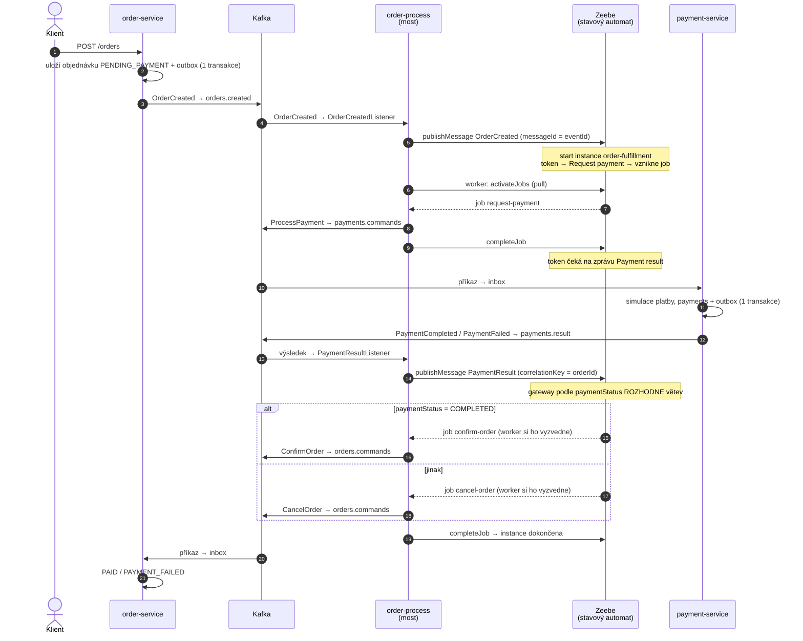
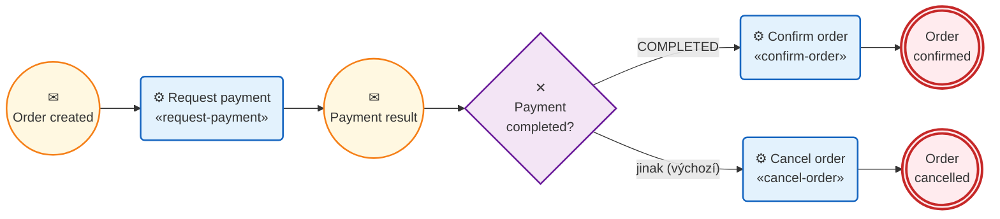

# Event-driven demo: Spring Boot + Kafka + PostgreSQL na lokálním Kubernetes

Cvičný projekt: dvě doménové Spring Boot mikroslužby a orchestrátor `order-process`, který tok
objednávky řídí BPMN procesem v **Camundě 8**. Veškerá komunikace služeb jde přes Kafku (příkazy
a události v JSON). Každá doménová služba má vlastní schéma v PostgreSQL a spolehlivé doručování řeší
vzory **transactional outbox** a **transactional inbox**. Základní deploy obsahuje služby, Camundu,
Kafku a DB; observabilita (Prometheus/Grafana, Elasticsearch/Kibana/Fluent Bit) se přidává volitelně.

> **Podrobný návod krok po kroku:** [`docs/poznamky/00_osnova.md`](docs/poznamky/00_osnova.md) –
> tutoriál „Event-driven a Camunda po lopate“ (slovensky, kapitoly 00–13, ověřené příkazy pro PowerShell).
> README je jen stručný přehled; detaily, vysvětlení a konfigurace jsou v kapitolách, na které odkazuje.

## Architektura



**Tok řídí Zeebe:** podle BPMN modelu drží stav každé objednávky, rozhoduje o dalším kroku (vytvoří
job, vybere větev gateway) a čeká na zprávy. `order-process` je jen most – listenery předávají události
z Kafky do Zeebe jako zprávy a workery provádějí joby, které jim Zeebe přidělí. Spojení k Zeebe otevírá
vždy `order-process` (worker si job vyzvedne – pull); Zeebe sám nikoho nevolá a Kafku nezná.

Úložiště: order-service a payment-service mají vlastní schéma v PostgreSQL (`eda`); Zeebe drží stav
procesů ve svém logu (RocksDB na PVC) a exportér ho kopíruje do databáze `camunda`, odkud čte Operate.

## Proces v Camundě



Kroužky jsou události (✉ = zpráva), zaoblené obdélníky service tasky (pod názvem job type), kosočtverec
exclusive gateway, dvojitý kroužek konec. Je to stavový automat, který vykonává Zeebe – kde právě
stojí token, je stav objednávky. Jak se proces napojuje na Kafku, ukazuje sekvenční diagram v
[Architektuře](#architektura). Originál pro Camunda Modeler je
[`order-fulfillment.bpmn`](order-process/src/main/resources/bpmn/order-fulfillment.bpmn).

Elementy procesu, correlation key a gateway s default flow popisuje
[kapitola 07](docs/poznamky/07_bpmn_proces.md); jak `order-process` překládá zprávy a joby
(`messageId = eventId`, `eventId` příkazu z `jobKey`, TTL zpráv 1 h) [kapitola 08](docs/poznamky/08_most_zeebe_kafka.md).

## Rychlý start

Předpoklady: Docker Desktop se zapnutým Kubernetes (nebo minikube), `kubectl`; pro testy mimo Docker
JDK 21 a Maven 3.9+. Profil `base` potřebuje ~2,5 GB RAM. Podrobně (minikube, paměť, WSL2):
[kapitola 02](docs/poznamky/02_predpoklady_a_setup.md).

```bash
./scripts/build-images.sh          # image :dev pro order-service, payment-service, order-process
./scripts/deploy.sh                # profil base: Kafka, PostgreSQL, Camunda a tři služby
./scripts/port-forward.sh          # v samostatném terminálu, Ctrl+C ukončí
./scripts/send-orders.sh 20        # 20 objednávek s náhodnou částkou
curl -s localhost:8080/orders/<id> # PENDING_PAYMENT → PAID / PAYMENT_FAILED
./scripts/teardown.sh              # smaže namespace eda-demo vč. dat DB a Camundy
```

```powershell
.\scripts\build-images.ps1
.\scripts\deploy.ps1
.\scripts\port-forward.ps1
.\scripts\send-orders.ps1 -Count 20
Invoke-RestMethod http://localhost:8080/orders/<id>
.\scripts\teardown.ps1
```

| Co | Kde |
|---|---|
| order-service API | http://localhost:8080/orders |
| Camunda Operate | http://localhost:8088/operate – `demo` / `demo` |
| health payment-service / order-process | http://localhost:8081/actuator/health, http://localhost:8082/actuator/health |
| PostgreSQL | `jdbc:postgresql://localhost:5432/eda`; je-li port 5432 obsazený: `kubectl -n eda-demo port-forward svc/postgres 15432:5432` a `localhost:15432` |

Celý cyklus s očekávanými výstupy: [kapitola 03](docs/poznamky/03_spustenie_stacku.md). Poison částka
666 (`send-orders.sh 1 666`, `-Count 1 -Amount 666`) ukáže retry → DLT a čekající instanci:
[kapitola 09](docs/poznamky/09_chybove_scenare.md). Observabilitu přidá `deploy.sh monitoring|logging|full`
(`deploy.ps1 -Stack …`): [kapitola 11](docs/poznamky/11_observabilita.md).

## Topicy a kontrakt

Služby záměrně **nesdílí žádný kód** – kontraktem je JSON zpráv. Klíč zprávy je vždy `orderId`.

| Topic | Producent → konzument |
|---|---|
| `orders.created` | order-service → order-process |
| `payments.commands` | order-process → payment-service |
| `payments.result` | payment-service → order-process |
| `orders.commands` | order-process → order-service |
| `*.DLT` | konzument po vyčerpání retry → čte jen `payments.commands.DLT` (group `payment-service-dlt`) |

Všechny topicy včetně DLT mají 3 partitions. Ukázky zpráv, consumer groups a ack módy:
[kapitola 04](docs/poznamky/04_kafka_v_praxi.md); překlad zpráv na Zeebe a zpět:
[kapitola 08](docs/poznamky/08_most_zeebe_kafka.md).

## Co projekt demonstruje

| Téma | Kde v kódu | Kapitola |
|---|---|---|
| Event vs. příkaz, orchestrace místo choreografie | `order-process`, `order-fulfillment.bpmn` | [01](docs/poznamky/01_co_je_event_driven.md) |
| Topicy, klíč `orderId`, consumer groups, ack módy, DLT | `config/KafkaConfig` (`edaTopics`, `kafkaErrorHandler`) | [04](docs/poznamky/04_kafka_v_praxi.md) |
| Transactional outbox a inbox, idempotence, retry s backoffem | `outbox/*`, `inbox/*` (dedup `existsById` + PK `event_id`) | [05](docs/poznamky/05_outbox_a_inbox.md) |
| `SKIP LOCKED`, JPA, deklarativní transakce, úklid | `*Repository` (`@Lock`), `@Transactional` servisy, `cleanup/*` | [05](docs/poznamky/05_outbox_a_inbox.md) |
| Zeebe: stav toku, pull model, primární vs. sekundární úložiště | `k8s/base/camunda/camunda.yaml`, `camunda.client` v `application.yml` | [06](docs/poznamky/06_camunda_a_zeebe.md) |
| BPMN: message start, catch event, gateway | `order-fulfillment.bpmn`, `ProcessMessages` | [07](docs/poznamky/07_bpmn_proces.md) |
| Most Zeebe ↔ Kafka, `messageId = eventId`, `commandId` z `jobKey` | `ProcessGateway`, `messaging/*Listener`, `worker/*`, `CommandPublisher` | [08](docs/poznamky/08_most_zeebe_kafka.md) |
| Poison zpráva, incident, výpadek Zeebe, redrive z DLT | `PaymentSimulator`, `DeadLetterListener`, `KafkaConfig` | [09](docs/poznamky/09_chybove_scenare.md) |
| Testcontainers, Camunda Process Test | `*IntegrationTest`, `*RepositoryTest` | [10](docs/poznamky/10_testovanie.md) |
| CorrelationId v MDC, ECS JSON logy, metriky | `CorrelationIdFilter`, `CorrelationIdRecordInterceptor`, `CorrelationScope` | [11](docs/poznamky/11_observabilita.md) |

Konfigurace (míra zamítnutí plateb, poison částka, retry, TTL zpráv, úklid…) je v ConfigMapách
`order-service-config`, `payment-service-config` a `order-process-config`; přehled proměnných:
[kapitola 03, Konfigurácia služieb](docs/poznamky/03_spustenie_stacku.md#konfigurácia-služieb).

## Struktura repozitáře

```
order-service/            samostatný Maven projekt + Dockerfile (domain, api, inbox, outbox, messaging)
payment-service/          samostatný Maven projekt + Dockerfile (domain, inbox, outbox, messaging)
order-process/            orchestrátor: Maven projekt + Dockerfile (BPMN, listenery, workery, CommandPublisher), bez DB
pom.xml                   jen agregátor (mvn verify nad všemi službami), služby od něj nic nedědí
k8s/base/                 namespace, Kafka, PostgreSQL, Camunda, order-service, payment-service, order-process
k8s/components/           volitelné: monitoring (Prometheus, Grafana), logging (ES, Kibana, Fluent Bit)
k8s/overlays/             profily monitoring, logging, full
scripts/                  build-images, deploy, teardown, port-forward, send-orders (.sh + .ps1)
docs/poznamky/            tutoriál, kapitoly 00–13
```

## Verze

Ověřené jako aktuální stabilní k 2026-10-07:

| Komponenta | Verze |
|---|---|
| Java | 21 (image `eclipse-temurin:21-jre-noble`) |
| Spring Boot | 4.1.1 (Spring Kafka 4.1.1, Kafka klient 4.2.1, Spring Data JPA + Hibernate 7.4, Flyway 12.4, PostgreSQL driver 42.7.13) |
| Apache Kafka | `apache/kafka:4.3.1` (KRaft) |
| PostgreSQL | `postgres:18.6-alpine` |
| Camunda | 8.10.2 (image `camunda/camunda:8.10.2`, `camunda-spring-boot-starter`, `camunda-process-test-spring`) |
| Testcontainers | 2.0.5 |
| Elasticsearch / Kibana | 9.5.5 (volitelné) |
| Prometheus | v3.15.0 (volitelné) |
| Grafana | 13.2.3 (volitelné) |
| Fluent Bit | 5.1.3 (volitelné) |

## Testy

```bash
mvn verify          # unit, repository testy proti PostgreSQL a integrační testy s Kafkou a Camundou (Testcontainers, potřebuje Docker)
```

Vrstvy testů, Camunda Process Test a historie ověření (včetně nasazení na Kubernetes):
[kapitola 10](docs/poznamky/10_testovanie.md).

## Omezení demo řešení

- Kafka a volitelné ES/Prometheus mají data v `emptyDir`; restart podu = ztráta dat. PostgreSQL a Camunda (Zeebe) mají PVC.
- Camunda běží v jedné replice bez autentizace API (demo uživatel `demo/demo` jen pro UI); proces nemá timeout ani kompenzace.
- Hesla k DB jsou demo hodnoty přímo v manifestu; Elasticsearch/Kibana bez zabezpečení, Grafana admin/admin.
- Pořadí zpracování v inboxu je podle času přijetí; zpráva v retry neblokuje další zprávy stejné
  objednávky (pro tento tok to nevadí – každá objednávka má jen jednu zprávu v každém směru).
- Metriky (`eda_*`) jsou počítané v procesu – po restartu podu začínají od nuly.
