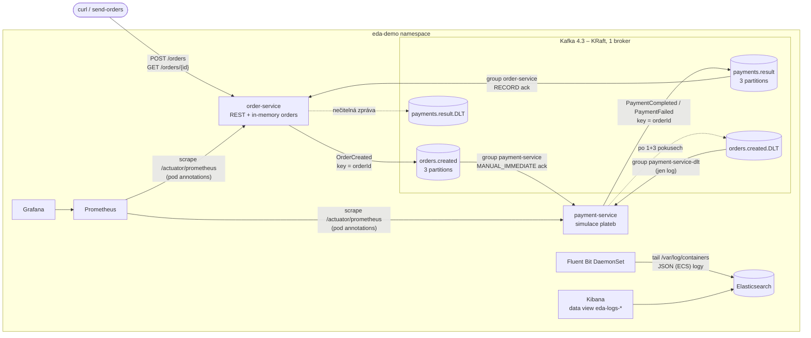

# Event-driven demo: Spring Boot + Kafka na lokálním Kubernetes

Cvičný projekt: dvě Spring Boot mikroslužby komunikují výhradně přes Kafku (události v JSON),
nasazené v lokálním Kubernetes spolu s kompletní observabilitou (Prometheus, Grafana,
Elasticsearch, Kibana, Fluent Bit).

## Architektura



### Tok objednávky

1. `POST /orders` uloží objednávku (`PENDING_PAYMENT`) a publikuje `OrderCreated` do `orders.created`.
2. payment-service platbu simuluje:
   - s pravděpodobností `PAYMENT_FAILURE_RATE` (výchozí 0.2) ji **zamítne** → `PaymentFailed`
     (business výsledek, žádný retry),
   - jinak → `PaymentCompleted`,
   - částka `PAYMENT_POISON_AMOUNT` (výchozí **666**) vyvolá **technickou chybu** → retry s backoffem
     → `orders.created.DLT`.
3. order-service přijme výsledek z `payments.result` a nastaví stav `PAID` / `PAYMENT_FAILED`.

### Kontrakt zpráv

Služby záměrně **nesdílí žádný kód** (žádný `common` modul) – každá má vlastní kopii tříd událostí
v balíčku `…event`. Kontraktem je pouze JSON formát zpráv:

```json
// orders.created  (key = orderId)
{"eventId":"5b7c…","timestamp":"2026-10-07T08:31:31.70Z","correlationId":"demo-1","orderId":"9543…",
 "customerId":"c1","amount":10.5,"currency":"CZK"}

// payments.result (key = orderId) – podtyp určuje pole "type"
{"type":"PaymentCompleted","eventId":"…","timestamp":"…","correlationId":"demo-1","orderId":"9543…",
 "paymentId":"…","amount":10.5}
{"type":"PaymentFailed","eventId":"…","timestamp":"…","correlationId":"demo-1","orderId":"9543…",
 "reason":"Payment declined by simulated gateway"}
```

Spring type hlavičky (`__TypeId__`) jsou vypnuté, takže konzument nezávisí na Java třídách producenta.
CorrelationId se přenáší v těle i v Kafka hlavičce `X-Correlation-Id`.

### Co projekt demonstruje (a kde to najít)

| Téma | Kde |
|---|---|
| Explicitní topicy s partitions | `config/KafkaConfig#edaTopics` (`KafkaAdmin.NewTopics`), na brokeru `auto.create.topics.enable=false` |
| Klíč = orderId (pořadí v rámci objednávky) | `OrderEventPublisher`, `PaymentResultPublisher` |
| Consumer groups | `order-service`, `payment-service`, `payment-service-dlt` |
| Potvrzování | order-service `AckMode.RECORD`, payment-service `MANUAL_IMMEDIATE` (`Acknowledgment`) |
| Retry s exponenciálním backoffem + DLT | `KafkaConfig#kafkaErrorHandler` (`DefaultErrorHandler` + `DeadLetterPublishingRecoverer`), nastavení `eda.kafka.retry.*` |
| Nečitelné zprávy | `ErrorHandlingDeserializer` → rovnou do DLT bez retry (původní bajty beze změny) |
| Idempotentní konzument | `ProcessedEventStore` (LRU paměť eventId), metrika `eda_messages_consumed_total{outcome="duplicate"}` |
| CorrelationId v MDC | `CorrelationIdFilter` (HTTP), `CorrelationIdRecordInterceptor` (Kafka) |
| Strukturované JSON logy | `logging.structured.format.console=ecs` (vestavěné ve Spring Boot) |

## Verze

Ověřené jako aktuální stabilní k 2026-10-07:

| Komponenta | Verze |
|---|---|
| Java | 21 (image `eclipse-temurin:21-jre-noble`) |
| Spring Boot | 4.1.1 (Spring Kafka 4.1.1, Kafka klient 4.2.1, Micrometer 1.17) |
| Apache Kafka | `apache/kafka:4.3.1` (KRaft) |
| Testcontainers | 2.0.5 |
| Elasticsearch / Kibana | 9.5.5 |
| Prometheus | v3.15.0 |
| Grafana | 13.2.3 |
| Fluent Bit | 5.1.3 |

## Předpoklady

- Docker Desktop (Windows/macOS)
- `kubectl`
- minikube s driverem docker – **nebo** Kubernetes zapnutý v Docker Desktopu (viz níže)
- Pro build a testy mimo Docker: JDK 21 a Maven 3.9+ (integrační testy potřebují běžící Docker)

## Spuštění krok za krokem

### 1. Cluster

**minikube** (doporučeno 4 CPU / 8 GB):

```bash
minikube start --driver=docker --cpus=4 --memory=8192
kubectl config use-context minikube
```

**Alternativa – Docker Desktop Kubernetes:** Settings → Kubernetes → Enable, pak
`kubectl config use-context docker-desktop`. Skripty to poznají a image do minikube nenahrávají
(Docker Desktop vidí lokální image přímo).

### 2. Build a testy (volitelné, image se buildí i bez toho)

```bash
mvn verify          # unit testy + integrační testy s Testcontainers Kafka
```

### 3. Image

```bash
./scripts/build-images.sh          # bash / macOS / Git Bash
.\scripts\build-images.ps1         # PowerShell
```

Multi-stage Dockerfile (Maven build → `jarmode=tools extract --layers` → JRE runtime, non-root).
Image jsou otagované `:dev` a nahrané přes `minikube image load` (žádná registry).

### 4. Deploy

```bash
./scripts/deploy.sh                # nebo .\scripts\deploy.ps1
```

`kubectl apply -k k8s` + čekání na rollout všech deploymentů a na Job, který v Kibaně vytvoří
data view. První start trvá několik minut: kubelet stahuje image postupně, takže i malé image
(busybox v initContaineru) čekají za ES/Kibanou (~1.5 GB). `0/1` u služeb v té době je normální.

Ověřená spotřeba paměti celého stacku po startu je **~3.1 GB** (ES ~1 GB, Kibana ~0.8 GB,
Kafka ~0.4 GB, Grafana ~0.4 GB, každá služba ~0.2 GB); součet limitů je ~5.6 GB.

> **Windows/WSL2:** Docker Desktop VM (`vmmemWSL`) si drží page cache z buildů a stahování image
> a paměť Windows nevrací – proces může ukazovat i 12+ GB, i když kontejnery berou ~3 GB.
> Jednorázové uvolnění: `wsl -d docker-desktop sh -c "echo 3 > /proc/sys/vm/drop_caches"`;
> trvale `memory=10GB` a `[experimental] autoMemoryReclaim=gradual` v `%UserProfile%\.wslconfig`.

### 5. Port-forwardy

```bash
./scripts/port-forward.sh          # nebo .\scripts\port-forward.ps1, Ctrl+C ukončí
```

| Služba | URL | Poznámka |
|---|---|---|
| order-service | http://localhost:8080/orders | REST API |
| payment-service | http://localhost:8081/actuator/health | jen actuator |
| Grafana | http://localhost:3000 | `admin` / `admin`, dashboard **EDA demo – overview** je domovská stránka |
| Prometheus | http://localhost:9090 | Status → Targets ukazuje oba pody |
| Kibana | http://localhost:5601 | Discover → data view **EDA logs** (`eda-logs-*`) |
| Elasticsearch | http://localhost:9200 | bez autentizace |

Ručně např.: `kubectl -n eda-demo port-forward svc/grafana 3000:3000`.

### 6. Posílání objednávek

```bash
./scripts/send-orders.sh 20              # 20 objednávek s náhodnou částkou
.\scripts\send-orders.ps1 -Count 20

curl -s localhost:8080/orders/<id>       # stav: PENDING_PAYMENT → PAID / PAYMENT_FAILED
```

Ručně:

```bash
curl -i -X POST localhost:8080/orders -H 'Content-Type: application/json' \
  -H 'X-Correlation-Id: my-test-1' -d '{"customerId":"c1","amount":99.90,"currency":"CZK"}'
```

## Demo: selhání → DLT → logy → dashboard

1. **Vyvolej technickou chybu** – pošli objednávku s poison částkou:
   ```bash
   ./scripts/send-orders.sh 1 666             # nebo .\scripts\send-orders.ps1 -Count 1 -Amount 666
   ```
   Objednávka zůstane `PENDING_PAYMENT` (výsledek platby nikdy nevznikne).
2. **Retry a DLT v logu payment-service:**
   ```bash
   kubectl -n eda-demo logs deploy/payment-service | grep -E 'Delivery attempt|DLT|Dead letter'
   ```
   Uvidíš 4 neúspěšné pokusy (1 doručení + 3 retry, backoff 0.5 s → 1 s → 2 s), pak
   `moved to orders.created.DLT` a `Dead letter received` z DLT listeneru (s důvodem chyby
   z hlaviček `kafka_dlt-exception-*`).
3. **Obsah DLT přímo v Kafce** (v Git Bash na Windows předřaď `MSYS_NO_PATHCONV=1`, jinak se
   `/opt/...` přepíše na Windows cestu):
   ```bash
   kubectl -n eda-demo exec deploy/kafka -- /opt/kafka/bin/kafka-console-consumer.sh \
     --bootstrap-server localhost:9092 --topic orders.created.DLT --from-beginning \
     --formatter-property print.key=true --formatter-property print.headers=true --timeout-ms 5000
   ```
   Consumer lag všech skupin (po přesunu do DLT má být 0 – offset poison zprávy se commitne):
   ```bash
   kubectl -n eda-demo exec deploy/kafka -- /opt/kafka/bin/kafka-consumer-groups.sh \
     --bootstrap-server localhost:9092 --describe --all-groups
   ```
4. **Kibana** (Discover, data view *EDA logs*) – dotazy KQL:
   - `correlationId : "demo-…"` – celá cesta jedné objednávky přes obě služby,
   - `log.level : "ERROR"` – retry/DLT chyby,
   - `kubernetes.labels.app_kubernetes_io/name : "payment-service"` – logy jedné služby.
5. **Grafana** – na dashboardu *EDA demo – overview* naskočí panel **Dead-lettered messages** (červeně)
   a graf *DLT rate*. Dál: HTTP rate/latence (p50/p95/p99), produced/consumed msg/s, consumer lag,
   JVM paměť.
6. **Business selhání** (bez DLT) – nastav 100% zamítání a pošli objednávky:
   ```bash
   kubectl -n eda-demo set env deploy/payment-service PAYMENT_FAILURE_RATE=1.0
   ./scripts/send-orders.sh 5      # všechny skončí PAYMENT_FAILED
   ```

## Konfigurace

| Proměnná / property | Služba | Výchozí | Význam |
|---|---|---|---|
| `KAFKA_BOOTSTRAP_SERVERS` | obě | `localhost:9092` | adresa brokeru (v K8s `kafka:9092`) |
| `PAYMENT_FAILURE_RATE` | payment | `0.2` | pravděpodobnost zamítnutí platby (0–1) |
| `PAYMENT_POISON_AMOUNT` | payment | `666` | částka vyvolávající technickou chybu → DLT |
| `eda.kafka.topics.partitions` | obě | `3` | partitions vytvářených topiců |
| `eda.kafka.retry.max-retries` | obě | `3` | počet opakování před DLT |
| `eda.kafka.retry.initial-interval` / `multiplier` / `max-interval` | obě | `500ms` / `2.0` / `5s` | exponenciální backoff |

V K8s jsou hodnoty v ConfigMapách `order-service-config` a `payment-service-config`.

## Úklid

```bash
./scripts/teardown.sh              # nebo .\scripts\teardown.ps1 – smaže namespace eda-demo a RBAC
minikube delete                    # smaže celý cluster
```

## Struktura repozitáře

```
order-service/      samostatný Maven projekt + Dockerfile
payment-service/    samostatný Maven projekt + Dockerfile
pom.xml             jen agregátor (mvn verify nad oběma službami), služby od něj nic nedědí
k8s/                Kustomize: namespace, kafka, služby, observability/ (prometheus, grafana, ES, kibana, fluent-bit)
scripts/            build-images, deploy, teardown, port-forward, send-orders (.sh + .ps1)
```

## Co bylo ověřeno (2026-10-07)

| Ověřeno | Jak |
|---|---|
| Unit + integrační testy (Testcontainers `apache/kafka:4.3.1`) | `mvn verify` – 79 testů, 0 selhání |
| Image a běh mimo K8s | Kafka + obě image v Docker síti, objednávka → `PAID` |
| Deploy celého stacku | **Kubernetes v Docker Desktopu** (v1.32), `deploy.ps1`, všechny pody Ready |
| E2E tok objednávky | 6/6 objednávek `PAID`, poison objednávka zůstala `PENDING_PAYMENT` |
| Retry + DLT | 4 pokusy s backoffem, záznam v `orders.created.DLT` s hlavičkami, lag všech skupin 0 |
| Logy v ES/Kibaně | dotaz podle `correlationId` vrací logy obou služeb ve správném pořadí; data view `eda-logs-*` existuje |
| Metriky | Prometheus targety `up`, všechny dotazy dashboardu vrací data, Grafana datasource OK |

**Neověřeno:** běh na **minikube** – na testovacím stroji nebyl nainstalovaný, deploy proběhl na
Docker Desktop Kubernetes. Manifesty jsou na tom nezávislé; minikube-specifické jsou jen
`minikube image load` v `build-images` a formát cesty k logům (Fluent Bit má parsery `docker, cri`
a mountuje `/var/log` i `/var/lib/docker/containers`). Vizuální vzhled dashboardu a Kibana UI
byly kontrolovány jen přes API, ne v prohlížeči.

## Omezení demo řešení

- Stav objednávek je jen v paměti – restart order-service ho smaže (výsledky plateb pro neznámé
  objednávky se pak jen zalogují).
- Uložení objednávky a publikace eventu nejsou atomické (chybí transactional outbox).
- Paměť pro deduplikaci je v paměti procesu a omezená (LRU 10 000) – po restartu se duplicity
  nerozpoznají; v produkci by patřila do DB.
- Kafka, Elasticsearch i Prometheus mají data v `emptyDir`; restart podu = ztráta dat.
- Elasticsearch/Kibana bez zabezpečení, Grafana s admin/admin.
- Metrika `eda_messages_dead_lettered_total` je počítána v procesu – po restartu podu začíná od nuly
  (zprávy v DLT topicu zůstávají).
