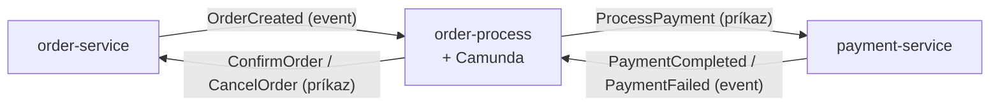
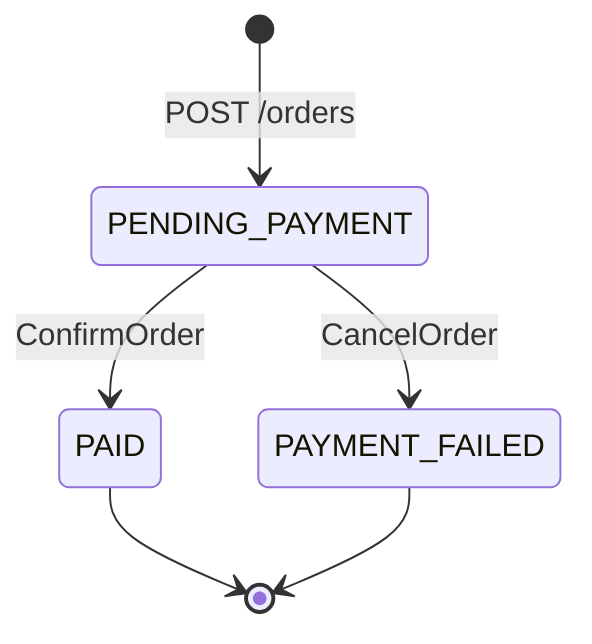
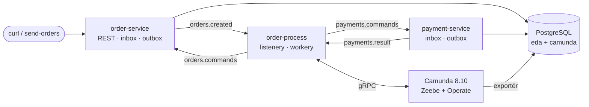

# 01 – Čo je event-driven

## Čo sa naučíš

- Rozdiel medzi **udalosťou (event)** a **príkazom (command)** a prečo na ňom záleží
- Čo je **choreografia** a čo **orchestrácia** a prečo demo prešlo z prvej na druhú
- Prečo je objednávka vlastne **stavový automat** a prečo ho chceme mať v Camunde
- Ako je repo poskladané: tri služby, Kafka, PostgreSQL, Camunda

---

## Teória v skratke

### 1. Synchrónne vs. event-driven

Klasický prístup: order-service zavolá REST-om payment-service a **čaká** na odpoveď. Ak payment-service práve nebeží, objednávka zlyhá. Obe služby musia byť živé v tej istej sekunde.

Event-driven prístup: order-service zapíše správu do Kafky a **ide ďalej**. Payment-service si ju prečíta, keď môže. Ak práve nebeží, správa na ňu v Kafke počká.

Analógia: telefonát vs. SMS. Pri telefonáte musia byť obaja na linke naraz. SMS si druhý prečíta, keď vytiahne mobil, a odpíše, keď má čas.

| | Synchrónne (REST) | Event-driven (Kafka) |
|---|---|---|
| Väzba v čase | obe služby musia bežať naraz | stačí, že beží Kafka |
| Výpadok príjemcu | chyba u volajúceho | správa počká |
| Odpoveď | hneď, v tom istom volaní | neskôr, ako ďalšia správa |
| Zložitosť | nízka | vyššia: duplicity, poradie, „kde je moja objednávka?“ |

Preto `POST /orders` v deme vracia `PENDING_PAYMENT`, nie `PAID`. Platba prebehne **neskôr** a asynchrónne.

### 2. Event vs. príkaz

| | Event (udalosť) | Príkaz (command) |
|---|---|---|
| Význam | „Stalo sa X.“ | „Urob X.“ |
| Čas | minulý: `OrderCreated`, `PaymentCompleted` | rozkazovací: `ProcessPayment`, `ConfirmOrder` |
| Adresát | ktokoľvek, koho to zaujíma (aj nikto) | jeden konkrétny príjemca |
| Kto rozhoduje, čo ďalej | príjemca | odosielateľ |

V deme platí:

- **order-service** publikuje udalosť `OrderCreated` („objednávka vznikla“) a nestará sa, čo bude ďalej.
- **order-process** (orchestrátor) posiela **príkazy**: `ProcessPayment` pre payment-service, `ConfirmOrder` / `CancelOrder` pre order-service.
- **payment-service** odpovedá **udalosťou** `PaymentCompleted` / `PaymentFailed`.

### 3. Choreografia vs. orchestrácia

**Choreografia** = tanečníci bez dirigenta. Každý pozná svoje kroky a reaguje na ostatných. V pôvodnej verzii dema (commit `ba78d05`):

```
order-service --OrderCreated--> payment-service --PaymentCompleted/Failed--> order-service
```

payment-service „vedel“, že na `OrderCreated` má reagovať platbou, a order-service „vedel“, že na výsledok platby má zmeniť stav. Celý tok nebol nikde napísaný, bol rozsypaný v listeneroch dvoch služieb.

**Orchestrácia** = orchestra s dirigentom. Dirigent (orchestrátor) drží partitúru (BPMN proces) a hovorí, kto kedy hrá:



| | Choreografia | Orchestrácia |
|---|---|---|
| Kde je tok | rozsypaný v listeneroch služieb | na jednom mieste (BPMN) |
| Kde je stav toku | nikde explicitne (len stav objednávky v DB) | v Zeebe: kde je token, aké sú premenné |
| Pridať krok | upraviť viac služieb | upraviť proces + pridať worker |
| „Kde visí objednávka X?“ | lúštiš logy troch služieb | pozrieš sa do Operate |
| Väzba služieb | služby poznajú udalosti iných služieb | služby poznajú len orchestrátor |
| Riziko | „spaghetti“ udalostí pri raste | orchestrátor je ďalšia kritická súčiastka |

Ani jedno nie je „správne“. Pre dva kroky je choreografia jednoduchšia. Keď tok rastie (timeouty, kompenzácie, viac služieb), orchestrácia sa vyplatí, lebo tok je vidieť.

### 4. Prečo stavový automat

Objednávka prechádza stavmi a prechody spúšťajú udalosti:



To je **stavový automat**: konečný počet stavov a pravidlá prechodov. V order-service ho vidíš v [`OrderStatus.java`](../../order-service/src/main/java/cz/demo/eda/order/domain/OrderStatus.java) (`isFinal()` = už sa nedá zmeniť).

Proces v Camunde je **stavový automat celého toku**, nielen objednávky: „čakám na platbu“, „platba prišla, rozhodujem“, „posielam potvrdenie“. Camunda ho drží za teba: perzistentne, s históriou, s opakovaním a s UI. Bez nej by si si tento stav musel ukladať sám (tabuľka „saga_state“, plánovače, timeouty…).

### 5. Mapa repa



| Komponent | Čo robí | Má DB? |
|---|---|---|
| `order-service` | REST API `/orders`, objednávky, prijíma príkazy `ConfirmOrder` / `CancelOrder` | áno, schéma `orders` |
| `payment-service` | simuluje platbu, posiela výsledok | áno, schéma `payments` |
| `order-process` | most medzi Kafkou a Zeebe, job workery | **nie**, stav drží Zeebe |
| Camunda (`camunda-0`) | Zeebe engine + Operate + REST API | áno, DB `camunda` (sekundárne úložisko) + PVC |
| Kafka | 4 topicy + DLT, KRaft (bez ZooKeepera) | dáta v `emptyDir` |
| PostgreSQL | databázy `eda` a `camunda` | PVC |

---

## Krok po kroku

**Predpoklad:** stack beží ([kapitola 03](03_spustenie_stacku.md)) a beží port-forward. Ak ešte nebeží, prečítaj si túto časť len ako ukážku a vráť sa sem po kapitole 03.

### 1. Čo beží v namespace `eda-demo`

```powershell
kubectl -n eda-demo get pods -o custom-columns=NAME:.metadata.name,IMAGE:.spec.containers[0].image
```

```
NAME                              IMAGE
camunda-0                         camunda/camunda:8.10.2
kafka-5ffd4dbcb9-4brtd            apache/kafka:4.3.1
order-process-fb56b7b75-hqsfm     order-process:dev
order-service-775b4b98dc-g5mj9    order-service:dev
payment-service-d8d9878d9-tg49f   payment-service:dev
postgres-0                        postgres:18.6-alpine
```

Šesť podov = šesť krabičiek z mapy vyššie. Tri sú naše služby (`:dev` image buildnuté lokálne), tri sú infraštruktúra.

### 2. Pošli objednávku a pozri sa, že je „asynchrónna“

```powershell
curl.exe -s -i -X POST http://localhost:8080/orders -H "Content-Type: application/json" -H "X-Correlation-Id: tutorial-1" -d '{\"customerId\":\"c1\",\"amount\":99.90,\"currency\":\"CZK\"}'
```

```
HTTP/1.1 201
X-Correlation-Id: tutorial-1
Location: http://localhost:8080/orders/3101528e-e2ce-4a55-bfa6-a7790b46e89e
Content-Type: application/json

{"id":"3101528e-e2ce-4a55-bfa6-a7790b46e89e","customerId":"c1","amount":99.90,"currency":"CZK","status":"PENDING_PAYMENT","paymentId":null,"failureReason":null,...}
```

- `201 Created` + `status: PENDING_PAYMENT`. Platba ešte neprebehla, order-service len uložil objednávku a udalosť do outboxu.
- V PS 5.1 treba vnútorné úvodzovky v JSON escapovať ako `\"`, inak ich PowerShell pri volaní `curl.exe` zahodí.

O sekundu neskôr:

```powershell
Invoke-RestMethod http://localhost:8080/orders/3101528e-e2ce-4a55-bfa6-a7790b46e89e | Select-Object id, status, paymentId
```

```
id                                   status paymentId
--                                   ------ ---------
3101528e-e2ce-4a55-bfa6-a7790b46e89e PAID   dca41277-ed8a-430b-937a-661d7bcf84c7
```

Medzi týmito dvoma volaniami prebehlo 13 krokov cez 3 služby, 4 topicy a Camundu. Celú cestu si rozoberieme v [kapitole 11](11_observabilita.md), tu len skrátene (reálny výpis logov podľa `correlationId`):

```
06:21:28.235  order-service    Order 3101528e-… created for customer c1 amount 99.90 CZK
06:21:28.577  order-service    Published event db702ddb-… for order 3101528e-… to orders.created
06:21:28.603  order-process    Message OrderCreated published for 3101528e-… (messageId db702ddb-…)
06:21:28.621  order-process    ProcessPayment 0ebf6a18-… sent for order 3101528e-…
06:21:28.848  payment-service  Payment for order 3101528e-… finished with PaymentCompleted
06:21:28.886  order-process    Message PaymentResult published for 3101528e-… (messageId 342cdce7-…)
06:21:28.907  order-process    ConfirmOrder f7717ad2-… sent for order 3101528e-…
06:21:29.071  order-service    Order 3101528e-… status changed PENDING_PAYMENT -> PAID
```

Celé to trvalo ~0,8 s. Najdlhšie čakanie je na plánovače outboxu a inboxu (každý beží raz za 500 ms).

---

## Kód z repa

| Súbor | Čo v ňom uvidíš |
|---|---|
| [`order-service/.../api/OrderController.java`](../../order-service/src/main/java/cz/demo/eda/order/api/OrderController.java) | `POST /orders` vracia `201` a `PENDING_PAYMENT` – platba je asynchrónna |
| [`order-service/.../domain/OrderService.java`](../../order-service/src/main/java/cz/demo/eda/order/domain/OrderService.java) | `createOrder` (objednávka + `OrderCreated` do outboxu v jednej transakcii) a `applyCommand` (stavový prechod podľa príkazu) |
| [`order-service/.../domain/OrderStatus.java`](../../order-service/src/main/java/cz/demo/eda/order/domain/OrderStatus.java) | tri stavy, `isFinal()` |
| [`order-process/.../event/`](../../order-process/src/main/java/cz/demo/eda/process/event) | kontrakt správ z pohľadu orchestrátora: eventy (`OrderCreated`, `PaymentResult`) aj príkazy (`ProcessPayment`, `OrderCommand`) |
| [`order-process/src/main/resources/bpmn/order-fulfillment.bpmn`](../../order-process/src/main/resources/bpmn/order-fulfillment.bpmn) | samotný tok – stavový automat procesu |

Všimni si v `OrderService.applyCommand` pattern matching nad sealed rozhraním:

```java
switch (command) {
    case ConfirmOrder confirm -> order.markPaid(confirm.paymentId(), now);
    case CancelOrder cancel -> order.markPaymentFailed(cancel.reason(), now);
}
```

`OrderCommand` je `sealed` a povoľuje len tieto dva podtypy, takže kompilátor vie, že `switch` je úplný. Nový príkaz bez úpravy `switch` sa neskompiluje.

**Dôležité pravidlo repa:** služby **nezdieľajú žiadny kód**. Každá má vlastnú kópiu tried udalostí (napr. `OrderCreated` je v order-service aj v order-process). Kontraktom je len JSON formát správ. Prečo? Zdieľaná knižnica by služby zviazala: zmena triedy by znamenala nasadiť všetky naraz.

---

## Bez Camundy by to vyzeralo takto

V commite `ba78d05` (pred zavedením Camundy) žiadny `order-process` nebol. Pozri sa:

```powershell
git show ba78d05:order-service/src/main/java/cz/demo/eda/order/domain/OrderService.java | Select-String -Pattern "public Optional<Order> applyPaymentResult" -Context 0,6
```

```
>     public Optional<Order> applyPaymentResult(PaymentResult result) {
          Optional<Order> order = repository.findForUpdate(result.orderId());
          if (order.isEmpty()) {
              // Výsledek pro neznámou objednávku retry nespraví – jen varování, zpráva se označí jako zpracovaná.
              log.warn("Payment result {} for unknown order {} ignored", result.eventId(), result.orderId());
              return order;
          }
```

V starej verzii teda order-service priamo spracúval **výsledok platby** (udalosť payment-service). Teraz rovnaké miesto spracúva **príkaz** od orchestrátora (`applyCommand`).

Rozdiel:

| Choreografia (`ba78d05`) | Orchestrácia (teraz) |
|---|---|
| payment-service počúva `orders.created` a sám sa rozhodne zaplatiť | payment-service počúva `payments.commands` a platí, až keď mu to orchestrátor prikáže |
| order-service počúva `payments.result` a sám mení stav | order-service počúva `orders.commands` a mení stav podľa príkazu |
| order-service musí poznať udalosti payment-service | order-service pozná len svoje príkazy |
| tok objednávky nikde nevidíš | tok je diagram v BPMN a živý v Operate |

Doménové služby sa takmer nezmenili (inbox, outbox, stavy zostali). Zmenilo sa **kto komu čo posiela**.

---

## Časté chyby

| Príznak | Príčina | Riešenie |
|---|---|---|
| Po `POST /orders` je stav stále `PENDING_PAYMENT` | Normálne – platba je asynchrónna | Počkaj ~1 s a sprav `GET /orders/{id}` |
| Stav ostane `PENDING_PAYMENT` aj po minúte | Niekde sa tok zasekol (poison 666, nebeží order-process, Zeebe…) | Operate: kde stojí token; [kapitola 09](09_chybove_scenare.md) |
| `curl` v PowerShelli vráti zvláštny objekt namiesto textu | V PS 5.1 je `curl` alias na `Invoke-WebRequest` | Píš `curl.exe` |
| `curl.exe` vráti `400 Bad Request` | PS 5.1 zjedol úvodzovky v JSON | Escapuj ich `\"` alebo použi `Invoke-RestMethod` |
| Mätie ťa „event“ vs. „príkaz“ | Oboje ide cez Kafku a vyzerá rovnako (JSON) | Rozhoduje význam: minulý čas = event, rozkaz = príkaz |

---

## Otázky na zopakovanie

**Aký je rozdiel medzi eventom a príkazom?**
Event hovorí, čo sa už stalo, a odosielateľa nezaujíma, kto naň zareaguje. Príkaz žiada konkrétneho príjemcu, aby niečo urobil. `OrderCreated` je event, `ProcessPayment` je príkaz.

**Prečo `POST /orders` nevracia rovno `PAID`?**
Lebo platba beží asynchrónne cez Kafku a ďalšie služby. Order-service v čase odpovede ešte nevie, ako platba dopadne.

**Čo je choreografia a čo orchestrácia?**
Pri choreografii služby reagujú na udalosti iných služieb a tok nie je nikde centrálne. Pri orchestrácii jeden orchestrátor (tu `order-process` + Camunda) drží stav toku a posiela príkazy.

**Kde je v deme uložený stav toku objednávky?**
V Zeebe (primárne úložisko na PVC). Stav samotnej objednávky (`PAID`…) je v tabuľke `orders.orders`. `order-process` vlastnú DB nemá.

**Prečo služby nezdieľajú triedy udalostí?**
Aby sa dali vyvíjať a nasadzovať nezávisle. Kontraktom je JSON, nie Java trieda.

## Vyskúšaj si

1. Pošli dve objednávky hneď za sebou a hneď (do 100 ms) sa pýtaj na stav prvej. **Očakávanie:** `PENDING_PAYMENT`. Po sekunde `PAID` alebo `PAYMENT_FAILED` (zamietnutie s pravdepodobnosťou 0.2).
2. Otvor [`OrderStatus.java`](../../order-service/src/main/java/cz/demo/eda/order/domain/OrderStatus.java) a nakresli si na papier stavový automat objednávky. Potom ho porovnaj s diagramom v README (sekcia „Proces v Camundě“). **Očakávanie:** proces má viac „stavov“ (čakám na platbu, rozhodujem, posielam príkaz) ako objednávka.

---

**Ďalej:** [02 – Predpoklady a setup](02_predpoklady_a_setup.md)
