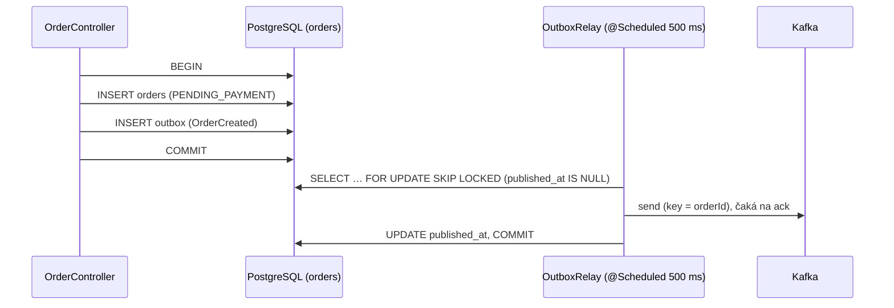

# 05 – Outbox a inbox

## Čo sa naučíš

- Čo je problém **dual write** a ako ho rieši **transactional outbox** (`OutboxRelay`)
- Ako **transactional inbox** rieši duplicity, retry s backoffom a DLT bez blokovania Kafky
- Prečo relay aj processor zamykajú riadky cez `SELECT … FOR UPDATE SKIP LOCKED`
- Ako sa na to všetko pozrieť SQL dotazmi v `psql` (alebo DBeaveri)

---

## Teória v skratke

### 1. Dual write: dve veci, ktoré nejdú atomicky

`POST /orders` musí urobiť dve veci: **uložiť objednávku do DB** a **poslať `OrderCreated` do Kafky**. Neexistuje transakcia, ktorá by objala PostgreSQL aj Kafku naraz. Čo sa môže stať:

| Poradie | Pád medzi krokmi | Výsledok |
|---|---|---|
| DB commit, potom Kafka | služba spadne po commite | objednávka existuje, ale nikto o nej nevie → navždy `PENDING_PAYMENT` |
| Kafka, potom DB commit | DB commit zlyhá | platba prebehne za objednávku, ktorá neexistuje |

### 2. Outbox: „napíš si to na lístok do tej istej šuplíky“

Analógia: namiesto toho, aby si list hneď niesol na poštu, **vložíš ho do zásuvky „na odoslanie“ v tom istom pohybe**, ako zapisuješ objednávku do šanónu. Poštár (relay) chodí každých 500 ms, vyberie zásuvku, odnesie listy a odškrtne ich.



- Objednávka a správa vzniknú **spolu alebo vôbec**.
- Ak relay spadne po odoslaní, ale pred `UPDATE published_at`, pošle správu **znova** → duplicita. Outbox dáva **at-least-once**, nie exactly-once. Duplicity rieši inbox na druhej strane.

### 3. Inbox: „najprv do schránky, spracovanie neskôr“

Listener v payment-service správu **nespracuje** hneď. Len ju uloží do tabuľky `inbox` (PK = `event_id`) a potvrdí offset. Spracovanie robí plánovač `InboxProcessor` (každých 500 ms).

| Problém | Ako ho inbox rieši |
|---|---|
| Kafka doručí správu dvakrát | `event_id` už v inboxe je → duplicita sa preskočí |
| Spracovanie zlyhá (technická chyba) | retry s backoffom 0,5 s → 1 s → 2 s, stav retry je v DB (`attempts`, `next_attempt_at`, `last_error`) |
| Po 4 pokusoch stále chyba | `status = FAILED` a správa ide do `<topic>.DLT` (cez outbox, v tej istej transakcii) |
| Dlhé spracovanie by blokovalo partíciu a hrozil by rebalance | listener len uloží a hneď potvrdí, ťažká práca beží mimo poll loop |
| Retry musí prežiť reštart podu | všetko je v DB, nie v pamäti |

Jedno spracovanie správy = **jedna transakcia** `InboxService.process`: doménová zmena (napr. `payments.payments`) + výsledok do outboxu + `inbox.status = PROCESSED`. Keď handler vyhodí výjimku, vráti sa **všetko**. Potom `InboxService.recordFailure` v **novej** transakcii zapíše retry alebo `FAILED` + DLT.

### 4. `SKIP LOCKED`: viac replík bez dvojitého spracovania

Relay aj processor zamykajú riadky `SELECT … FOR UPDATE SKIP LOCKED`. Ak dve repliky siahnu po tej istej dávke, prvá riadky zamkne a druhá ich **preskočí** (nečaká, nevidí ich) a vezme si ďalšie. Takto sa dá služba škálovať na viac replík.

V JPA to nie je napísané ako SQL, ale ako `@Lock(PESSIMISTIC_WRITE)` + hint `jakarta.persistence.lock.timeout = -2` – Hibernate z hodnoty `-2` vygeneruje `SKIP LOCKED`.

### 5. Business chyba vs. technická chyba

| | Business (`PaymentFailed`) | Technická (poison 666) |
|---|---|---|
| Príklad | banka platbu zamietla (`PAYMENT_FAILURE_RATE` 0.2) | „spadla brána“ – `PaymentProcessingException` |
| Je to chyba? | nie, je to **platný výsledok** | áno |
| Retry? | nie, pošle sa `PaymentFailed` | áno, 4 pokusy, potom DLT |
| Výsledok objednávky | `PAYMENT_FAILED` | ostane `PENDING_PAYMENT` |

---

## Krok po kroku

SQL spúšťame cez `psql` priamo v pode `postgres-0` ako superuser `postgres` (vidí všetky schémy). V DBeaveri (port 15432, [kapitola 03](03_spustenie_stacku.md)) fungujú tie isté dotazy.

### 1. Stav objednávok

```powershell
kubectl -n eda-demo exec statefulset/postgres -- psql -U postgres -d eda -c "SELECT status, count(*) FROM orders.orders GROUP BY status;"
```

```
     status      | count
-----------------+-------
 PAID            |    16
 PENDING_PAYMENT |     1
 PAYMENT_FAILED  |     3
(3 rows)
```

### 2. Outbox a inbox v order-service

```powershell
kubectl -n eda-demo exec statefulset/postgres -- psql -U postgres -d eda -c "SELECT topic, status, count(*) FROM orders.inbox GROUP BY 1,2;" -c "SELECT topic, count(*) AS total, count(published_at) AS published FROM orders.outbox GROUP BY 1;"
```

```
      topic      |  status   | count
-----------------+-----------+-------
 orders.commands | PROCESSED |    19
(1 row)

     topic      | total | published
----------------+-------+-----------
 orders.created |    20 |        20
(1 row)
```

20 objednávok → 20 `OrderCreated` v outboxe, všetky publikované. 19 príkazov (`ConfirmOrder`/`CancelOrder`) v inboxe – poison objednávka žiadny nedostala.

### 3. Outbox a inbox v payment-service

```powershell
kubectl -n eda-demo exec statefulset/postgres -- psql -U postgres -d eda -c "SELECT topic, status, count(*) FROM payments.inbox GROUP BY 1,2;" -c "SELECT topic, count(*) AS total, count(published_at) AS published FROM payments.outbox GROUP BY 1;"
```

```
       topic       |  status   | count
-------------------+-----------+-------
 payments.commands | PROCESSED |    19
 payments.commands | FAILED    |     1
(2 rows)

         topic         | total | published
-----------------------+-------+-----------
 payments.commands.DLT |     1 |         1
 payments.result       |    19 |        19
(2 rows)
```

Všimni si: správa do DLT išla **cez outbox** (`payments.commands.DLT` v tabuľke outbox). Zápis `FAILED` a „pošli do DLT“ je teda tiež atomický.

### 4. Jedna objednávka v outboxe a inboxe

```powershell
kubectl -n eda-demo exec statefulset/postgres -- psql -U postgres -d eda -x -c "SELECT id, event_id, topic, message_key, headers, created_at, published_at FROM orders.outbox WHERE message_key = '3101528e-e2ce-4a55-bfa6-a7790b46e89e';"
```

```
-[ RECORD 1 ]+-------------------------------------
id           | 20
event_id     | db702ddb-0def-48ef-93b2-410be0309435
topic        | orders.created
message_key  | 3101528e-e2ce-4a55-bfa6-a7790b46e89e
headers      | {"X-Correlation-Id": "tutorial-1"}
created_at   | 2026-10-08 06:21:28.233419+00
published_at | 2026-10-08 06:21:28.577156+00
```

Medzi `created_at` a `published_at` je ~344 ms: čakanie na ďalší beh relaye (perióda 500 ms). `headers` je JSONB s hlavičkami, ktoré relay pridá ku Kafka správe.

```powershell
kubectl -n eda-demo exec statefulset/postgres -- psql -U postgres -d eda -x -c "SELECT event_id, topic, status, attempts, correlation_id, received_at, processed_at FROM payments.inbox WHERE message_key = '3101528e-e2ce-4a55-bfa6-a7790b46e89e';"
```

```
-[ RECORD 1 ]--+-------------------------------------
event_id       | 0ebf6a18-2708-397b-b36b-c9ed180cd5f0
topic          | payments.commands
status         | PROCESSED
attempts       | 0
correlation_id | tutorial-1
received_at    | 2026-10-08 06:21:28.623334+00
processed_at   | 2026-10-08 06:21:28.848359+00
```

`attempts = 0` – podarilo sa na prvý pokus (počítajú sa len neúspešné pokusy).

### 5. Poison správa v inboxe

```powershell
kubectl -n eda-demo exec statefulset/postgres -- psql -U postgres -d eda -c "SELECT event_id, status, attempts, left(last_error, 60) FROM payments.inbox WHERE status <> 'PROCESSED';"
```

```
               event_id               | status | attempts |                             left
--------------------------------------+--------+----------+--------------------------------------------------------------
 d7ca6def-37a8-3b99-9f3e-4b69b873c375 | FAILED |        4 | cz.demo.eda.payment.domain.PaymentProcessingException: Simul
(1 row)
```

Ako to vyzerá v čase, uvidíš v logu payment-service ([kapitola 09](09_chybove_scenare.md)): 3× `retry in 500/1000/2000 ms`, potom `giving up and moving it to payments.commands.DLT`.

### 6. Duplicita: inbox ju zahodí

Pošleme ručne **rovnaký** `ProcessPayment` (rovnaké `eventId` `0ebf6a18-…`) znova do `payments.commands`:

```powershell
'3101528e-e2ce-4a55-bfa6-a7790b46e89e|{"eventId":"0ebf6a18-2708-397b-b36b-c9ed180cd5f0","timestamp":"2026-10-08T06:21:28.610Z","correlationId":"tutorial-1","orderId":"3101528e-e2ce-4a55-bfa6-a7790b46e89e","amount":99.90,"currency":"CZK"}' | kubectl -n eda-demo exec -i deploy/kafka -- /opt/kafka/bin/kafka-console-producer.sh --bootstrap-server localhost:9092 --topic payments.commands --reader-property parse.key=true --reader-property key.separator='|'
kubectl -n eda-demo logs deploy/payment-service --since=30s 2>$null | Select-String 'Duplicate' | ForEach-Object { ($_.Line | ConvertFrom-Json).message }
kubectl -n eda-demo exec statefulset/postgres -- psql -U postgres -d eda -c "SELECT count(*) FROM payments.payments WHERE order_id = '3101528e-e2ce-4a55-bfa6-a7790b46e89e';"
```

```
Duplicate ProcessPayment 0ebf6a18-2708-397b-b36b-c9ed180cd5f0 for order 3101528e-e2ce-4a55-bfa6-a7790b46e89e skipped
 count
-------
     1
(1 row)
```

Platba je stále jedna. Zákazníka sme nezaťažili dvakrát.

- `kubectl exec -i` (s `-i`) – bez neho by sa vstup z rúry do podu neodovzdal.
- `parse.key=true` + `key.separator='|'` – text pred `|` je kľúč správy.

### 7. `SKIP LOCKED` naživo

Dve `psql` session naraz. Prvá (na pozadí) zamkne riadok 1 v outboxe na 6 sekúnd, druhá chce riadky 1 a 2 so `SKIP LOCKED`. Zamykáme už publikovaný riadok, takže relay to neovplyvní:

```powershell
$job = Start-Job { kubectl -n eda-demo exec statefulset/postgres -- psql -U postgres -d eda -c "BEGIN" -c "SELECT id FROM orders.outbox WHERE id = 1 FOR UPDATE" -c "SELECT pg_sleep(6)" -c "COMMIT" }
Start-Sleep -Seconds 2
kubectl -n eda-demo exec statefulset/postgres -- psql -U postgres -d eda -c "SELECT id FROM orders.outbox WHERE id IN (1, 2) ORDER BY id FOR UPDATE SKIP LOCKED;"
Receive-Job $job -Wait; Remove-Job $job
```

```
 id
----
  2
(1 row)

BEGIN
 id
----
  1
(1 row)
...
COMMIT
```

Druhá session dostala len riadok **2** – riadok 1 bol zamknutý, tak ho preskočila bez čakania. Presne toto robia dve repliky relaye.

(Na konzole sa môže objaviť aj `E1008 … websocket.go … Unknown stream id 1, discarding message` – je to šum z `kubectl exec`, nie chyba.)

---

## Kód z repa

Inbox a outbox sú v order-service aj payment-service **rovnaké** (kópia, nie zdieľaný modul). Odkazy sú na order-service.

| Súbor | Čo v ňom je |
|---|---|
| [`domain/OrderService.java`](../../order-service/src/main/java/cz/demo/eda/order/domain/OrderService.java) | `createOrder`: `repository.save(order)` + `outbox.publish(ORDERS_CREATED, …)` v jednej `@Transactional` metóde |
| [`outbox/OutboxPublisher.java`](../../order-service/src/main/java/cz/demo/eda/order/outbox/OutboxPublisher.java) | `@Transactional(propagation = MANDATORY)` – zápis do outboxu **musí** byť súčasťou transakcie volajúceho; `publishDeadLetter` s hlavičkami `eda-dlt-*` |
| [`outbox/OutboxRelay.java`](../../order-service/src/main/java/cz/demo/eda/order/outbox/OutboxRelay.java) | `@Scheduled` každých 500 ms, volá `publishBatch` kým je dávka plná (100) |
| [`outbox/OutboxService.java`](../../order-service/src/main/java/cz/demo/eda/order/outbox/OutboxService.java) | zamkne dávku, pošle všetko naraz, počká na ack, `markPublished` (dirty checking → `UPDATE` pri commite) |
| [`outbox/OutboxRepository.java`](../../order-service/src/main/java/cz/demo/eda/order/outbox/OutboxRepository.java) | `lockUnpublished` s `@Lock(PESSIMISTIC_WRITE)` a hintom `-2` (SKIP LOCKED) |
| [`messaging/OrderCommandListener.java`](../../order-service/src/main/java/cz/demo/eda/order/messaging/OrderCommandListener.java) | listener len volá `inbox.store(...)` |
| [`inbox/InboxService.java`](../../order-service/src/main/java/cz/demo/eda/order/inbox/InboxService.java) | `store` (duplicita → `false`), `process` (zamkne, handler, `PROCESSED`), `recordFailure` (retry alebo `FAILED` + DLT) |
| [`inbox/InboxProcessor.java`](../../order-service/src/main/java/cz/demo/eda/order/inbox/InboxProcessor.java) | `@Scheduled` – pre každé ID: `process`, pri výnimke `recordFailure` |
| [`inbox/InboxProperties.java`](../../order-service/src/main/java/cz/demo/eda/order/inbox/InboxProperties.java) | `maxAttempts 4`, backoff `500ms × 2.0`, max `5s`; `backoffAfter(n)` |
| [`db/migration/V1__orders_inbox_outbox.sql`](../../order-service/src/main/resources/db/migration/V1__orders_inbox_outbox.sql) | tabuľky + čiastočné indexy (`WHERE status = 'PENDING'`, `WHERE published_at IS NULL`) |

### Ako sa pozná duplicita

```java
public boolean store(InboxEntry entry) {
    if (repository.existsById(entry.eventId())) {
        return false;
    }
    repository.save(entry);
    return true;
}
```

Najprv `existsById`, potom `save`. Ak by dve vlákna uložili to isté `eventId` naraz, druhé narazí na **porušenie primárneho kľúča**, výnimka vráti správu Kafke a pri ďalšom doručení už `existsById` vráti `true`. Žiadne `INSERT … ON CONFLICT DO NOTHING` – deduplikáciu robí `existsById` + primárny kľúč.

### Prečo processor nemá `@Transactional`

```java
private void processOne(UUID eventId) {
    try {
        inbox.process(eventId);              // transakcia 1
    } catch (RuntimeException e) {
        inbox.recordFailure(eventId, e);     // transakcia 2 (nová)
    }
}
```

Keby boli oba kroky v jednej transakcii, výnimka handlera by ju označila na rollback a zápis retry by sa vrátil spolu s ňou. Preto: plánovač je netransakčný „spúšťač“, transakcie sú len na `@Service` metódach (pravidlo repa: deklaratívne transakcie, žiadne programové).

Medzi transakciou 1 a 2 nie je riadok zamknutý. Iná replika si ho v tej chvíli môže vziať – najhorší následok je jeden pokus navyše, ktorý pokryje idempotencia.

### Backoff

`backoffAfter(n) = initialBackoff × multiplier^(n-1)`, max `maxBackoff`:

| Neúspešný pokus | Ďalší pokus o |
|---|---|
| 1 | 500 ms |
| 2 | 1000 ms |
| 3 | 2000 ms |
| 4 | – (`maxAttempts = 4`) → `FAILED` + DLT |

### JPA a deklaratívne transakcie

- **JPA** (Spring Data JPA, Hibernate 7) – entity `Order`, `Payment`, `InboxEntry`, `OutboxEntry`. Stav sa mení len cez metódy entít (`markPaid`, `markPublished`…), uloženie zariadi dirty checking pri commite. Schému spravuje Flyway, Hibernate ju len validuje (`ddl-auto: validate`). JSONB stĺpce (`payload`, `headers`) cez `@JdbcTypeCode(SqlTypes.JSON)`.
- **Transakcie len deklaratívne:** servisy (`@Service`) majú `@Transactional` nad triedou (čítacie metódy `readOnly`), repozitáre `@Transactional(readOnly = true)` nad rozhraním. Žiadne programové transakcie.
- Plánovače a listenery transakcie neriadia – volajú transakčné servisy:

| Netransakčný spúšťač | Transakčná servisa | Čo urobí jedna transakcia |
|---|---|---|
| `InboxProcessor` (`@Scheduled`) | `InboxService` | `process(id)`: handler + `PROCESSED`; `recordFailure(id)`: retry alebo `FAILED` + DLT |
| `OutboxRelay` (`@Scheduled`) | `OutboxService` | `publishBatch()`: zamknúť dávku, odoslať, označiť `published_at` |
| `RetentionCleanup` (`@Scheduled`) | `CleanupService` | zmazať jednu dávku starých riadkov |
| `*Listener` (`@KafkaListener`) | `InboxService.store` | uložiť správu do inboxu (duplicita → `false`) |
| `OrderController` | `OrderService` | uložiť objednávku + `OrderCreated` do outboxu |

### Úklid starých správ

`cleanup/RetentionCleanup` (v každej službe nad jej schémou) raz denne (`EDA_CLEANUP_CRON`, predvolene 03:00) zmaže dokončené správy z inboxu (`PROCESSED`, `FAILED`) a publikované správy z outboxu staršie ako `EDA_CLEANUP_RETENTION_DAYS` (predvolene 7 dní). Čakajúce a nepublikované správy nemaže nikdy. Maže po dávkach (`eda.cleanup.batch-size`, 1000), metrika `eda_cleanup_deleted_total{table}`.

Pozor: po zmazaní už inbox nespozná duplicitu takto starej správy – retencia musí byť dlhšia ako najdlhšie možné opakované doručenie. Konfigurácia: [kapitola 03](03_spustenie_stacku.md#konfigurácia-služieb).

### Databáza: schémy a používatelia

Jedna inštancia PostgreSQL (`StatefulSet`, PVC 1 Gi). Doménové služby zdieľajú databázu `eda`, ale každá má **vlastnú schému a vlastného DB používateľa** bez prístupu k cudzej schéme – zdieľa sa len server. Camunda má vlastnú databázu `camunda`, `order-process` DB nepoužíva.

| Schéma | Používateľ | Tabuľky | Migrácie |
|---|---|---|---|
| `orders` | `order_service` | `orders`, `inbox`, `outbox` | `order-service/src/main/resources/db/migration` (Flyway) |
| `payments` | `payment_service` | `payments`, `inbox`, `outbox` | `payment-service/src/main/resources/db/migration` (Flyway) |
| databáza `camunda` | `camunda` | tabuľky spravuje Camunda (sekundárne úložisko, plní ho exportér) | Camunda sama pri štarte |

Používateľov a schémy zakladá init skript v [`k8s/base/postgres/postgres.yaml`](../../k8s/base/postgres/postgres.yaml). Heslá sú v troch oddelených Secretoch (admin, order-service, payment-service) plus Secret `camunda-db` pre Camundu – každý vidí len svoje. Init skript beží len nad prázdnym PVC, preto v skôr nasadenom clustri databáza `camunda` nevznikne a treba teardown ([kapitola 03](03_spustenie_stacku.md), Časté chyby).

---

## Bez Camundy by to vyzeralo takto

Inbox a outbox boli **už v choreografii** (`ba78d05`) a prechod na Camundu ich nezmenil. Zmenilo sa len, **čo** do nich chodí:

| | Choreografia | Orchestrácia |
|---|---|---|
| payment-service inbox | `OrderCreated` z `orders.created` | `ProcessPayment` z `payments.commands` |
| order-service inbox | `PaymentCompleted/Failed` z `payments.result` | `ConfirmOrder/CancelOrder` z `orders.commands` |

Zaujímavé je, čo **nemá** `order-process`: ani inbox, ani outbox, ani DB. Prečo to nepotrebuje:

- **Namiesto outboxu**: worker posiela príkaz do Kafky **synchrónne** a job dokončí až po ack brokera. Ak spadne medzi tým, Zeebe job rozdá znova a príkaz odíde s **rovnakým** `eventId` (z `jobKey`). Opakovanie zabezpečí Zeebe.
- **Namiesto inboxu**: deduplikáciu `OrderCreated` / `PaymentResult` robí Zeebe cez `messageId = eventId` ([kapitola 08](08_most_zeebe_kafka.md)).

---

## Časté chyby

| Príznak | Príčina | Riešenie |
|---|---|---|
| `ERROR: relation "orders" does not exist` v `psql` | `psql` nemá `search_path` na schému (aplikácia ho má cez Hikari `schema: orders`) | Píš so schémou: `orders.orders`, `payments.inbox` |
| `ERROR: permission denied for schema payments` | Pripojený ako `order_service` – každý používateľ vidí len svoju schému | Zámer (izolácia). Na čítanie všetkého `-U postgres` v pode |
| Outbox má riadky s `published_at IS NULL` a nepribúdajú | Relay nevie poslať do Kafky (Kafka dole) | Logy: `Outbox relay failed`; po návrate Kafky sa pošlú samy |
| Inbox `PENDING` s rastúcim `attempts` | Handler padá (technická chyba) | `last_error`; po 4 pokusoch `FAILED` + DLT |
| `IllegalTransactionStateException` pri `OutboxPublisher` | Volaný mimo transakcie (`MANDATORY`) | Volať len z `@Transactional` servisy |
| Duplicitná platba | Nemalo by nastať – inbox ju zahodí | Over `SELECT count(*) FROM payments.payments WHERE order_id = …` |

---

## Otázky na zopakovanie

**Čo je dual write a prečo je problém?**
Zápis do DB a odoslanie do Kafky sú dve oddelené operácie bez spoločnej transakcie. Pád medzi nimi vedie k strate správy alebo k správe o neexistujúcej zmene.

**Akú záruku dáva outbox?**
At-least-once: správa sa určite odošle, ale môže prísť viackrát. Preto potrebuje príjemca inbox (idempotenciu).

**Prečo listener len uloží správu do inboxu a nespracuje ju hneď?**
Aby hneď potvrdil offset a neblokoval partíciu dlhým spracovaním či retry. Retry s backoffom potom beží z DB a prežije reštart.

**Prečo sú `process` a `recordFailure` dve transakcie?**
Výnimka handlera vráti prvú transakciu. Zápis retry alebo `FAILED` + DLT musí prežiť, preto ide v novej.

**Na čo je `SKIP LOCKED`?**
Aby viac replík relaye/processora mohlo bežať naraz: zamknuté riadky iná replika preskočí namiesto čakania.

**Prečo `order-process` nepotrebuje outbox?**
Job dokončí až po potvrdení Kafky. Ak niečo spadne, Zeebe job zopakuje a príkaz odíde s rovnakým `eventId`; duplicitu zahodí inbox príjemcu.

## Vyskúšaj si

1. Spusti dotaz z kroku 3, pošli `.\scripts\send-orders.ps1 -Count 3` a spusti ho znova. **Očakávanie:** `payments.result` v outboxe +3 (všetky `published`), inbox `PROCESSED` +3.
2. Pošli poison objednávku (`.\scripts\send-orders.ps1 -Count 1 -Amount 666`) a do 2 sekúnd spusti dotaz z kroku 5 dvakrát za sebou. **Očakávanie:** najprv `PENDING` s `attempts` 1–3, potom `FAILED` s `attempts = 4`.
3. Pripoj sa ako `order_service` a skús cudziu schému: `kubectl -n eda-demo exec statefulset/postgres -- psql -U order_service -d eda -c "SELECT count(*) FROM payments.payments;"`. **Očakávanie:** `ERROR:  permission denied for schema payments`.

---

**Ďalej:** [06 – Camunda a Zeebe](06_camunda_a_zeebe.md)
