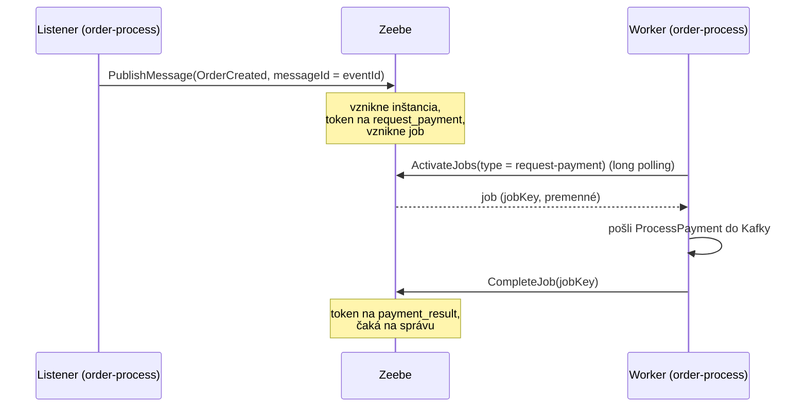

# 06 – Camunda a Zeebe

## Čo sa naučíš

- Čo je Zeebe a čo je „Orchestration Cluster“ v Camunde 8.10
- Prečo **Zeebe nikoho nevolá** (pull model): workery si joby vyzdvihujú samy
- Rozdiel medzi **primárnym** úložiskom (log + RocksDB na PVC) a **sekundárnym** (DB `camunda` v PostgreSQL) a úloha **exportéra**
- Ako sa na Camundu pozrieť: Operate a REST API `/v2/...`

---

## Teória v skratke

### 1. Zeebe = stavový automat ako služba

Zeebe je procesný engine Camundy 8. Dostane BPMN model a pre každú inštanciu si pamätá, **kde je token** a aké má **premenné**. Sám nič „nerobí“ – nevolá REST, nepíše do Kafky. Len:

- vytvára **joby**, keď token príde na service task,
- čaká na **správy** (messages), keď token príde na message event,
- posunie token, keď je job dokončený alebo správa zkorelovaná.

Analógia: Zeebe je **nástenka s úlohami v kuchyni reštaurácie**. Čašník (listener) pripne objednávku. Na nástenke sa objaví lístok „uvar polievku“ (job). Kuchár (worker) si lístok **sám zoberie**, uvarí a odškrtne. Nástenka nikoho nevolá, len ukazuje, čo treba urobiť a čo je hotové.

### 2. Orchestration Cluster

V Camunde 8.10 je všetko v **jednom** image `camunda/camunda:8.10.2` (v deme jeden pod `camunda-0`):

| Časť | Čo robí | Port |
|---|---|---|
| Zeebe broker | engine, drží stav (log udalostí + RocksDB) | interne 26501 |
| Gateway | vstup pre klientov (gRPC aj REST) | gRPC 26500, REST 8080 (`/v2/...`) |
| Operate | UI na sledovanie inštancií a incidentov | 8080 (`/operate`) |
| Tasklist | UI pre user tasky (demo ich nemá) | 8080 (`/tasklist`) |
| Actuator / metriky | health, Prometheus | 9600 |

### 3. Pull model: Zeebe nikoho nevolá

Všetky spojenia otvára `order-process` ako **klient**:



Prečo je to dobré:

- Zeebe nemusí poznať adresy služieb ani ich protokoly.
- Worker si berie toľko práce, koľko zvládne (back-pressure).
- Keď worker nebeží, joby **počkajú** v Zeebe. Nič sa nestratí.

Ako si worker joby berie? Dve možnosti:

| Spôsob | Ako | V deme |
|---|---|---|
| **Long polling** (`ActivateJobs`) | worker sa pýta „máš job typu X?“; gateway drží požiadavku otvorenú, kým job nepríde alebo nevyprší timeout | **áno** |
| **Job streaming** (push) | worker otvorí dlhodobý stream a broker mu joby posiela hneď | nie je zapnutý |

Overené metrikou brokera: `zeebe_broker_jobs_pushed_count_total` je `0`, kým exportér hlási stovky `JOB_BATCH` záznamov (dávky aktivácie jobov). V praxi je to teda long polling. Pre demo to nevadí: long polling vráti job prakticky hneď (v logoch ~17 ms od vzniku inštancie po odoslanie `ProcessPayment`).

### 4. Primárne vs. sekundárne úložisko

| | Primárne | Sekundárne |
|---|---|---|
| Čo | log udalostí Zeebe + RocksDB | DB `camunda` v PostgreSQL (53 tabuliek) |
| Kde | PVC `data-camunda-0` (1 Gi) | pod `postgres-0` |
| Kto zapisuje | Zeebe broker, synchrónne | **exportér**, asynchrónne |
| Kto číta | engine (pri behu procesu) | Operate, Tasklist, REST search API (`/v2/.../search`) |
| Konzistencia | zdroj pravdy | *eventually consistent* – trochu pozadu |

Analógia: primárne úložisko je **účtovná kniha**, do ktorej sa zapisuje každý pohyb. Sekundárne je **výpis z účtu** – vyrába sa z knihy priebežne a môže byť pár stoviek milisekúnd starý.

Dôsledok: čerstvú inštanciu môžeš v Operate alebo cez `search` API vidieť **s oneskorením**. Nikdy nerob rozhodnutia v kóde na základe search API („už existuje inštancia pre túto objednávku?“) – na to je `messageId` a correlation key priamo v engine.

### 5. Prečo gRPC a nie REST

Klient v `order-process` vie hovoriť REST aj gRPC. Demo má `prefer-rest-over-grpc: false`, teda **gRPC**. Dôvod: pri duplicitnom `messageId` vráti gRPC jednoznačný kód `ALREADY_EXISTS`, na ktorý `ProcessGateway` spolieha ([kapitola 08](08_most_zeebe_kafka.md)).

---

## Krok po kroku

Predpoklad: port-forward na Camundu beží (`localhost:8088`). REST API je v deme bez autentizácie.

### 1. Topológia clustra

```powershell
$t = Invoke-RestMethod http://localhost:8088/v2/topology
$t | Select-Object clusterSize, partitionsCount, replicationFactor, gatewayVersion
$t.brokers | Select-Object nodeId, host, port, version
```

```
clusterSize       : 1
partitionsCount   : 1
replicationFactor : 1
gatewayVersion    : 8.10.2

nodeId host        port version
------ ----        ---- -------
     0 10.1.1.164 26501 8.10.2
```

Jeden broker, jedna partícia, bez replikácie. V produkcii by boli aspoň 3 brokery s replikačným faktorom 3.

Surový JSON (`curl.exe -s http://localhost:8088/v2/topology`) ukazuje aj stav partície:

```
{"brokers":[{"nodeId":0,"brokerId":"0","host":"10.1.1.168","port":26501,"partitions":[{"partitionId":1,"role":"leader","health":"healthy","state":"active"}],"version":"8.10.2"}],"clusterId":"64edd678-…","clusterSize":1,"partitionsCount":1,"replicationFactor":1,"gatewayVersion":"8.10.2",...}
```

(IP brokera sa zmení po reštarte podu – tu `10.1.1.164` pred a `10.1.1.168` po reštarte Camundy v [kapitole 09](09_chybove_scenare.md).)

### 2. Nasadené procesy

```powershell
$d = Invoke-RestMethod -Method Post -Uri http://localhost:8088/v2/process-definitions/search -ContentType 'application/json' -Body '{}'
$d.items | Select-Object processDefinitionId, name, version, processDefinitionKey, resourceName
```

```
processDefinitionId name              version processDefinitionKey resourceName
------------------- ----              ------- -------------------- ------------
order-fulfillment   Order fulfillment       1 2251799813685325     order-fulfillment.bpmn
```

`order-process` nasadzuje BPMN pri **každom** štarte (`@Deployment`). Verzia je stále `1`, hoci sa pod počas písania niekoľkokrát reštartoval – Zeebe identický model nenasadí znova (deduplikácia podľa obsahu). Nová verzia vznikne až po zmene BPMN.

V logu `order-process` pri štarte:

```powershell
kubectl -n eda-demo logs deploy/order-process 2>$null | Select-String 'Deployed Processes' | ForEach-Object { ($_.Line | ConvertFrom-Json).message }
```

```
Deployed Processes: <order-fulfillment:1>
```

### 3. Inštancie, premenné, cesta tokenu

Koľko inštancií a v akom stave:

```powershell
$r = Invoke-RestMethod -Method Post -Uri http://localhost:8088/v2/process-instances/search -ContentType 'application/json' -Body '{"filter":{"processDefinitionId":"order-fulfillment"},"page":{"limit":100}}'
$r.items | Group-Object state | Select-Object Name, Count
```

```
Name      Count
----      -----
COMPLETED    19
ACTIVE        1
```

Premenné jednej dokončenej inštancie (objednávka `tutorial-1` z kapitoly 01):

```powershell
$k = '2251799813686295'
$v = Invoke-RestMethod -Method Post -Uri http://localhost:8088/v2/variables/search -ContentType 'application/json' -Body ('{"filter":{"processInstanceKey":"' + $k + '","scopeKey":"' + $k + '"}}')
$v.items | Select-Object name, value
```

```
name          value
----          -----
correlationId "tutorial-1"
amount        99.9
orderId       "3101528e-e2ce-4a55-bfa6-a7790b46e89e"
currency      "CZK"
paymentStatus "COMPLETED"
failureReason null
paymentId     "dca41277-ed8a-430b-937a-661d7bcf84c7"
```

- Hodnoty sú JSON (preto reťazce v úvodzovkách).
- Prvé štyri nastavil `OrderCreated`, posledné tri `PaymentResult`.
- `scopeKey = processInstanceKey` = premenné na úrovni procesu. Bez tohto filtra uvidíš štyri premenné **dvakrát** – raz v scope start eventu (tam ich správa pristála), raz na procese (odtiaľ ich vidia všetky ďalšie kroky).

Cesta tokenu (element instances):

```powershell
$e = Invoke-RestMethod -Method Post -Uri http://localhost:8088/v2/element-instances/search -ContentType 'application/json' -Body ('{"filter":{"processInstanceKey":"' + $k + '"},"sort":[{"field":"startDate"}]}')
$e.items | Select-Object elementId, type, state, startDate
```

```
elementId                 type                     state     startDate
---------                 ----                     -----     ---------
order_created             START_EVENT              COMPLETED 2026-10-08T06:21:28.583Z
request_payment           SERVICE_TASK             COMPLETED 2026-10-08T06:21:28.583Z
payment_result            INTERMEDIATE_CATCH_EVENT COMPLETED 2026-10-08T06:21:28.625Z
payment_completed_gateway EXCLUSIVE_GATEWAY        COMPLETED 2026-10-08T06:21:28.876Z
confirm_order             SERVICE_TASK             COMPLETED 2026-10-08T06:21:28.876Z
order_confirmed           END_EVENT                COMPLETED 2026-10-08T06:21:28.911Z
```

Toto je presne to, čo Operate kreslí ako zelenú cestu v diagrame. Na `payment_result` token čakal 251 ms – kým payment-service zaplatil a výsledok prešiel cez outbox a Kafku.

### 4. Nájdi inštanciu podľa `orderId`

Search API vie filtrovať premenné podľa mena a hodnoty (hodnota je JSON, preto `\"…\"` v reťazci):

```powershell
$o = Invoke-RestMethod -Method Post -Uri http://localhost:8080/orders -ContentType 'application/json' -Headers @{ 'X-Correlation-Id' = 'lag-test-1' } -Body '{"customerId":"c1","amount":12.00,"currency":"CZK"}'
$sw = [Diagnostics.Stopwatch]::StartNew()
$body = '{"filter":{"name":"orderId","value":"\"' + $o.id + '\""}}'
for ($i = 0; $i -lt 50; $i++) {
  $v = Invoke-RestMethod -Method Post -Uri http://localhost:8088/v2/variables/search -ContentType 'application/json' -Body $body
  if ($v.page.totalItems -gt 0) { break }
  Start-Sleep -Milliseconds 100
}
"order {0} visible in search API after {1} ms ({2} pokusov)" -f $o.id, $sw.ElapsedMilliseconds, ($i + 1)
$v.items | Select-Object -First 1 processInstanceKey, name, value
```

```
order 14ef2d96-a49f-4c36-baa1-6e55b1731aa1 visible in search API after 695 ms (5 pokusov)

processInstanceKey : 2251799813686708
name               : orderId
value              : "14ef2d96-a49f-4c36-baa1-6e55b1731aa1"
```

695 ms je súčet: outbox relay (až 500 ms) + Kafka + `publishMessage` + **exportér** do PostgreSQL. Zmeranie ukazuje celkové oneskorenie od `POST /orders`, nie len exportér – ale prakticky vidíš, prečo je sekundárne úložisko „trochu pozadu“.

### 5. Sekundárne úložisko v PostgreSQL

```powershell
kubectl -n eda-demo exec statefulset/postgres -- psql -U postgres -d camunda -c "SELECT count(*) AS tables FROM information_schema.tables WHERE table_schema = 'public';"
kubectl -n eda-demo exec statefulset/postgres -- psql -U postgres -d camunda -c "SELECT state, count(*) FROM process_instance GROUP BY state;"
```

```
 tables
--------
     53
(1 row)

   state   | count
-----------+-------
 ACTIVE    |     1
 COMPLETED |    19
(2 rows)
```

Tie isté čísla ako z REST API – lebo REST search API **číta práve odtiaľto**. Tabuľky vytvára a spravuje Camunda sama (`process_instance`, `job`, `incident`, `variable`…). Nikdy do nich nezapisuj ručne.

### 6. Exportér a joby v metrikách brokera

Metriky brokera sú na porte 9600 (nie je v `port-forward.ps1`), preto dočasný forward na pozadí:

```powershell
$pf = Start-Job { kubectl -n eda-demo port-forward svc/camunda 19600:9600 }
Start-Sleep -Seconds 3
(curl.exe -s http://localhost:19600/actuator/prometheus) -split "`n" | Select-String '^zeebe_broker_jobs_pushed|^zeebe_exporter_events_total' | Select-Object -First 8 | ForEach-Object { $_.Line }
Stop-Job $pf; Remove-Job $pf
```

```
zeebe_broker_jobs_pushed_count_total{broker_id="0",physicalTenant="default"} 0.0
zeebe_exporter_events_total{action="exported",...,valueType="AUTHORIZATION"} 114.0
zeebe_exporter_events_total{action="exported",...,valueType="IDENTITY_SETUP"} 2.0
zeebe_exporter_events_total{action="exported",...,valueType="JOB"} 12.0
zeebe_exporter_events_total{action="exported",...,valueType="JOB_BATCH"} 390.0
zeebe_exporter_events_total{action="exported",...,valueType="JOB_METRICS_BATCH"} 6.0
zeebe_exporter_events_total{action="exported",...,valueType="MESSAGE"} 8.0
zeebe_exporter_events_total{action="exported",...,valueType="MESSAGE_START_EVENT_SUBSCRIPTION"} 2.0
```

- `jobs_pushed = 0` → žiadny job streaming, workery si joby aktivujú pollingom (`JOB_BATCH` = dávka aktivácie).
- Exportér posiela do sekundárneho úložiska **záznamy podľa typu** (`JOB`, `MESSAGE`, `PROCESS_INSTANCE`…). Čísla sú od posledného reštartu podu Camundy.

### 7. Operate

http://localhost:8088/operate, `demo` / `demo`. V Operate nájdeš všetko z krokov 3–5 klikaním: zoznam inštancií s filtrom (Active / Completed / Incidents), diagram s tokenom, panel premenných a históriu. Operate čerpá zo **sekundárneho** úložiska, takže je tiež eventually consistent. (UI som pri písaní neklikal; REST API, ktoré používa, áno.)

---

## Kód z repa

| Súbor | Čo v ňom je |
|---|---|
| [`k8s/base/camunda/camunda.yaml`](../../k8s/base/camunda/camunda.yaml) | ConfigMap (`secondary-storage.type: rdbms`, JDBC URL na DB `camunda`, používateľ `demo`, `unprotectedApi: true`), StatefulSet s PVC `data` na `/usr/local/camunda/data`, porty 8080/26500/9600, probes na 9600 |
| [`order-process/src/main/resources/application.yml`](../../order-process/src/main/resources/application.yml) | `camunda.client`: `mode: self-managed`, `auth.method: none`, `rest-address`, `grpc-address`, `prefer-rest-over-grpc: false` |
| [`order-process/.../OrderProcessApplication.java`](../../order-process/src/main/java/cz/demo/eda/process/OrderProcessApplication.java) | `@Deployment(resources = "classpath*:bpmn/*.bpmn")` – nasadenie BPMN pri štarte |
| [`k8s/base/order-process/order-process.yaml`](../../k8s/base/order-process/order-process.yaml) | `CAMUNDA_REST_ADDRESS=http://camunda:8080`, `CAMUNDA_GRPC_ADDRESS=http://camunda:26500` |

Komentár v `camunda.yaml` hovorí podstatné: *„Primárne úložisko (log udalostí + RocksDB) je na PVC – to je zdroj pravdy o bežiacich inštanciách.“* Preto inštancie prežijú reštart podu Camundy (overené v [kapitole 09](09_chybove_scenare.md)), ale nie teardown (zmaže PVC).

---

## Bez Camundy by to vyzeralo takto

V choreografii **žiadny** explicitný stav toku nebol. Na otázku „kde visí objednávka X?“ si mal:

1. `GET /orders/X` → `PENDING_PAYMENT` (nič viac),
2. `payments.inbox` – prišla správa? Je `FAILED`?
3. `payments.outbox` – odišiel výsledok?
4. logy dvoch služieb podľa `correlationId`.

S Camundou je odpoveď jeden pohľad do Operate (alebo `element-instances/search`): token stojí na `payment_result` od 06:04:51. Stojí ťa to jeden pod navyše a druhé úložisko.

---

## Časté chyby

| Príznak | Príčina | Riešenie |
|---|---|---|
| Inštancia „chýba“ v Operate hneď po vytvorení | Sekundárne úložisko je eventually consistent | Počkaj chvíľu; nikdy na to nestavaj logiku |
| `variables/search` vracia premenné dvakrát | Rovnaké meno v scope start eventu a v scope procesu | Pridaj filter `scopeKey = processInstanceKey` |
| `variables/search` s `value":"abc"` nič nenájde | Hodnota je JSON – reťazec musí byť v úvodzovkách | `"value":"\"abc\""` |
| `order-process` loguje `Failed to activate jobs … UNAVAILABLE: io exception` | Zeebe gateway (gRPC 26500) nie je dostupná | `kubectl get pod camunda-0`; po reštarte trvá chvíľu, kým gRPC začne odpovedať (kapitola 09) |
| Po teardowne zmizli všetky inštancie | PVC sa zmazalo | Očakávané; reštart podu ich nezmaže |
| Nová verzia BPMN sa nenasadila | Image `order-process` nebol prebuildnutý / reštartovaný | `build-images.ps1` + reštart deploymentu ([kapitola 07](07_bpmn_proces.md), krok 5) |

---

## Otázky na zopakovanie

**Volá Zeebe niekedy služby?**
Nie. Všetky spojenia otvára klient (`order-process`): listenery publikujú správy, workery si aktivujú joby a hlásia ich dokončenie.

**Aký je rozdiel medzi primárnym a sekundárnym úložiskom?**
Primárne (log + RocksDB na PVC) je zdroj pravdy pre engine. Sekundárne (DB `camunda`) je kópia pre Operate a search API, plnená exportérom asynchrónne – preto môže byť pozadu.

**Prečo nesmieš v kóde rozhodovať podľa search API?**
Lebo je eventually consistent. Čerstvá inštancia tam ešte nemusí byť. Deduplikáciu rieš cez `messageId`, koreláciu cez correlation key.

**Prečo demo používa gRPC?**
Kvôli jednoznačnému kódu `ALREADY_EXISTS` pri duplicitnom `messageId`.

**Používa demo job streaming?**
Nie. `zeebe_broker_jobs_pushed_count_total` je 0, workery používajú long polling `ActivateJobs`.

## Vyskúšaj si

1. Spusti dotaz z kroku 3 pre inštanciu, ktorá skončila `PAYMENT_FAILED` (nájdi ju v Operate alebo cez `variables/search` s `paymentStatus` = `"FAILED"`). **Očakávanie:** cesta cez `cancel_order` a `order_cancelled`, `failureReason` = `"Payment declined by simulated gateway"`.
2. Porovnaj počty `COMPLETED`/`ACTIVE` z REST API a z tabuľky `process_instance`. **Očakávanie:** zhodujú sa (REST search číta tú istú DB).

---

**Ďalej:** [07 – BPMN proces](07_bpmn_proces.md)
