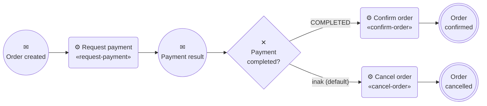
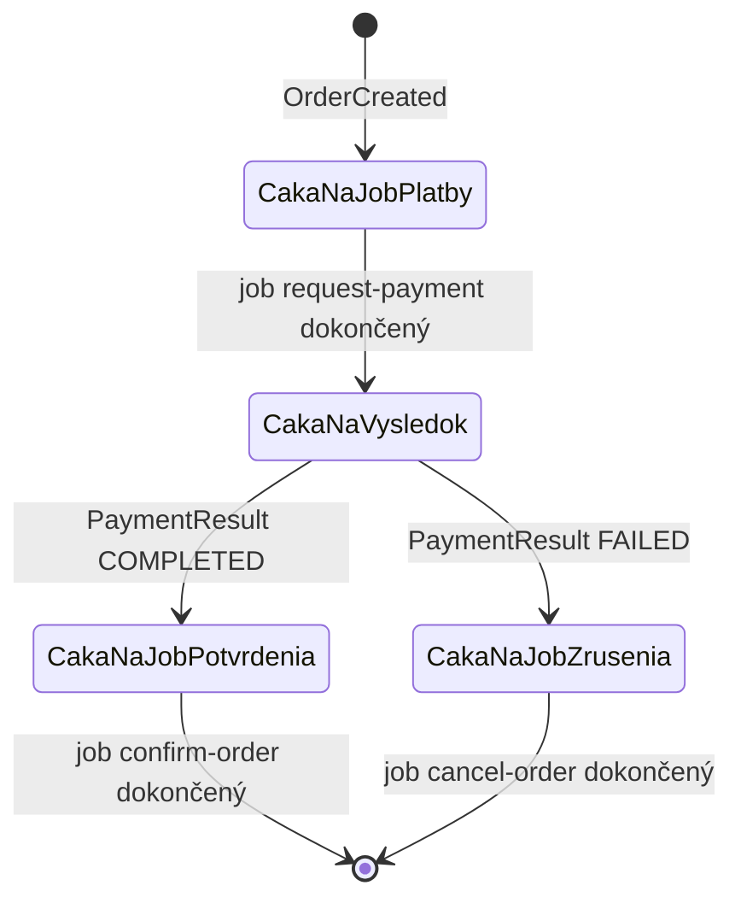

# 07 – BPMN proces `order-fulfillment`

## Čo sa naučíš

- Čítať [`order-fulfillment.bpmn`](../../order-process/src/main/resources/bpmn/order-fulfillment.bpmn) element po elemente
- Čo je **token** a ako „putuje“ procesom
- Ako funguje **message start event**, **intermediate message catch event** a **correlation key**
- Ako **exclusive gateway** rozhoduje podľa premennej a čo je **default flow**

---

## Teória v skratke

### 1. BPMN = diagram, ktorý sa dá spustiť

BPMN (Business Process Model and Notation) je štandard na kreslenie procesov. Súbor `.bpmn` je XML s dvoma časťami:

- `<bpmn:process>` – **logika**: elementy, prechody, podmienky (toto vykonáva Zeebe),
- `<bpmndi:BPMNDiagram>` – **súradnice** na kreslenie (toto potrebuje len Modeler a Operate).

Proces vyzerá takto (prepis z README):



### 2. Token

Analógia: **figúrka v spoločenskej hre**. Každá inštancia procesu (= jedna objednávka) má svoju figúrku. Figúrka stojí na políčku, kým sa nesplní podmienka na posun (job dokončený, správa prišla). Diagram je hracia doska, inštancia je jedna hra.

V Operate je token vidieť ako počet na elemente (koľko inštancií tam práve stojí).

### 3. Element po elemente

| ID | Typ | Čo sa tu deje | Token čaká na |
|---|---|---|---|
| `order_created` | **message start event** | správa `OrderCreated` **vytvorí** novú inštanciu a jej premenné (`orderId`, `amount`, `currency`, `correlationId`) | – (tu vzniká) |
| `request_payment` | **service task**, job type `request-payment`, `retries="3"` | Zeebe vytvorí job; `RequestPaymentWorker` pošle `ProcessPayment` | dokončenie jobu |
| `payment_result` | **intermediate message catch event** | čaká na správu `PaymentResult` s correlation key `=orderId` | správu |
| `payment_completed_gateway` | **exclusive gateway**, `default="flow_failed"` | `=paymentStatus = "COMPLETED"` → `confirm_order`, inak `cancel_order` | nič (rozhodne hneď) |
| `confirm_order` | service task, `confirm-order` | `ConfirmOrderWorker` pošle `ConfirmOrder` | dokončenie jobu |
| `cancel_order` | service task, `cancel-order` | `CancelOrderWorker` pošle `CancelOrder` | dokončenie jobu |
| `order_confirmed` / `order_cancelled` | end event | koniec, inštancia `COMPLETED` | – |

### 4. Správy a correlation key

V BPMN sú dve správy:

```xml
<bpmn:message id="message_order_created" name="OrderCreated" />
<bpmn:message id="message_payment_result" name="PaymentResult">
  <bpmn:extensionElements>
    <zeebe:subscription correlationKey="=orderId" />
  </bpmn:extensionElements>
</bpmn:message>
```

- **`OrderCreated`** nemá correlation key v modeli – je to start event, nová inštancia vzniká vždy. (Klient ho pri publikovaní posiela tiež – `orderId` – a Zeebe ho pri message start evente použije na to, aby pre rovnaký kľúč nebežali dve inštancie naraz.)
- **`PaymentResult`** má `correlationKey="=orderId"`. Keď token príde na `payment_result`, Zeebe vytvorí **subscription**: „čakám na správu `PaymentResult` s kľúčom = hodnota premennej `orderId` tejto inštancie“. Prvé `=` znamená, že je to FEEL výraz.

Analógia: correlation key je **číslo stola v reštaurácii**. Kuchyňa (payment-service) pošle jedlo s číslom stola, čašník (Zeebe) ho donesie k správnemu stolu (inštancii), nie k prvému, ktorý čaká.

### 5. Exclusive gateway a default flow

```xml
<bpmn:exclusiveGateway id="payment_completed_gateway" name="Payment completed?" default="flow_failed">
...
<bpmn:sequenceFlow id="flow_completed" name="yes" sourceRef="payment_completed_gateway" targetRef="confirm_order">
  <bpmn:conditionExpression xsi:type="bpmn:tFormalExpression">=paymentStatus = "COMPLETED"</bpmn:conditionExpression>
</bpmn:sequenceFlow>
<bpmn:sequenceFlow id="flow_failed" name="no" sourceRef="payment_completed_gateway" targetRef="cancel_order" />
```

- Exclusive (XOR) = ide sa **práve jednou** vetvou.
- `flow_completed` má podmienku. `flow_failed` nemá žiadnu, je **default** – použije sa, keď žiadna podmienka neplatí.
- Prečo default namiesto `=paymentStatus = "FAILED"`? Keby prišiel neočakávaný stav (napr. `null`), bez defaultu by gateway nenašla cestu a vznikol by **incident**. S defaultom bezpečne zruší objednávku.

### 6. Stavový automat procesu

Proces je stavový automat s „čakacími“ stavmi:



Každý čakací stav je bezpečne uložený v Zeebe. Keď všetko spadne a znova nabehne, inštancia čaká presne tam, kde bola.

---

## Krok po kroku

### 1. Elementy priamo zo súboru

```powershell
Select-String -Path order-process\src\main\resources\bpmn\order-fulfillment.bpmn -Pattern '<bpmn:(startEvent|serviceTask|intermediateCatchEvent|exclusiveGateway|endEvent|message) |zeebe:(taskDefinition|subscription)|conditionExpression' | ForEach-Object { $_.Line.Trim() }
```

```
<bpmn:startEvent id="order_created" name="Order created">
<bpmn:serviceTask id="request_payment" name="Request payment">
<zeebe:taskDefinition type="request-payment" retries="3" />
<bpmn:intermediateCatchEvent id="payment_result" name="Payment result">
<bpmn:exclusiveGateway id="payment_completed_gateway" name="Payment completed?" default="flow_failed">
<bpmn:serviceTask id="confirm_order" name="Confirm order">
<zeebe:taskDefinition type="confirm-order" retries="3" />
<bpmn:serviceTask id="cancel_order" name="Cancel order">
<zeebe:taskDefinition type="cancel-order" retries="3" />
<bpmn:endEvent id="order_confirmed" name="Order confirmed">
<bpmn:endEvent id="order_cancelled" name="Order cancelled">
<bpmn:conditionExpression xsi:type="bpmn:tFormalExpression">=paymentStatus = "COMPLETED"</bpmn:conditionExpression>
<bpmn:message id="message_order_created" name="OrderCreated" />
<bpmn:message id="message_payment_result" name="PaymentResult">
<zeebe:subscription correlationKey="=orderId" />
```

To je celá logika procesu na 15 riadkoch.

### 2. Kto na čo čaká: message subscriptions

```powershell
$s = Invoke-RestMethod -Method Post -Uri http://localhost:8088/v2/message-subscriptions/search -ContentType 'application/json' -Body '{"filter":{"messageSubscriptionState":"CREATED"}}'
$s.items | Select-Object processInstanceKey, elementId, messageName, correlationKey, messageSubscriptionState
```

```
processInstanceKey elementId      messageName   correlationKey                       messageSubscriptionState
------------------ ---------      -----------   --------------                       ------------------------
                   order_created  OrderCreated                                       CREATED
2251799813685609   payment_result PaymentResult debb6888-0ea7-4517-b2c4-573ee14878d4 CREATED
2251799813686366   payment_result PaymentResult 1c116cc8-e9fb-4c7c-aa80-4f5bf4c18052 CREATED
```

- Prvý riadok: **start event subscription** – patrí procesu, nie inštancii (preto prázdny `processInstanceKey`). Hovorí „každá správa `OrderCreated` spustí novú inštanciu“.
- Ďalšie dva: dve inštancie stoja na `payment_result` a čakajú na `PaymentResult` so svojím `orderId`. Obe sú poison objednávky (suma 666), ktorým výsledok nikdy nepríde ([kapitola 09](09_chybove_scenare.md)). Druhú (`1c116cc8-…`) som neskôr v kapitole 09 „zachránil“ ručne poslaným výsledkom, takže dnes uvidíš už len jednu.

### 3. Kde stojí token zaseknutej inštancie

```powershell
$e = Invoke-RestMethod -Method Post -Uri http://localhost:8088/v2/element-instances/search -ContentType 'application/json' -Body '{"filter":{"processInstanceKey":"2251799813685609"}}'
$e.items | Select-Object elementId, type, state
```

```
elementId       type                     state
---------       ----                     -----
order_created   START_EVENT              COMPLETED
request_payment SERVICE_TASK             COMPLETED
payment_result  INTERMEDIATE_CATCH_EVENT ACTIVE
```

Token je na `payment_result` (`ACTIVE`). `request_payment` je `COMPLETED` – príkaz `ProcessPayment` teda odišiel, problém je až na strane payment-service.

### 4. Ktoré správy už boli zkorelované

```powershell
$c = Invoke-RestMethod -Method Post -Uri http://localhost:8088/v2/correlated-message-subscriptions/search -ContentType 'application/json' -Body '{"page":{"limit":3}}'
$c.items | Select-Object processInstanceKey, elementId, messageName, correlationKey, messageKey
"total: " + $c.page.totalItems
```

```
processInstanceKey elementId     messageName  correlationKey                       messageKey
------------------ ---------     -----------  --------------                       ----------
2251799813685334   order_created OrderCreated 751b4da4-be21-4cf8-860a-6f8d8b632ad3 2251799813685333
2251799813685356   order_created OrderCreated e3bf1ece-250c-4201-b422-e4e771aa2613 2251799813685355
2251799813685371   order_created OrderCreated b9a73cf2-1434-4b1a-9056-d4ce6f5a128a 2251799813685370
total: 40
```

40 = 20 × `OrderCreated` + 20 × `PaymentResult` (stav v čase dotazu). Pri `OrderCreated` vidno, že klient posiela `orderId` ako correlation key aj pri start evente.

### 5. Desktop Modeler

Stiahni Camunda Desktop Modeler (camunda.com → Download → Modeler), otvor v ňom `order-process\src\main\resources\bpmn\order-fulfillment.bpmn`. V pravom paneli pri elementoch uvidíš job type, retries, correlation key a podmienku. Súbor má `modeler:executionPlatform="Camunda Cloud"` a verziu `8.10.0`, takže ho Modeler otvorí ako Camunda 8 diagram.

**Neoverené:** Modeler na stroji, kde sa poznámky písali, nainštalovaný nie je. Diagram v README (mermaid) je prepis tohto súboru.

Ako dostať zmenu do bežiaceho stacku: `order-process` nasadzuje BPMN pri štarte sám (`@Deployment`), takže stačí uložiť BPMN → `.\scripts\build-images.ps1` → reštart `order-process` (napr. `kubectl -n eda-demo rollout restart deploy/order-process`). Pri štarte sa nasadí nová verzia procesu. Bežiace inštancie zostanú na **svojej** (starej) verzii, nové pobežia na novej. Toto som pri písaní nespúšťal (zmena kódu a nasadenie sú mimo rozsahu overovania).

---

## Kód z repa

| Súbor | Čo v ňom je |
|---|---|
| [`order-fulfillment.bpmn`](../../order-process/src/main/resources/bpmn/order-fulfillment.bpmn) | model procesu |
| [`process/ProcessMessages.java`](../../order-process/src/main/java/cz/demo/eda/process/process/ProcessMessages.java) | konštanty: `PROCESS_ID`, mená správ a job typov – **musia sedieť s BPMN** |
| [`process/OrderVariables.java`](../../order-process/src/main/java/cz/demo/eda/process/process/OrderVariables.java) | record s premennými inštancie, ako ich čítajú workery (`job.getVariablesAsType(OrderVariables.class)`) |
| [`messaging/OrderCreatedListener.java`](../../order-process/src/main/java/cz/demo/eda/process/messaging/OrderCreatedListener.java) | naplní premenné `orderId`, `amount`, `currency`, `correlationId` |
| [`messaging/PaymentResultListener.java`](../../order-process/src/main/java/cz/demo/eda/process/messaging/PaymentResultListener.java) | naplní `paymentStatus` (`COMPLETED`/`FAILED`), `paymentId`, `failureReason` |

`ProcessMessages` je „lepidlo“ medzi Javou a BPMN. Keď v Modeleri premenuješ job type `request-payment` a nezmeníš konštantu, worker bude čakať na job typ, ktorý nikto nevytvára, a token zostane na `request_payment` navždy (bez incidentu – job jednoducho nikto neaktivuje).

Prečo `PaymentResultListener` dáva do mapy aj `null` hodnoty (`failureReason = null` pri úspechu)? Premenné správy sa **zlúčia** s premennými inštancie. Explicitný `null` zaručí, že premenná existuje vždy a FEEL podmienka v gateway ani worker nenarazia na „chýbajúcu premennú“.

---

## Bez Camundy by to vyzeralo takto

V choreografii (`ba78d05`) bol „proces“ len v hlavách vývojárov:

| BPMN element | Kde bol v choreografii |
|---|---|
| `order_created` (start) | `OrderCreatedListener` v **payment-service** |
| `request_payment` | implicitne: payment-service rovno platil |
| `payment_result` (čakanie) | nikde – nikto „nečakal“, order-service len reagoval, keď výsledok prišiel |
| `payment_completed_gateway` | `switch` v `OrderService.transition` |
| `confirm_order` / `cancel_order` | `order.markPaid` / `order.markPaymentFailed` priamo v order-service |

Keby si chcel pridať napr. „ak platba nepríde do 10 minút, zruš objednávku“, v choreografii by si potreboval vlastnú tabuľku s termínmi a plánovač. V BPMN je to jeden **timer** – buď ako boundary event na receive tasku, ktorým nahradíš `payment_result`, alebo vetva event-based gateway ([kapitola 12](12_cvicenia.md), cvičenie 9).

---

## Časté chyby

| Príznak | Príčina | Riešenie |
|---|---|---|
| Token stojí na service tasku a nič sa nedeje, žiadny incident | Žiadny worker pre daný job type (preklep, nesúlad s `ProcessMessages`) | Porovnaj `zeebe:taskDefinition type` s `@JobWorker(type = …)` |
| Token stojí na `payment_result` | Správa `PaymentResult` s daným `orderId` neprišla (poison, DLT) | `message-subscriptions/search`; kapitola 09 |
| Incident na gateway „no outgoing flow“ | Žiadna podmienka neplatí a chýba default flow | V deme vyriešené `default="flow_failed"` |
| Incident „failed to evaluate expression“ | Premenná v FEEL výraze neexistuje | Listener dáva explicitné `null` hodnoty |
| Zmena BPMN sa neprejavila | Starý image alebo nereštartovaný pod | Rebuild + rollout restart; pozri verziu v `process-definitions/search` |
| Bežiaca inštancia nevidí nový krok | Inštancie bežia na verzii, s ktorou vznikli | Očakávané; migrácia inštancií je samostatná téma |

---

## Otázky na zopakovanie

**Čo je token?**
Myslená značka, ktorá ukazuje, kde v diagrame sa inštancia práve nachádza. Každá inštancia má svoj token (pri paralelných vetvách aj viac).

**Ako vzniká inštancia procesu?**
Publikovaním správy `OrderCreated` – proces začína message start eventom. Kód nikde nevolá „create process instance“.

**Čo je correlation key a aký má `PaymentResult`?**
Hodnota, podľa ktorej Zeebe páruje správu s čakajúcou inštanciou. Pre `PaymentResult` je to `=orderId`.

**Prečo má gateway default flow?**
Aby pri neočakávanej hodnote `paymentStatus` nevznikol incident – objednávka sa radšej zruší.

**Čo sa stane s bežiacimi inštanciami po nasadení novej verzie BPMN?**
Dobehnú na svojej pôvodnej verzii. Nová verzia platí pre nové inštancie.

## Vyskúšaj si

1. Spusti dotaz z kroku 2 a potom pošli normálnu objednávku. Hneď (do 200 ms) dotaz zopakuj. **Očakávanie:** väčšinou už nič nové neuvidíš – inštancia prebehne za < 1 s a subscription na `payment_result` sa hneď zkoreluje. Čakajúce zostávajú len poison inštancie.
2. V `order-fulfillment.bpmn` nájdi `flow_failed` a vysvetli, prečo nemá `conditionExpression`. **Očakávanie:** je to default flow gateway.

---

**Ďalej:** [08 – Most Zeebe ↔ Kafka](08_most_zeebe_kafka.md)
