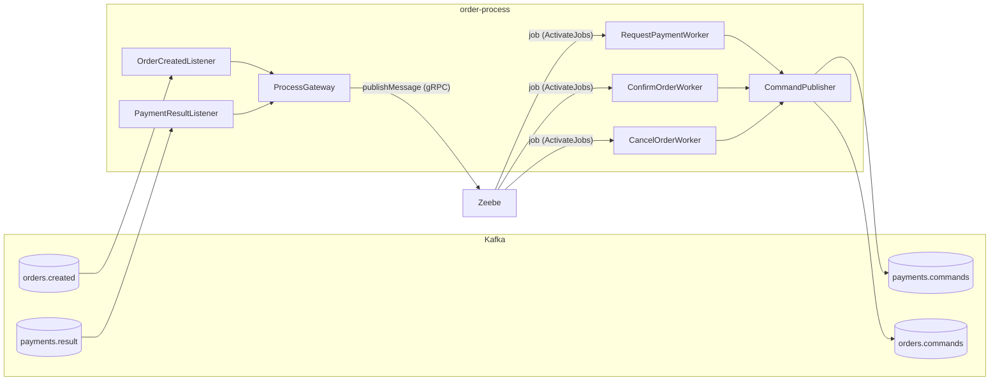

# 08 – Most Zeebe ↔ Kafka

## Čo sa naučíš

- Ako `order-process` prekladá Kafka správy na Zeebe správy (**listenery + `ProcessGateway`**) a joby na Kafka príkazy (**workery + `CommandPublisher`**)
- Prečo `messageId = eventId` robí z Zeebe deduplikátor a prečo je `ALREADY_EXISTS` úspech
- Prečo je `eventId` príkazu **odvodené z `jobKey`** a ako si to overíš sám
- Prečo má message TTL hodnotu **1 hodina** a nie 1 minúta

---

## Teória v skratke

### 1. Dva smery mostu

Zeebe nevie nič o Kafke a Kafka nič o Zeebe. `order-process` je **tlmočník** medzi nimi:



| Smer | Vstup | Kto | Výstup |
|---|---|---|---|
| Kafka → Zeebe | `OrderCreated` z `orders.created` | `OrderCreatedListener` → `ProcessGateway` | správa `OrderCreated` (vznikne inštancia) |
| Kafka → Zeebe | `PaymentCompleted/Failed` z `payments.result` | `PaymentResultListener` → `ProcessGateway` | správa `PaymentResult` (correlation key `orderId`) |
| Zeebe → Kafka | job `request-payment` | `RequestPaymentWorker` → `CommandPublisher` | `ProcessPayment` do `payments.commands` |
| Zeebe → Kafka | job `confirm-order` / `cancel-order` | `ConfirmOrderWorker` / `CancelOrderWorker` | `ConfirmOrder` / `CancelOrder` do `orders.commands` |

### 2. Kafka → Zeebe: `messageId = eventId`

Kafka doručuje **at-least-once**, takže `OrderCreated` môže prísť dvakrát (napr. outbox relay spadol po odoslaní). Druhá kópia by vytvorila **druhú inštanciu procesu** a druhú platbu. Riešenie bez vlastnej DB:

- `ProcessGateway` publikuje správu s `messageId = eventId` z Kafky.
- Zeebe si `messageId` pamätá **počas TTL správy**. Druhú správu s rovnakým `messageId` (a rovnakým menom) odmietne kódom `ALREADY_EXISTS`.
- `ProcessGateway` berie `ALREADY_EXISTS` ako **úspech** (vráti `false`, zaloguje „Duplicate … skipped“). Listener sa vráti normálne, offset sa potvrdí.

Analógia: šatňa v divadle. Každý kabát má lístok s číslom (`eventId`). Keď niekto prinesie kabát s číslom, ktoré už na vešiaku visí, šatniarka povie „ten už mám“ a nezavesí ho druhýkrát.

Každá iná chyba (napr. Zeebe nedostupné) sa **vyhodí ďalej** → `DefaultErrorHandler` skúša 3× s backoffom → DLT. Offset sa potvrdí až po úspechu (`AckMode.RECORD`).

### 3. Zeebe → Kafka: `commandId` z `jobKey`

Worker urobí dve veci: **pošle príkaz do Kafky** a **dokončí job**. Ani toto nejde atomicky (zase dual write). Čo ak worker pošle `ProcessPayment` a spadne pred `completeJob`?

- Zeebe po **timeoute jobu** (štandardne 5 minút) job rozdá znova.
- Worker pošle `ProcessPayment` **druhýkrát**.
- Keby mal príkaz náhodné `eventId`, payment-service by zaplatil dvakrát.

Riešenie: `eventId` príkazu sa **odvodí z `jobKey`**:

```java
public static UUID commandId(long jobKey) {
    return UUID.nameUUIDFromBytes(("job-" + jobKey).getBytes(StandardCharsets.UTF_8));
}
```

Ten istý job (rovnaký `jobKey`) → vždy rovnaké `eventId` → inbox payment-service duplicitu zahodí. `UUID.nameUUIDFromBytes` vyrobí UUID **verzie 3** (MD5 z mena), preto majú príkazy v Kafke v tretej skupine `3xxx`.

### 4. Synchrónne odoslanie namiesto outboxu

```java
kafkaTemplate.send(record).get(SEND_TIMEOUT.toMillis(), TimeUnit.MILLISECONDS);
```

`CommandPublisher` **čaká na potvrdenie brokera** (`acks: all`), až potom sa metóda workera vráti a Spring klient Camundy job **automaticky dokončí**. Ak odoslanie zlyhá, vyhodí `CommandPublishException` → job sa nedokončí → Zeebe zníži `retries` (3 v BPMN) → pri 0 vznikne **incident**.

| Pád | Čo sa stane | Prečo je to v poriadku |
|---|---|---|
| pred odoslaním | job sa po timeoute zopakuje | príkaz ešte neodišiel |
| po odoslaní, pred `completeJob` | job sa po timeoute zopakuje, príkaz odíde znova | rovnaké `eventId` → inbox ho zahodí |
| odoslanie zlyhá (Kafka dole) | výnimka, `retries - 1`, nakoniec incident | človek vidí incident v Operate a môže ho po oprave vyriešiť |

### 5. Message TTL = 1 hodina, a prečo nie menej

TTL správy = ako dlho Zeebe drží publikovanú správu, ak na ňu **zatiaľ nikto nečaká**. Kedy sa to stane? Keď výsledok platby **predbehne** proces:

1. Worker pošle `ProcessPayment`, ale pred `completeJob` sa zasekne (alebo spadne).
2. payment-service rýchlo zaplatí a `PaymentResult` príde do Zeebe.
3. Token je ešte na `request_payment`, nie na `payment_result` → nikto nečaká → Zeebe správu **podrží** (TTL).
4. Po timeoute jobu (5 min) sa job zopakuje, token prejde na `payment_result` a Zeebe podržanú správu **hneď zkoreluje**.

Keby bolo TTL kratšie ako timeout jobu (napr. 1 minúta), správa by v kroku 3 **vypršala** a inštancia by na `payment_result` čakala navždy. Preto 1 h: pokryje 5 min timeout jobu + čas, kým niekto vyrieši prípadný incident. Navyše je TTL aj **okno deduplikácie** `messageId` – duplicita, ktorá príde po vypršaní TTL, už odhalená nebude.

`ProcessProperties` odmietne nulové alebo záporné TTL už pri štarte aplikácie (fail fast).

---

## Krok po kroku

### 1. `messageId` = `eventId` z outboxu

Objednávka `lag-test-1` z kapitoly 06. Logy `order-process` (pole `jobKey` a `processInstanceKey` pridáva do MDC Camunda klient pri jobe):

```powershell
kubectl -n eda-demo logs deploy/order-process --since=3h 2>$null | Select-String 'lag-test-1' | ForEach-Object { $j = $_.Line | ConvertFrom-Json; '{0} | jobKey={1} processInstanceKey={2}' -f $j.message, $j.jobKey, $j.processInstanceKey }
```

```
Message OrderCreated published for 14ef2d96-a49f-4c36-baa1-6e55b1731aa1 (messageId 44376e5d-93c9-45f7-ade3-20b8b0c2f013) | jobKey= processInstanceKey=
Process order-fulfillment requested for order 14ef2d96-a49f-4c36-baa1-6e55b1731aa1 | jobKey= processInstanceKey=
ProcessPayment 2c32cb6a-3d1d-333a-899a-ec5f9b478541 sent for order 14ef2d96-a49f-4c36-baa1-6e55b1731aa1 | jobKey=2251799813686721 processInstanceKey=2251799813686708
Message PaymentResult published for 14ef2d96-a49f-4c36-baa1-6e55b1731aa1 (messageId 85063bb8-34fe-499a-bc41-c7a3337f32a9) | jobKey= processInstanceKey=
ConfirmOrder 861bb6cc-1c95-39ed-b3ee-509ba2ad3492 sent for order 14ef2d96-a49f-4c36-baa1-6e55b1731aa1 | jobKey=2251799813686738 processInstanceKey=2251799813686708
```

A `event_id` v outboxe order-service:

```powershell
kubectl -n eda-demo exec statefulset/postgres -- psql -U postgres -d eda -c "SELECT event_id, published_at FROM orders.outbox WHERE message_key = '14ef2d96-a49f-4c36-baa1-6e55b1731aa1';"
```

```
               event_id               |         published_at
--------------------------------------+------------------------------
 44376e5d-93c9-45f7-ade3-20b8b0c2f013 | 2026-10-08 06:37:21.90787+00
(1 row)
```

`messageId` v Zeebe = `event_id` v outboxe. Jedno ID prejde od DB cez Kafku až do Zeebe.

### 2. Prepočítaj `commandId` z `jobKey`

PowerShell ekvivalent `UUID.nameUUIDFromBytes` (MD5 + nastavenie verzie a variantu):

```powershell
function Get-CommandId([long] $jobKey) {
  $md5 = [Security.Cryptography.MD5]::Create().ComputeHash([Text.Encoding]::UTF8.GetBytes("job-$jobKey"))
  $md5[6] = ($md5[6] -band 0x0f) -bor 0x30   # verzia 3
  $md5[8] = ($md5[8] -band 0x3f) -bor 0x80   # IETF variant
  ($md5 | ForEach-Object { $_.ToString('x2') }) -join '' -replace '^(.{8})(.{4})(.{4})(.{4})(.{12})$', '$1-$2-$3-$4-$5'
}
Get-CommandId 2251799813686721
Get-CommandId 2251799813686738
```

```
2c32cb6a-3d1d-333a-899a-ec5f9b478541
861bb6cc-1c95-39ed-b3ee-509ba2ad3492
```

Presne `eventId` príkazov `ProcessPayment` a `ConfirmOrder` z logu. ID nie je náhodné – kto pozná `jobKey`, vie ho kedykoľvek vypočítať znova. Presne na tom stojí idempotencia pri opakovanom jobe.

### 3. Duplicitný `PaymentResult`: Zeebe ho odmietne

Pošleme znova výsledok platby objednávky `tutorial-1` s **pôvodným** `eventId` `342cdce7-…` (inštancia je už dávno dokončená):

```powershell
$msg = '3101528e-e2ce-4a55-bfa6-a7790b46e89e|{"type":"PaymentCompleted","eventId":"342cdce7-fe71-40ad-8a64-77de498ee541","timestamp":"2026-10-08T06:21:28.848Z","correlationId":"tutorial-1","orderId":"3101528e-e2ce-4a55-bfa6-a7790b46e89e","paymentId":"dca41277-ed8a-430b-937a-661d7bcf84c7","amount":99.9}'
$msg | kubectl -n eda-demo exec -i deploy/kafka -- /opt/kafka/bin/kafka-console-producer.sh --bootstrap-server localhost:9092 --topic payments.result --reader-property parse.key=true --reader-property key.separator='|'
Start-Sleep -Seconds 3
kubectl -n eda-demo logs deploy/order-process --since=1m 2>$null | Select-String 'Duplicate|PaymentResult' | ForEach-Object { ($_.Line | ConvertFrom-Json).message }
```

```
Duplicate message PaymentResult for 3101528e-e2ce-4a55-bfa6-a7790b46e89e (messageId 342cdce7-fe71-40ad-8a64-77de498ee541) skipped
```

- Žiadne `Message PaymentResult published`, žiadna výnimka, nič v `payments.result.DLT`.
- Funguje to, lebo pôvodná správa je v Zeebe ešte v rámci TTL (1 h), hoci už bola zkorelovaná. Po hodine by Zeebe duplicitu prijal ako novú správu – a keďže na ňu nikto nečaká, po ďalšej hodine by ticho vypršala.

### 4. Joby a workery v metrikách klienta

```powershell
(curl.exe -s http://localhost:8082/actuator/prometheus) -split "`n" | Select-String -Pattern '^camunda_client_worker_job_(activated|handled)_total' | ForEach-Object { $_.Line }
```

```
camunda_client_worker_job_activated_total{application="order-process",type="cancel-order"} 0.0
camunda_client_worker_job_activated_total{application="order-process",type="confirm-order"} 2.0
camunda_client_worker_job_activated_total{application="order-process",type="request-payment"} 2.0
camunda_client_worker_job_handled_total{application="order-process",type="cancel-order"} 0.0
camunda_client_worker_job_handled_total{application="order-process",type="confirm-order"} 2.0
camunda_client_worker_job_handled_total{application="order-process",type="request-payment"} 2.0
```

Čísla sú od posledného štartu podu `order-process` (počítadlá sú v pamäti). `activated` = koľko jobov si worker vyzdvihol, `handled` = koľko dokončil.

---

## Kód z repa

| Súbor | Na čo sa pozrieť |
|---|---|
| [`process/ProcessGateway.java`](../../order-process/src/main/java/cz/demo/eda/process/process/ProcessGateway.java) | jediné miesto, kde sa volá `newPublishMessageCommand()`: `messageName`, `correlationKey`, `messageId`, `timeToLive`, `variables`, `.send().join()`; `ALREADY_EXISTS` → `false` |
| [`messaging/OrderCreatedListener.java`](../../order-process/src/main/java/cz/demo/eda/process/messaging/OrderCreatedListener.java) | `@KafkaListener` na `orders.created`, premenné cez `HashMap` (kvôli `null` – `Map.of` ich nepripúšťa) |
| [`messaging/PaymentResultListener.java`](../../order-process/src/main/java/cz/demo/eda/process/messaging/PaymentResultListener.java) | pattern matching `switch` nad sealed `PaymentResult` → `paymentStatus`, `paymentId`, `failureReason` |
| [`worker/RequestPaymentWorker.java`](../../order-process/src/main/java/cz/demo/eda/process/worker/RequestPaymentWorker.java) | `@JobWorker(type = "request-payment")`, `job.getVariablesAsType(OrderVariables.class)`, `CommandPublisher.commandId(job.getKey())` |
| [`worker/CorrelationScope.java`](../../order-process/src/main/java/cz/demo/eda/process/worker/CorrelationScope.java) | `correlationId` do MDC počas jobu (worker nebeží v Kafka listeneri, interceptor mu ho nenastaví) |
| [`messaging/CommandPublisher.java`](../../order-process/src/main/java/cz/demo/eda/process/messaging/CommandPublisher.java) | `commandId(jobKey)`, synchrónne `send(...).get(10 s)`, hlavička `X-Correlation-Id` |
| [`config/ProcessProperties.java`](../../order-process/src/main/java/cz/demo/eda/process/config/ProcessProperties.java) | `eda.process.message-ttl` (default `1h`), validácia kladnej hodnoty |

Jadro `ProcessGateway.publish`:

```java
try {
    client.newPublishMessageCommand()
            .messageName(messageName)
            .correlationKey(correlationKey)
            .messageId(messageId.toString())
            .timeToLive(properties.messageTtl())
            .variables(variables)
            .send()
            .join();
    return true;
} catch (ClientStatusException e) {
    if (e.getStatusCode() != Status.Code.ALREADY_EXISTS) {
        throw e;                       // iná chyba → Kafka retry → DLT
    }
    return false;                      // duplicita = úspech
}
```

`.join()` čaká na potvrdenie Zeebe. Bez neho by sa offset v Kafke potvrdil skôr, ako by Zeebe správu naozaj prijal.

Worker je obyčajná metóda – `@JobWorker` (Camunda Spring SDK) zariadi aktiváciu, deserializáciu premenných aj automatické `completeJob` po návrate (alebo `failJob` pri výnimke):

```java
@JobWorker(type = ProcessMessages.JOB_REQUEST_PAYMENT)
public void requestPayment(ActivatedJob job) {
    OrderVariables variables = job.getVariablesAsType(OrderVariables.class);
    try (CorrelationScope ignored = CorrelationScope.open(variables.correlationId())) {
        ProcessPayment command = new ProcessPayment(CommandPublisher.commandId(job.getKey()), clock.instant(),
                variables.correlationId(), variables.orderId(), variables.amount(), variables.currency());
        publisher.send(Topics.PAYMENTS_COMMANDS, variables.orderId(), command, variables.correlationId());
    }
}
```

---

## Bez Camundy by to vyzeralo takto

V choreografii nebolo čo „premosťovať“ – služby si posielali udalosti priamo a deduplikáciu robil len inbox v DB. S Camundou prišli dve nové otázky, ktoré v choreografii neexistovali:

| Otázka | Odpoveď v deme |
|---|---|
| Ako deduplikovať vstup do procesu bez vlastnej DB? | `messageId = eventId` + TTL v Zeebe |
| Ako zaručiť, že opakovaný job nepošle „nový“ príkaz? | `eventId` príkazu = f(`jobKey`) |
| Čo keď odpoveď predbehne proces? | Zeebe správu podrží počas TTL |

Bez Camundy by si tieto veci (ak by si chcel stav toku) riešil tabuľkou „saga“ s vlastnými zámkami a plánovačmi.

---

## Časté chyby

| Príznak | Príčina | Riešenie |
|---|---|---|
| Duplicitný `OrderCreated` vytvoril dve inštancie | `messageId` sa nenastavuje alebo je náhodné | Vždy `messageId = eventId` zo správy; `ProcessGateway` odmietne `null` |
| Pri duplicite skončí správa v DLT | `ALREADY_EXISTS` sa nevyhodnotí ako úspech (napr. REST namiesto gRPC) | `prefer-rest-over-grpc: false`, kontrola `Status.Code.ALREADY_EXISTS` |
| Opakovaný job zaplatil dvakrát | `eventId` príkazu je náhodné | `CommandPublisher.commandId(job.getKey())` |
| Inštancia čaká na `payment_result` navždy, hoci výsledok v Kafke je | Správa prišla skôr a vypršala (TTL kratšie ako timeout jobu) | TTL > timeout jobu + čas na incident (1 h) |
| Logy workera nemajú `correlationId` | Worker beží mimo Kafka listenera | `CorrelationScope.open(...)` v `try-with-resources` |
| Job sa nedokončil, hoci príkaz v Kafke je | `send` trval > 10 s → `TimeoutException` → job sa zopakuje | Neškodné: rovnaké `eventId`, inbox deduplikuje |

---

## Otázky na zopakovanie

**Prečo je `ALREADY_EXISTS` úspech?**
Znamená, že Zeebe správu s týmto `messageId` už má – teda ide o duplicitné doručenie z Kafky. Práca je hotová, offset sa môže potvrdiť.

**Prečo `eventId` príkazu nie je náhodné UUID?**
Opakovaný job (po páde workera) musí poslať príkaz s **rovnakým** ID, aby ho inbox príjemcu zahodil ako duplicitu.

**Prečo `order-process` nemá outbox?**
Job dokončí až po potvrdení brokera. Ak sa niečo pokazí, zopakovanie zabezpečí Zeebe (timeout jobu / retries), duplicitu inbox príjemcu.

**Prečo je TTL 1 h?**
Musí byť dlhšie ako timeout jobu (5 min) plus čas na vyriešenie incidentu – inak by predbehnutý `PaymentResult` vypršal a inštancia by čakala navždy. Zároveň je to okno deduplikácie `messageId`.

**Čo urobí worker, keď Kafka nie je dostupná?**
`CommandPublisher` vyhodí `CommandPublishException`, job sa nedokončí, Zeebe zníži `retries`; pri 0 vznikne incident.

## Vyskúšaj si

1. Nájdi v logu `order-process` ľubovoľný `ProcessPayment … sent` s `jobKey` a prepočítaj `eventId` funkciou `Get-CommandId`. **Očakávanie:** zhoda.
2. Zopakuj krok 3 s **novým** `eventId` pre tú istú dokončenú objednávku:

   ```powershell
   $json = @{ type = 'PaymentCompleted'; eventId = [guid]::NewGuid().ToString(); timestamp = (Get-Date).ToUniversalTime().ToString('o'); correlationId = 'tutorial-1'; orderId = '3101528e-e2ce-4a55-bfa6-a7790b46e89e'; paymentId = 'x-1'; amount = 99.9 } | ConvertTo-Json -Compress
   "3101528e-e2ce-4a55-bfa6-a7790b46e89e|$json" | kubectl -n eda-demo exec -i deploy/kafka -- /opt/kafka/bin/kafka-console-producer.sh --bootstrap-server localhost:9092 --topic payments.result --reader-property parse.key=true --reader-property key.separator='|'
   ```

   **Očakávanie (overené):** v logu `Message PaymentResult published for 3101528e-… (messageId 2cc9aeb3-…)` – Zeebe správu prijme, lebo `messageId` je nové. Nič viac sa nestane: žiadna inštancia na ňu nečaká, správa po hodine vyprší, objednávka zostane `PAID`.

---

**Ďalej:** [09 – Chybové scenáre](09_chybove_scenare.md)
