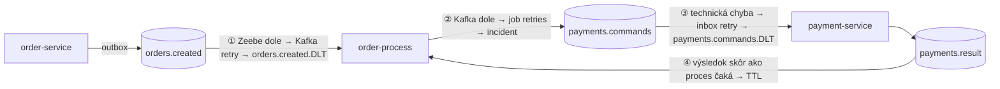

# 09 – Chybové scenáre

## Čo sa naučíš

- Čo presne sa stane pri **poison správe** (suma 666): inbox retry → DLT → inštancia čaká
- Ako sa správajú **duplicity** na troch miestach (inbox, Zeebe `messageId`, `commandId`)
- Čo spraví **výpadok `order-process`** a **výpadok Zeebe** – a ako objednávku zachrániť (redrive)
- Kedy vzniká **incident**, čo je **predbehnutá správa** a čo **TTL**

---

## Teória v skratke

### 1. Kde všade sa dá „spadnúť“



| # | Scenár | Mechanizmus | Kde to vidíš | Overené naživo? |
|---|---|---|---|---|
| 1 | poison 666 | inbox retry 4×, potom `payments.commands.DLT` | log payment-service, `payments.inbox`, Operate (token na `payment_result`) | áno |
| 2 | duplicitná správa | inbox `event_id`, Zeebe `messageId`, `commandId` z `jobKey` | logy „Duplicate … skipped“ | áno (inbox, Zeebe) |
| 3 | `order-process` nebeží | správy čakajú v Kafke (lag) | `kafka-consumer-groups.sh` | áno |
| 4 | Zeebe nebeží | Kafka retry 3×, potom `orders.created.DLT` | log `order-process`, DLT | áno |
| 5 | redrive z DLT | ručne poslať správu späť do topicu | – | áno |
| 6 | incident | job vyčerpá `retries` (Kafka dole pri odosielaní príkazu) | Operate → Incidents | **nie** (pozri nižšie) |
| 7 | predbehnutá správa | Zeebe drží správu počas TTL | – | len integračným testom |
| 8 | vypršanie TTL | správa po 1 h zmizne | – | **nie** (trvá hodinu) |

### 2. Technická vs. business chyba (pripomenutie)

- **Business** (`PaymentFailed`, 20 %) nie je chyba – proces ide vetvou `Cancel order` a objednávka skončí `PAYMENT_FAILED`.
- **Technická** (poison 666) je chyba – inbox ju skúša 4× a potom ju odloží do DLT. Výsledok platby **nikdy nevznikne**, takže proces sa o ničom nedozvie a čaká.

Proces **nemá timeout**. To je zámer dema: ukazuje, prečo by sa hodil timeout – timer na receive tasku alebo event-based gateway ([kapitola 12](12_cvicenia.md), cvičenie 1).

### 3. Incident

Incident = inštancia narazila na problém, ktorý sama nevyrieši. V deme vzniká hlavne, keď worker nevie poslať príkaz do Kafky:

```
job request-payment (retries 3) → CommandPublishException → retries 2 → … → retries 0 → INCIDENT
```

V Operate je inštancia červená, v detaile je chybová hláška. Po oprave príčiny sa incident vyrieši tlačidlom **Retry** (Operate zvýši retries a job sa znova rozdá).

**Neoverené naživo:** vyvolať incident by znamenalo vypnúť Kafku. Kafka má dáta v `emptyDir`, takže reštart jej podu by zmazal všetky topicy a správy a rozbil by bežiaci stack. Správanie pokrývajú unit testy (`RequestPaymentWorkerTest.should_propagate_whenPublishFails`, `CommandPublisherTest.should_throw_whenSendFails`). Aktuálny stav:

```powershell
$i = Invoke-RestMethod -Method Post -Uri http://localhost:8088/v2/incidents/search -ContentType 'application/json' -Body '{}'
"incidents: " + $i.page.totalItems
```

```
incidents: 0
```

---

## Krok po kroku

### 1. Poison 666: retry → DLT → čakajúca inštancia

```powershell
.\scripts\send-orders.ps1 -Count 1 -Amount 666
```

```
order 1c116cc8-e9fb-4c7c-aa80-4f5bf4c18052  amount 666  correlationId demo-1791440611-8b7b-1
Check status: Invoke-RestMethod http://localhost:8080/orders/<id>
```

Log payment-service (JSON logy prevedieme na čitateľný riadok):

```powershell
kubectl -n eda-demo logs deploy/payment-service --since=1m 2>$null | Select-String -Pattern 'Delivery attempt|Dead letter' | ForEach-Object { $_.Line | ConvertFrom-Json } | ForEach-Object { '{0} {1,-5} {2}' -f $_.'@timestamp'.Substring(11,12), $_.log.level, $_.message }
```

```
06:23:31.863 WARN  Delivery attempt 1 of event 9093435d-99bb-367e-ab1c-e649eac9cf3c failed, retry in 500 ms: Simulated gateway crash for poison amount 666 (order 1c116cc8-…)
06:23:32.374 WARN  Delivery attempt 2 of event 9093435d-… failed, retry in 1000 ms: Simulated gateway crash for poison amount 666 (order 1c116cc8-…)
06:23:33.385 WARN  Delivery attempt 3 of event 9093435d-… failed, retry in 2000 ms: Simulated gateway crash for poison amount 666 (order 1c116cc8-…)
06:23:35.402 ERROR Delivery attempt 4 of event 9093435d-… failed, giving up and moving it to payments.commands.DLT
06:23:35.424 ERROR Dead letter received: key=1c116cc8-… originalTopic=payments.commands exception=cz.demo.eda.payment.domain.PaymentProcessingException message=Simulated gateway crash … attempts=4 payload=…
```

Časy sedia s backoffom: +0,5 s, +1 s, +2 s. Posledný riadok loguje `DeadLetterListener` (vlastná group `payment-service-dlt`) – DLT si „prečítal“ a zalogoval ako ERROR.

Obsah DLT v Kafke:

```powershell
kubectl -n eda-demo exec deploy/kafka -- /opt/kafka/bin/kafka-console-consumer.sh --bootstrap-server localhost:9092 --topic payments.commands.DLT --from-beginning --formatter-property print.key=true --formatter-property print.headers=true --timeout-ms 5000
```

```
eda-dlt-exception-fqcn:cz.demo.eda.payment.domain.PaymentProcessingException,X-Correlation-Id:demo-1791440611-8b7b-1,eda-dlt-attempts:4,eda-dlt-original-topic:payments.commands,eda-dlt-exception-message:Simulated gateway crash for poison amount 666 (order 1c116cc8-…)	1c116cc8-…	{"amount": 666, "eventId": "9093435d-99bb-367e-ab1c-e649eac9cf3c", "orderId": "1c116cc8-…", "currency": "CZK", ...}
eda-dlt-exception-fqcn:…,X-Correlation-Id:demo-1791439491-3866-1,eda-dlt-attempts:4,…	debb6888-…	{"amount": 666, "eventId": "d7ca6def-…", ...}
```

Hlavičky `eda-dlt-*` pridáva inbox (`OutboxPublisher.publishDeadLetter`). Keby správu do DLT poslal Kafka error handler (nečitateľný JSON), hlavičky by sa volali `kafka_dlt-*` – `DeadLetterListener` číta oboje.

Stav objednávky a procesu:

```powershell
Invoke-RestMethod http://localhost:8080/orders/1c116cc8-e9fb-4c7c-aa80-4f5bf4c18052 | Select-Object id, amount, status
$a = Invoke-RestMethod -Method Post -Uri http://localhost:8088/v2/process-instances/search -ContentType 'application/json' -Body '{"filter":{"state":"ACTIVE"}}'
$a.items | Select-Object processInstanceKey, state, startDate
```

```
id                                   amount status
--                                   ------ ------
1c116cc8-e9fb-4c7c-aa80-4f5bf4c18052 666.00 PENDING_PAYMENT

processInstanceKey state  startDate
------------------ -----  ---------
2251799813685609   ACTIVE 2026-10-08T06:04:51.967Z
2251799813686366   ACTIVE 2026-10-08T06:23:31.612Z
```

Dve aktívne inštancie = dve poison objednávky. Token oboch stojí na `payment_result` ([kapitola 07](07_bpmn_proces.md), krok 3).

### 2. Záchrana zaseknutej objednávky ručne

Platba neprebehla a nikdy neprebehne. Rozumné rozhodnutie: objednávku zrušiť. Najčistejšia cesta je poslať procesu to, na čo čaká – `PaymentFailed` s **novým** `eventId` – cez Kafku, teda tou istou cestou, ktorou by prišiel od payment-service:

```powershell
$order = '1c116cc8-e9fb-4c7c-aa80-4f5bf4c18052'
$json = @{ type = 'PaymentFailed'; eventId = [guid]::NewGuid().ToString(); timestamp = (Get-Date).ToUniversalTime().ToString('o'); correlationId = 'manual-fix-1'; orderId = $order; reason = 'Manually failed after DLT' } | ConvertTo-Json -Compress
"$order|$json" | kubectl -n eda-demo exec -i deploy/kafka -- /opt/kafka/bin/kafka-console-producer.sh --bootstrap-server localhost:9092 --topic payments.result --reader-property parse.key=true --reader-property key.separator='|'
Start-Sleep -Seconds 3
Invoke-RestMethod http://localhost:8080/orders/$order | Select-Object id, status, failureReason
```

```
id            : 1c116cc8-e9fb-4c7c-aa80-4f5bf4c18052
status        : PAYMENT_FAILED
failureReason : Manually failed after DLT
```

A cesta tokenu (`element-instances/search` pre `2251799813686366`):

```
elementId                 state
---------                 -----
order_created             COMPLETED
request_payment           COMPLETED
payment_result            COMPLETED
payment_completed_gateway COMPLETED
cancel_order              COMPLETED
order_cancelled           COMPLETED
```

Proces sa zachoval presne ako pri bežnom zamietnutí. Prvú poison objednávku (`debb6888-…`) som nechal zaseknutú ako ukážku pre Operate.

### 3. Duplicity

Overené v predchádzajúcich kapitolách, tu len prehľad:

| Kde | Ako som duplicitu poslal | Čo sa stalo | Kapitola |
|---|---|---|---|
| payment-service inbox | ten istý `ProcessPayment` (`eventId 0ebf6a18-…`) cez `kafka-console-producer` | `Duplicate ProcessPayment … skipped`, stále 1 platba | [05](05_outbox_a_inbox.md) |
| Zeebe | ten istý `PaymentResult` (`eventId 342cdce7-…`) | `Duplicate message PaymentResult … skipped` | [08](08_most_zeebe_kafka.md) |
| opakovaný job | – (vyžaduje pád workera) | `eventId` = f(`jobKey`) – prepočítané a overené | [08](08_most_zeebe_kafka.md) |

### 4. `order-process` nebeží

Dočasne vypneme orchestrátor (pôvodne 1 replika), pošleme objednávku a pozrieme lag:

```powershell
kubectl -n eda-demo get deploy order-process -o jsonpath='{.spec.replicas}'
kubectl -n eda-demo scale deploy/order-process --replicas=0
kubectl -n eda-demo wait --for=delete pod -l app.kubernetes.io/name=order-process --timeout=60s
$o = Invoke-RestMethod -Method Post -Uri http://localhost:8080/orders -ContentType 'application/json' -Headers @{ 'X-Correlation-Id' = 'scale-test-1' } -Body '{"customerId":"c1","amount":42.00,"currency":"CZK"}'
$o.id
Start-Sleep -Seconds 5
(Invoke-RestMethod http://localhost:8080/orders/$($o.id)).status
kubectl -n eda-demo exec deploy/kafka -- /opt/kafka/bin/kafka-consumer-groups.sh --bootstrap-server localhost:9092 --describe --group order-process
```

```
1
deployment.apps/order-process scaled
pod/order-process-fb56b7b75-dfn9c condition met
6243b666-4d24-41bc-811e-2d5a24445934
PENDING_PAYMENT

GROUP           TOPIC           PARTITION  CURRENT-OFFSET  LOG-END-OFFSET  LAG             CONSUMER-ID     HOST            CLIENT-ID
order-process   orders.created  0          6               6               0               -               -               -
order-process   orders.created  1          5               5               0               -               -               -
order-process   orders.created  2          10              11              1               -               -               -
order-process   payments.result 0          6               6               0               -               -               -
...
```

- Objednávka vznikla (order-service beží), `OrderCreated` je v Kafke, ale nikto ho nečíta: `LAG 1`, `CONSUMER-ID -`.
- Nič sa nestratilo. Správa čaká.

**Obnova (povinná):**

```powershell
kubectl -n eda-demo scale deploy/order-process --replicas=1
kubectl -n eda-demo rollout status deploy/order-process --timeout=180s
(Invoke-RestMethod http://localhost:8080/orders/6243b666-4d24-41bc-811e-2d5a24445934).status
```

```
deployment.apps/order-process scaled
Waiting for deployment "order-process" rollout to finish: 0 of 1 updated replicas are available...
deployment "order-process" successfully rolled out
PAID
```

Nový pod prečítal správu od uloženého offsetu a objednávka prešla celým tokom. Lag je opäť 0 všade. Port-forward na 8082 po tejto operácii spadne – treba ho spustiť znova.

### 5. Zeebe nebeží → `orders.created.DLT`

Teraz dočasne vypneme Camundu (StatefulSet, pôvodne 1 replika) a pošleme objednávku:

```powershell
kubectl -n eda-demo get statefulset camunda -o jsonpath='{.spec.replicas}'
kubectl -n eda-demo scale statefulset/camunda --replicas=0
kubectl -n eda-demo wait --for=delete pod/camunda-0 --timeout=120s
$o = Invoke-RestMethod -Method Post -Uri http://localhost:8080/orders -ContentType 'application/json' -Headers @{ 'X-Correlation-Id' = 'zeebe-down-1' } -Body '{"customerId":"c1","amount":55.00,"currency":"CZK"}'
$o.id
Start-Sleep -Seconds 15
(Invoke-RestMethod http://localhost:8080/orders/$($o.id)).status
kubectl -n eda-demo logs deploy/order-process --since=1m 2>$null | Select-String 'zeebe-down-1' | ForEach-Object { $j = $_.Line | ConvertFrom-Json; '{0} {1,-5} {2}' -f $j.'@timestamp'.Substring(11,12), $j.log.level, $j.message.Substring(0,[Math]::Min(120,$j.message.Length)) }
```

```
1
statefulset.apps/camunda scaled
pod/camunda-0 condition met
707fa902-f362-4057-8f61-8150c72d9e0e
PENDING_PAYMENT
06:26:00.815 WARN  Delivery attempt 1 of record orders.created-1@5 failed: Listener method 'public void cz.demo.eda.process.messaging.Order
06:26:01.322 INFO  [Consumer clientId=consumer-order-process-2, groupId=order-process] Seeking to offset 5 for partition orders.created-1
06:26:01.327 WARN  Delivery attempt 2 of record orders.created-1@5 failed: …
06:26:02.333 WARN  Delivery attempt 3 of record orders.created-1@5 failed: …
06:26:04.340 WARN  Delivery attempt 4 of record orders.created-1@5 failed: …
06:26:04.357 ERROR Record orders.created-1@5 moved to orders.created.DLT after retries
```

- `publishMessage` zlyhá (`UNAVAILABLE: io exception`, `Connection refused: camunda/…:26500`).
- `DefaultErrorHandler`: 1 + 3 pokusy (0,5 s → 1 s → 2 s), spolu ~3,5 s, potom DLT. Po každom neúspechu „Seeking to offset 5“ – Spring Kafka sa vráti na tú istú správu.
- Objednávka zostane `PENDING_PAYMENT` **bez inštancie procesu**. Toto README uvádza ako známe správanie.

V DLT je pôvodná správa + hlavičky Spring Kafka s dôvodom (stack trace skrátený):

```
X-Correlation-Id:zeebe-down-1,kafka_dlt-exception-fqcn:org.springframework.kafka.listener.ListenerExecutionFailedException,kafka_dlt-exception-cause-fqcn:io.camunda.client.api.command.ClientStatusException,kafka_dlt-exception-message:Listener method '…onOrderCreated(…)' threw exception; io exception,kafka_dlt-exception-stacktrace:<...>,kafka_dlt-original-topic:orders.created,…,kafka_dlt-original-consumer-group:order-process	707fa902-f362-4057-8f61-8150c72d9e0e	{"eventId":"61c429ed-c888-4b6f-94f6-f33044ba5660","timestamp":"2026-10-08T06:26:00.773921321Z","correlationId":"zeebe-down-1","orderId":"707fa902-f362-4057-8f61-8150c72d9e0e","customerId":"c1","amount":55.00,"currency":"CZK"}
```

**Obnova (povinná):**

```powershell
kubectl -n eda-demo scale statefulset/camunda --replicas=1
kubectl -n eda-demo rollout status statefulset/camunda --timeout=300s
kubectl -n eda-demo get pods
```

```
statefulset.apps/camunda scaled
Waiting for 1 pods to be ready...
partitioned roll out complete: 1 new pods have been updated...
NAME                              READY   STATUS    RESTARTS   AGE
camunda-0                         1/1     Running   0          21s
...
```

Inštancie prežili (PVC): poison inštancia `2251799813685609` je po reštarte stále `ACTIVE`.

> **Pozor – „Ready“ neznamená „gRPC odpovedá“.** Pod bol `Ready` po ~21 s (readiness probe je na porte 9600), ale `order-process` ešte ďalších ~40 s hlásil `Failed to activate jobs … UNAVAILABLE: io exception … Connection refused: camunda/…:26500`. Moja prvá redrive správa (06:27:15) do tohto okna spadla a skončila **znova** v DLT. Pred redrivom si over, že v logu `order-process` už nie sú nové `Failed to activate jobs`.

### 6. Redrive z DLT

Správu z DLT pošleme späť do `orders.created` – s **pôvodným** `eventId` (Zeebe ju nepozná, lebo publikovanie nikdy neuspelo):

```powershell
$v = '{"eventId":"61c429ed-c888-4b6f-94f6-f33044ba5660","timestamp":"2026-10-08T06:26:00.773921321Z","correlationId":"zeebe-down-1","orderId":"707fa902-f362-4057-8f61-8150c72d9e0e","customerId":"c1","amount":55.00,"currency":"CZK"}'
"707fa902-f362-4057-8f61-8150c72d9e0e|$v" | kubectl -n eda-demo exec -i deploy/kafka -- /opt/kafka/bin/kafka-console-producer.sh --bootstrap-server localhost:9092 --topic orders.created --reader-property parse.key=true --reader-property key.separator='|'
kubectl -n eda-demo logs deploy/order-process --since=30s 2>$null | Select-String '707fa902' | ForEach-Object { ($_.Line | ConvertFrom-Json).message }
(Invoke-RestMethod http://localhost:8080/orders/707fa902-f362-4057-8f61-8150c72d9e0e).status
```

```
Message OrderCreated published for 707fa902-f362-4057-8f61-8150c72d9e0e (messageId 61c429ed-c888-4b6f-94f6-f33044ba5660)
Process order-fulfillment requested for order 707fa902-f362-4057-8f61-8150c72d9e0e
ProcessPayment d265e956-0eeb-343e-a66d-9c715302e6c2 sent for order 707fa902-f362-4057-8f61-8150c72d9e0e
Message PaymentResult published for 707fa902-f362-4057-8f61-8150c72d9e0e (messageId 1946667d-5332-4557-8b9d-de350e556c89)
ConfirmOrder 5963a731-41a2-3440-8637-ab5a6d28c4d4 sent for order 707fa902-f362-4057-8f61-8150c72d9e0e
PAID
```

Prečo je bezpečné poslať správu s pôvodným `eventId`? Ak by ju Zeebe predsa len už mal, odmietne ju (`ALREADY_EXISTS`) – redrive je **idempotentný**. S novým `eventId` by to riziko existovalo (dve inštancie).

### 7. Predbehnutá správa a TTL

Scenár „`PaymentResult` príde skôr, ako proces čaká na `payment_result`“ som naživo **nevyvolal** – potreboval by som zaseknúť worker medzi odoslaním a `completeJob`. Pokrýva ho integračný test proti skutočnému Zeebe:

```java
@DisplayName("Výsledek platby, který předběhne proces, Zeebe podrží a po dojetí na čekání ho zkoreluje")
void should_confirmOrder_whenPaymentResultArrivesBeforeProcessWaits() {
    sendPaymentResult(orderId, …, "PaymentCompleted", …);   // najprv výsledok
    sendOrderCreated(orderId, …);                           // potom objednávka
    JsonNode confirm = awaitCommand(Topics.ORDERS_COMMANDS, orderId);
    assertThat(confirm.get("type").asString()).isEqualTo("ConfirmOrder");
```

Test prechádza ([kapitola 10](10_testovanie.md)). Vypršanie TTL (1 h) som tiež neoveroval – z kódu: po TTL Zeebe správu zahodí a na `payment_result` by už nikdy nedorazila.

---

## Kód z repa

| Súbor | Čo s chybami robí |
|---|---|
| [`payment-service/.../domain/PaymentSimulator.java`](../../payment-service/src/main/java/cz/demo/eda/payment/domain/PaymentSimulator.java) | `poisonAmount` → `PaymentProcessingException`; `failureRate` → `PaymentFailed` |
| [`payment-service/.../inbox/InboxService.java`](../../payment-service/src/main/java/cz/demo/eda/payment/inbox/InboxService.java) | `recordFailure` → `scheduleRetry` alebo `markFailed` + `publishDeadLetter` |
| [`payment-service/.../messaging/DeadLetterListener.java`](../../payment-service/src/main/java/cz/demo/eda/payment/messaging/DeadLetterListener.java) | číta `payments.commands.DLT` (group `payment-service-dlt`), hodnota ako `String` (môže byť nevalidný JSON), loguje `kafka_dlt-*` aj `eda-dlt-*` hlavičky |
| [`order-process/.../config/KafkaConfig.java`](../../order-process/src/main/java/cz/demo/eda/process/config/KafkaConfig.java) | `DefaultErrorHandler` + `DeadLetterPublishingRecoverer` pre `orders.created` a `payments.result` |
| [`order-process/.../process/ProcessGateway.java`](../../order-process/src/main/java/cz/demo/eda/process/process/ProcessGateway.java) | `ALREADY_EXISTS` → úspech, inak výnimka (→ Kafka retry → DLT) |
| [`order-process/.../messaging/CommandPublisher.java`](../../order-process/src/main/java/cz/demo/eda/process/messaging/CommandPublisher.java) | `CommandPublishException` → job sa nedokončí → retries → incident |

`orders.created.DLT` a `payments.result.DLT` **nikto nečíta** – v `order-process` nie je DLT listener. Správy tam ležia, kým ich niekto ručne nepošle späť (redrive).

---

## Bez Camundy by to vyzeralo takto

| Scenár | Choreografia (`ba78d05`) | Orchestrácia |
|---|---|---|
| poison 666 | objednávka `PENDING_PAYMENT`, „zaseknutie“ vidno len v DB a logoch | to isté + v Operate vidno token na `payment_result` a čas od kedy |
| záchrana | ručný `UPDATE` alebo poslanie `PaymentFailed` priamo order-service | poslanie `PaymentFailed` procesu – ten rozhodne a pošle `CancelOrder` |
| orchestrátor dole | nebol | správy čakajú v Kafke (lag), nič sa nestratí |
| engine dole | nebol | `OrderCreated` → DLT po ~3,5 s, nutný redrive |
| timeout platby | vlastný plánovač nad tabuľkou objednávok | timer boundary event v BPMN |

Orchestrácia pridala nové chybové stavy (Zeebe dole), ale každý chybový stav je **viditeľný** na jednom mieste.

---

## Časté chyby

| Príznak | Príčina | Riešenie |
|---|---|---|
| Objednávka `PENDING_PAYMENT`, inštancia `ACTIVE` na `payment_result` | Poison / technická chyba, správa v `payments.commands.DLT` | Oprav príčinu; potom pošli procesu `PaymentFailed` / `PaymentCompleted` s novým `eventId` |
| Objednávka `PENDING_PAYMENT` a **žiadna** inštancia | `OrderCreated` skončil v `orders.created.DLT` (Zeebe bol dole) | Redrive z DLT s pôvodným `eventId` |
| Redrive skončil znova v DLT | Zeebe ešte neprijíma gRPC, hoci pod je Ready | Počkaj, kým zmiznú `Failed to activate jobs`, a opakuj |
| Lag `order-process` rastie | Pod `order-process` nebeží alebo padá | `kubectl get pods`, logy; po nábehu sa dobehne sám |
| Inštancia s incidentom | Job vyčerpal retries (napr. Kafka nedostupná pri odosielaní príkazu) | Oprav príčinu, v Operate **Retry** |
| Po `scale` nefungujú `localhost:8082` / `8088` | Port-forward smeroval na zmazaný pod | Spusti port-forward znova |

---

## Otázky na zopakovanie

**Prečo poison objednávka zostane `PENDING_PAYMENT` navždy?**
Inbox ju po 4 pokusoch odloží do DLT a výsledok platby nikdy nevznikne. Proces čaká na `PaymentResult` a nemá timeout.

**Aký je rozdiel medzi DLT z inboxu a DLT z Kafka error handlera?**
Inbox posiela do DLT cez outbox po zlyhaní **spracovania** (hlavičky `eda-dlt-*`). Error handler posiela po zlyhaní **listenera** – nečitateľná správa, nedostupná DB alebo Zeebe (hlavičky `kafka_dlt-*`).

**Čo sa stane, keď nebeží `order-process`?**
Nič sa nestratí – správy čakajú v Kafke ako lag. Po nábehu ich pod spracuje od uloženého offsetu.

**Čo sa stane, keď nebeží Zeebe?**
`OrderCreated` sa po ~3,5 s retry presunie do `orders.created.DLT` a objednávka zostane bez inštancie. Treba redrive.

**Prečo pri redrive použiť pôvodný `eventId`?**
Aby bol redrive idempotentný: ak by Zeebe správu už mal, odmietne ju a druhá inštancia nevznikne.

## Vyskúšaj si

1. Pošli `.\scripts\send-orders.ps1 -Count 1 -Amount 666` a v Operate (alebo `process-instances/search` s `state` = `ACTIVE`) nájdi novú inštanciu. Potom ju zachráň podľa kroku 2. **Očakávanie:** `PAYMENT_FAILED` s tvojím `reason` a inštancia `COMPLETED` cez `cancel_order`.
2. Zopakuj krok 4 (`order-process` na 0), ale pošli 3 objednávky. **Očakávanie:** lag na `orders.created` spolu 3, po obnovení všetky tri dobehnú. **Nezabudni obnoviť repliku na 1 a overiť Ready.**

---

**Ďalej:** [10 – Testovanie](10_testovanie.md)
