# 11 – Observabilita

## Čo sa naučíš

- Ako `correlationId` putuje cez HTTP hlavičku, Kafka hlavičku, inbox/outbox, premenné procesu a **MDC** – a ako podľa neho zložiť celú cestu objednávky
- Čo sú **ECS JSON logy** a prečo sa dajú filtrovať priamo v PowerShelli
- Aké metriky služby vystavujú (`eda_*`, `camunda_client_worker_*`) a kde ich nájdeš
- Čo pridávajú overlaye **monitoring** (Prometheus, Grafana) a **logging** (Elasticsearch, Kibana, Fluent Bit) – len popis, v overovanom clustri nie sú nasadené

---

## Teória v skratke

### 1. Tri otázky observability

| Otázka | Nástroj v deme |
|---|---|
| Čo sa stalo s **touto** objednávkou? | logy filtrované podľa `correlationId`; Operate |
| Ako sa darí **celému systému**? | metriky (`/actuator/prometheus`), Grafana |
| Kde je token **teraz**? | Operate / REST API Camundy |

### 2. `correlationId` vs. correlation key (opäť)

| | `correlationId` | correlation key |
|---|---|---|
| Hodnota | `demo-1791440484-d1f3-1`, `tutorial-1` | `orderId` |
| Kto ho vytvára | klient (`X-Correlation-Id`) alebo `CorrelationIdFilter` (nové UUID) | order-service (ID objednávky) |
| Na čo | **stopa v logoch** cez všetky služby | **párovanie správy** s inštanciou v Zeebe |
| Ovplyvňuje logiku? | nie | áno |

### 3. Ako `correlationId` putuje

```mermaid
flowchart LR
    H["HTTP hlavička<br/>X-Correlation-Id"] -->|CorrelationIdFilter| M1["MDC<br/>order-service"]
    M1 --> OB["outbox.headers<br/>+ telo správy"]
    OB -->|OutboxService| KH["Kafka hlavička<br/>X-Correlation-Id"]
    KH -->|CorrelationIdRecordInterceptor| M2["MDC<br/>order-process listener"]
    M2 --> PV["premenná procesu<br/>correlationId"]
    PV -->|CorrelationScope| M3["MDC<br/>order-process worker"]
    M3 -->|CommandPublisher| KH2["Kafka hlavička"]
    KH2 --> IB["inbox.correlation_id"]
    IB -->|InboxService.process| M4["MDC<br/>payment-service"]
```



Každý „preskok“ má svoj kúsok kódu:

| Kde | Trieda | Čo robí |
|---|---|---|
| HTTP → MDC | `CorrelationIdFilter` (order-service) | vezme hlavičku alebo vygeneruje UUID, vráti ju aj v odpovedi |
| MDC → outbox | `OrderService.createOrder` → `OutboxPublisher` | uloží do tela správy aj do `headers` (JSONB) |
| outbox → Kafka | `OutboxService.send` | `headers` → Kafka hlavičky |
| Kafka → MDC | `CorrelationIdRecordInterceptor` (všetky služby) | po dobu spracovania záznamu, aj pre retry a DLT logy |
| Kafka → inbox | `*Listener.correlationId(...)` | hlavička, inak pole z tela |
| inbox → MDC | `InboxService.process` / `recordFailure` | plánovač nemá Kafka kontext, preto z DB |
| Zeebe → MDC | `CorrelationScope` (order-process) | worker beží mimo Kafka listenera, číta premennú procesu |
| worker → Kafka | `CommandPublisher.send` | hlavička `X-Correlation-Id` |

### 4. ECS JSON logy

Všetky tri služby logujú **jeden JSON objekt na riadok** vo formáte Elastic Common Schema – zabudované v Spring Boot (`logging.structured.format.console: ecs`), žiadna knižnica navyše:

```json
{"@timestamp":"2026-10-08T06:21:28.235556554Z","log":{"level":"INFO","logger":"cz.demo.eda.order.domain.OrderService"},"process":{"pid":1,"thread":{"name":"http-nio-8080-exec-1"}},"service":{"name":"order-service","version":"0.0.1-SNAPSHOT","node":{}},"message":"Order 3101528e-… created for customer c1 amount 99.90 CZK","correlationId":"tutorial-1","ecs":{"version":"8.11"}}
```

Kľúče z MDC (`correlationId`, pri joboch aj `jobKey`, `processInstanceKey`, `elementInstanceKey`, `processDefinitionKey` – tie pridáva Camunda klient) sú **top-level polia**. Fluent Bit / Elasticsearch ich vedia indexovať bez regexov a PowerShell ich prečíta cez `ConvertFrom-Json`.

---

## Krok po kroku

### 1. Celá cesta objednávky podľa `correlationId`

Zozbierame logy všetkých troch služieb, necháme len riadky s daným `correlationId`, zoradíme podľa času:

```powershell
$cid = 'tutorial-1'
$all = foreach ($d in 'order-service','order-process','payment-service') {
  kubectl -n eda-demo logs deploy/$d --since=2h 2>$null | Select-String -SimpleMatch $cid | ForEach-Object { $_.Line | ConvertFrom-Json }
}
$all | Sort-Object '@timestamp' | ForEach-Object { '{0}  {1,-15}  {2}' -f $_.'@timestamp'.Substring(11,12), $_.service.name, $_.message }
```

```
06:21:28.235  order-service    Order 3101528e-e2ce-4a55-bfa6-a7790b46e89e created for customer c1 amount 99.90 CZK
06:21:28.577  order-service    Published event db702ddb-0def-48ef-93b2-410be0309435 for order 3101528e-… to orders.created
06:21:28.603  order-process    Message OrderCreated published for 3101528e-… (messageId db702ddb-0def-48ef-93b2-410be0309435)
06:21:28.604  order-process    Process order-fulfillment requested for order 3101528e-…
06:21:28.621  order-process    ProcessPayment 0ebf6a18-2708-397b-b36b-c9ed180cd5f0 sent for order 3101528e-…
06:21:28.630  payment-service  ProcessPayment 0ebf6a18-2708-397b-b36b-c9ed180cd5f0 for order 3101528e-… stored in inbox
06:21:28.845  payment-service  Processing payment for order 3101528e-… amount 99.9 CZK
06:21:28.848  payment-service  Payment for order 3101528e-… finished with PaymentCompleted
06:21:28.866  payment-service  Published event 342cdce7-fe71-40ad-8a64-77de498ee541 for order 3101528e-… to payments.result
06:21:28.886  order-process    Message PaymentResult published for 3101528e-… (messageId 342cdce7-fe71-40ad-8a64-77de498ee541)
06:21:28.907  order-process    ConfirmOrder f7717ad2-bb9f-3898-abda-75924d165ef7 sent for order 3101528e-…
06:21:28.915  order-service    Received ConfirmOrder f7717ad2-bb9f-3898-abda-75924d165ef7 for order 3101528e-… stored in inbox
06:21:29.071  order-service    Order 3101528e-… status changed PENDING_PAYMENT -> PAID
```

Ako to čítať:

- Tri ID putujú ďalej: `db702ddb-…` (outbox order-service = `messageId` v Zeebe), `0ebf6a18-…` (príkaz z `jobKey` = `event_id` v inboxe payment-service), `342cdce7-…` (outbox payment-service = `messageId` v Zeebe).
- Medzery: 28.235 → 28.577 (outbox relay), 28.630 → 28.845 (inbox processor) – každá ~200–350 ms, lebo plánovače bežia raz za 500 ms.
- Orchestrátor sám je rýchly: od `Message OrderCreated published` po `ProcessPayment sent` 18 ms.
- Tento výpis vyžaduje, aby pod bežal od času objednávky – `kubectl logs` číta len logy **aktuálneho** kontajnera. Po reštarte podu (napr. `scale` v kapitole 09) sú staré riadky preč. Preto v produkcii centralizované logy (overlay `logging`).

### 2. Pole z MDC pri jobe

```powershell
kubectl -n eda-demo logs deploy/order-process --since=3h 2>$null | Select-String 'lag-test-1' | Select-String 'ProcessPayment' | ForEach-Object { $_.Line | ConvertFrom-Json } | Select-Object correlationId, processInstanceKey, jobKey, elementInstanceKey
```

```
correlationId      : lag-test-1
processInstanceKey : 2251799813686708
jobKey             : 2251799813686721
elementInstanceKey : 2251799813686720
```

Z jedného riadku logu sa dostaneš priamo k inštancii v Operate (`processInstanceKey`). (Výstup je zo spustenia počas písania; `elementInstanceKey` z behu sa môže líšiť od tvojho.)

### 3. Metriky služieb

Každá služba má `/actuator/prometheus`. Vlastné metriky dema majú prefix `eda_`:

```powershell
(curl.exe -s http://localhost:8081/actuator/prometheus) -split "`n" | Select-String '^eda_' | ForEach-Object { $_.Line }
```

```
eda_inbox_processed_total{application="payment-service",outcome="failed",topic="payments.commands"} 2.0
eda_inbox_processed_total{application="payment-service",outcome="retry",topic="payments.commands"} 6.0
eda_inbox_processed_total{application="payment-service",outcome="success",topic="payments.commands"} 21.0
eda_messages_consumed_total{application="payment-service",outcome="stored",topic="payments.commands"} 23.0
eda_messages_dead_lettered_total{application="payment-service",topic="payments.commands.DLT"} 2.0
eda_messages_produced_total{application="payment-service",topic="payments.commands.DLT"} 2.0
eda_messages_produced_total{application="payment-service",topic="payments.result"} 21.0
```

- 2 poison objednávky → 2× `failed`, 6× `retry` (3 na každú), 2× do DLT.
- `consumed stored` 23 = 21 úspešných + 2 poison.
- Počítadlá sú v pamäti podu, po reštarte začínajú od nuly (README, Omezení).

`order-service` (`localhost:8080`) má tie isté metriky pre svoje topicy. `order-process` nemá `eda_*`, ale má metriky Camunda klienta:

```powershell
(curl.exe -s http://localhost:8082/actuator/prometheus) -split "`n" | Select-String -Pattern '^camunda_client_worker_job_(activated|handled)_total' | ForEach-Object { $_.Line }
```

```
camunda_client_worker_job_activated_total{application="order-process",type="cancel-order"} 0.0
camunda_client_worker_job_activated_total{application="order-process",type="confirm-order"} 2.0
camunda_client_worker_job_activated_total{application="order-process",type="request-payment"} 2.0
camunda_client_worker_job_handled_total{application="order-process",type="cancel-order"} 0.0
camunda_client_worker_job_handled_total{application="order-process",type="confirm-order"} 2.0
camunda_client_worker_job_handled_total{application="order-process",type="request-payment"} 2.0
```

Camunda broker má vlastné metriky na porte 9600 (`zeebe_*`, [kapitola 06](06_camunda_a_zeebe.md), krok 6).

### 4. Overlaye monitoring a logging

V overovanom clustri beží len profil `base`:

```powershell
kubectl -n eda-demo get svc grafana
```

```
Error from server (NotFound): services "grafana" not found
```

Čo by pridali (lokálne vyrenderované, **nie nasadené**):

```powershell
kubectl kustomize k8s/overlays/full | Select-String '^kind:' | Group-Object Line | Select-Object Count, Name
```

```
Count Name
----- ----
    1 kind: Namespace
    2 kind: ServiceAccount
    1 kind: Role
    1 kind: ClusterRole
    1 kind: RoleBinding
    1 kind: ClusterRoleBinding
    9 kind: ConfigMap
    4 kind: Secret
   10 kind: Service
    8 kind: Deployment
    2 kind: StatefulSet
    1 kind: DaemonSet
    1 kind: Job
```

`kubectl kustomize` len zloží YAML na konzolu, do clustra nič neposiela.

| Profil | Komponenty | Na čo | Prístup |
|---|---|---|---|
| `monitoring` | Prometheus, Grafana | metriky z podov s anotáciou `prometheus.io/scrape: "true"` (služby aj Camunda na 9600); dashboard **EDA demo – overview** | Grafana http://localhost:3000 (`admin`/`admin`), Prometheus http://localhost:9090 |
| `logging` | Elasticsearch, Kibana, Fluent Bit (DaemonSet) | centralizované logy, index `eda-logs-*`, data view **EDA logs** | Kibana http://localhost:5601 → Discover |
| `full` | všetko | | |

Nasadenie: `.\scripts\deploy.ps1 -Stack monitoring` / `-Stack logging` / `-Stack full` (bash: `./scripts/deploy.sh monitoring|logging|full`). Profily sú Kustomize overlaye (`k8s/overlays/*`), ktoré skladajú `k8s/base` a komponenty `k8s/components/{monitoring,logging}` – observabilitu teda pridáš kedykoľvek ďalším `deploy` s iným profilom. Počítaj s ~2 GB RAM navyše pre `full`. Elasticsearch je po port-forwarde na http://localhost:9200.

Panely dashboardu (z [`eda-overview.json`](../../k8s/components/monitoring/grafana/eda-overview.json)): HTTP request rate, HTTP latency p50/p95/p99, Messages produced / consumed (msg/s), Consumer lag, Dead-lettered messages, DLT rate & duplicates skipped, JVM heap a non-heap.

Kibana dotazy (Discover, data view *EDA logs*): `correlationId : "demo-…"`, `log.level : "ERROR"`.

> **Pozor:** Fluent Bit v [`fluent-bit.yaml`](../../k8s/components/logging/fluent-bit.yaml) zbiera len súbory `order-service-*` a `payment-service-*`. Logy `order-process` sa do Elasticsearch **nedostanú**, takže v Kibane by cesta objednávky podľa `correlationId` neobsahovala kroky orchestrátora – tie ukáže `kubectl -n eda-demo logs deploy/order-process`. PowerShell postup z kroku 1 ich obsahuje.

**Neoverené:** profily `monitoring`, `logging` a `full` som pri písaní nenasadzoval (zákaz deployu). Po reštrukturalizácii sú overené len renderom (`kubectl kustomize`), pozri históriu overenia v [kapitole 10](10_testovanie.md#4-čo-bolo-overené-pri-vývoji).

---

## Kód z repa

| Súbor | Čo v ňom je |
|---|---|
| [`order-service/.../support/CorrelationIdFilter.java`](../../order-service/src/main/java/cz/demo/eda/order/support/CorrelationIdFilter.java) | `OncePerRequestFilter` s `HIGHEST_PRECEDENCE`: hlavička alebo nové UUID → MDC + odpoveď |
| [`order-process/.../support/CorrelationIdRecordInterceptor.java`](../../order-process/src/main/java/cz/demo/eda/process/support/CorrelationIdRecordInterceptor.java) | `RecordInterceptor`: `intercept` → `MDC.put`, `afterRecord` → `MDC.remove` |
| [`order-process/.../worker/CorrelationScope.java`](../../order-process/src/main/java/cz/demo/eda/process/worker/CorrelationScope.java) | `AutoCloseable` – `try-with-resources` zaručí upratanie MDC aj pri výnimke |
| [`order-service/.../support/MessagingMetrics.java`](../../order-service/src/main/java/cz/demo/eda/order/support/MessagingMetrics.java) | Micrometer countery `eda_messages_*`, `eda_inbox_processed_total` |
| [`order-process/src/main/resources/application.yml`](../../order-process/src/main/resources/application.yml) | `logging.structured.format.console: ecs`, `management.endpoints.web.exposure.include: health,info,prometheus,metrics` |
| [`k8s/components/`](../../k8s/components) | monitoring a logging komponenty pre Kustomize |

Prečo MDC treba vždy upratať? Vlákna sú z poolu. Keby `correlationId` zostalo v MDC, ďalšia, úplne iná správa na tom istom vlákne by sa v logoch tvárila ako tá istá objednávka.

---

## Bez Camundy by to vyzeralo takto

V choreografii bol `correlationId` **jediný** spôsob, ako zistiť cestu objednávky. S Camundou máš navyše:

- Operate: pozícia tokenu, premenné, história a časy krokov – bez logov,
- `processInstanceKey` a `jobKey` v logoch workerov – priamy most medzi logom a inštanciou,
- metriky jobov (`camunda_client_worker_*`, `zeebe_*`).

Logy a `correlationId` sú stále potrebné: Camunda nevidí, čo sa deje **vnútri** služieb (inbox retry, outbox).

---

## Časté chyby

| Príznak | Príčina | Riešenie |
|---|---|---|
| `ConvertFrom-Json` padá na niektorých riadkoch | Nie každý riadok je JSON (napr. `Defaulted container …` zo stderr, banner pri štarte) | `2>$null` a filtrovať `Select-String` pred `ConvertFrom-Json` |
| V logoch chýba `correlationId` | Kód beží mimo listenera/requestu (plánovač, worker) a MDC nikto nenastavil | Vzor `InboxService.process` / `CorrelationScope` |
| Ručne poslaná správa (`kafka-console-producer`) nemá `correlationId` v logu listenera | Bez hlavičky `X-Correlation-Id` ho interceptor nenastaví | Očakávané; hlavičku pridáš cez `--reader-property parse.headers=true` |
| `kubectl logs` neukáže staré riadky | Pod sa reštartoval | `--previous` pre predchádzajúci kontajner, inak centralizované logy |
| `eda_*` metriky po reštarte od nuly | Počítadlá sú v pamäti | Prometheus to rieši cez `rate()`/`increase()` |
| V Kibane chýbajú logy `order-process` | Fluent Bit ich nezbiera (cesta v `tail` inpute) | Rozšíriť `path` v `fluent-bit.yaml` (zmena manifestu) |

---

## Otázky na zopakovanie

**Aký je rozdiel medzi `correlationId` a correlation key?**
`correlationId` je stopa pre logy, logiku neovplyvňuje. Correlation key (`orderId`) páruje správu s inštanciou v Zeebe.

**Prečo worker potrebuje `CorrelationScope`?**
Job worker nebeží v Kafka listeneri, takže `CorrelationIdRecordInterceptor` mu MDC nenastaví. `correlationId` si preto vezme z premenných procesu.

**Prečo ECS JSON a nie bežný text?**
Polia (`correlationId`, `log.level`, `service.name`) sú štruktúrované – Elasticsearch ich indexuje bez parsovania a PowerShell ich prečíta cez `ConvertFrom-Json`.

**Kde vidíš, koľko správ skončilo v DLT?**
Metrika `eda_messages_dead_lettered_total` (a v Grafane panel *Dead-lettered messages*).

## Vyskúšaj si

1. Pošli objednávku s vlastným `X-Correlation-Id` (napr. `moj-test-1`) a zlož jej cestu postupom z kroku 1. **Očakávanie:** 13 riadkov pri `PAID` (pri `PAYMENT_FAILED` namiesto `ConfirmOrder` riadok `CancelOrder` a `PENDING_PAYMENT -> PAYMENT_FAILED`).
2. Pošli objednávku **bez** hlavičky (`Invoke-RestMethod` bez `-Headers`) a pozri odpoveď cez `curl.exe -i`. **Očakávanie:** v odpovedi hlavička `X-Correlation-Id` s novým UUID – vygeneroval ho `CorrelationIdFilter`.

---

**Ďalej:** [12 – Cvičenia](12_cvicenia.md)
