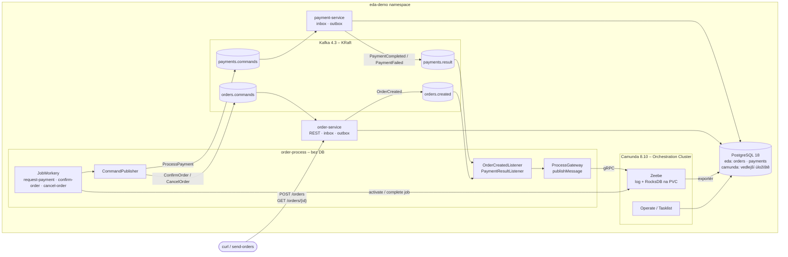

# Orchestrace objednávky přes Camundu 8 – implementační plán

> **For agentic workers:** REQUIRED SUB-SKILL: Use superpowers:subagent-driven-development (recommended) or superpowers:executing-plans to implement this plan task-by-task. Steps use checkbox (`- [ ]`) syntax for tracking.

**Goal:** Nahradit choreografii objednávky orchestrací – BPMN proces v Camundě 8.10 posílá příkazy přes Kafku do order-service a payment-service a posouvá se podle jejich událostí.

**Architecture:** Nová služba `order-process` (Spring Boot 4.1 + `camunda-spring-boot-starter` 8.10.2 + Spring Kafka, bez DB) je mostem Zeebe ↔ Kafka: Kafka listenery publikují zprávy do Zeebe (`publishMessage`, `messageId = eventId`), job workery posílají příkazy do Kafky (`eventId` odvozené z `jobKey`). Doménové služby jen mění vstupní topic a typ zprávy, inbox/outbox zůstávají. Camunda (Orchestration Cluster) běží v k8s jako `StatefulSet`, vedlejší úložiště v PostgreSQL.

**Tech Stack:** Java 21, Spring Boot 4.1.1, Spring Kafka, Camunda 8.10.2 (`camunda/camunda` image, `camunda-spring-boot-starter`, `camunda-process-test-spring`), Testcontainers 2, JUnit 5, Mockito, AssertJ, Awaitility, kustomize.

**Spec:** `docs/superpowers/specs/2026-10-08-camunda-orchestration-design.md`

## Global Constraints

- **Necommitovat a nepushovat** – git operace dělá uživatel. Místo commitu každý task končí zelenými testy (`mvn -q test` v dotčené službě).
- Žádný sdílený kód mezi službami – každá služba má vlastní kopii tříd událostí a podpůrných tříd; kontraktem je JSON.
- Java 21, žádné `var`, explicitní typy; records, sealed interfaces, pattern matching `switch`.
- `@Transactional` jen na servisách/repozitářích (order-process transakce nemá vůbec).
- Komentáře a JavaDoc česky (každá public metoda má JavaDoc), komentovat PROČ; identifikátory anglicky; konstanty `UPPER_CASE`.
- Testy: JUnit 5, `should_doSomething_whenCondition()`, `@DisplayName` česky, Mockito pro závislosti; každá nová public metoda má test.
- Logování přes SLF4J; žádné `System.out`; nikdy prázdný `catch`.
- Verze: Camunda **8.10.2** (Maven i Docker image), Kafka `apache/kafka:4.3.1`, PostgreSQL `postgres:18.6-alpine`.
- Topicy: `orders.created`, `payments.commands`, `payments.result`, `orders.commands` (3 partitions, klíč = `orderId`), DLT = `<topic>.DLT`.
- Spring type hlavičky vypnuté (`spring.json.add.type.headers: false`), correlationId v těle i hlavičce `X-Correlation-Id`.
- Upřesnění oproti specu (stejné chování, jednodušší kód): (1) topicy zakládá každá služba pro topicy, které produkuje nebo konzumuje, plus DLT svých konzumentů – stejná konvence jako dosud; (2) job workery používají `autoComplete = true` a odesílají do Kafky synchronně – job se tedy dokončí až po ack brokeru, výjimka job nedokončí.

## Review Focus

1. **Duplicitní `OrderCreated` z Kafky** → smí vzniknout jen jedna instance procesu (jen jeden `ProcessPayment`). Test: `OrderProcessIntegrationTest.should_startSingleInstance_whenOrderCreatedDeliveredTwice` (Task 7).
2. **Duplicitní `PaymentResult`** → druhá korelace se tiše ignoruje, nevznikne druhý `ConfirmOrder` ani záznam v DLT. Test: `OrderProcessIntegrationTest.should_confirmOnce_whenPaymentResultDeliveredTwice` (Task 7).
3. **`PaymentResult` pro objednávku bez čekající instance** → zpráva se v Zeebe uloží s TTL, listener nespadne a nic nejde do DLT. Test: `OrderProcessIntegrationTest.should_notDeadLetter_whenPaymentResultForUnknownOrder` (Task 7).
4. **Kafka nedostupná při odesílání příkazu** → worker vyhodí výjimku, job se nedokončí (Zeebe sníží retries → incident). Test: `CommandPublisherTest.should_throw_whenSendFails` a `RequestPaymentWorkerTest.should_propagate_whenPublishFails` (Task 6).
5. **Zeebe nedostupné / jiná chyba při `publishMessage`** → výjimka se propaguje do Kafka error handleru (retry → DLT), `ALREADY_EXISTS` se naopak bere jako úspěch. Test: `ProcessGatewayTest.should_rethrow_whenOtherClientError` (Task 4).

---

## Struktura souborů

```
pom.xml                                            (modify: + module order-process)
payment-service/…/event/ProcessPayment.java        (create; delete OrderCreated.java)
payment-service/…/messaging/ProcessPaymentListener.java, ProcessPaymentHandler.java (create; delete OrderCreated*)
payment-service/…/{support/Topics, config/KafkaConfig, messaging/DeadLetterListener, domain/PaymentSimulator, domain/Payment, domain/PaymentService}.java (modify)
order-service/…/event/OrderCommand.java, ConfirmOrder.java, CancelOrder.java (create; delete PaymentResult/PaymentCompleted/PaymentFailed)
order-service/…/messaging/OrderCommandListener.java, OrderCommandHandler.java (create; delete PaymentResult*)
order-service/…/{support/Topics, config/KafkaConfig, domain/OrderService}.java (modify)
order-process/                                     (nová služba)
  pom.xml, Dockerfile, .dockerignore
  src/main/java/cz/demo/eda/process/
    OrderProcessApplication.java                   – vstupní bod + @Deployment BPMN
    config/AppConfig.java, EdaKafkaProperties.java, KafkaConfig.java, ProcessProperties.java
    event/DomainEvent.java, OrderCreated.java, PaymentResult.java, PaymentCompleted.java, PaymentFailed.java,
          ProcessPayment.java, OrderCommand.java, ConfirmOrder.java, CancelOrder.java
    process/ProcessMessages.java                   – názvy BPMN zpráv a job typů
    process/ProcessGateway.java                    – publishMessage + deduplikace
    process/OrderVariables.java                    – proměnné procesu pro workery
    messaging/OrderCreatedListener.java, PaymentResultListener.java
    messaging/CommandPublisher.java, CommandPublishException.java
    worker/RequestPaymentWorker.java, ConfirmOrderWorker.java, CancelOrderWorker.java
    support/Topics.java, Tracing.java, CorrelationIdRecordInterceptor.java
  src/main/resources/application.yml, bpmn/order-fulfillment.bpmn
  src/test/java/cz/demo/eda/process/…              – unit testy + OrderProcessIntegrationTest
k8s/base/camunda/camunda.yaml                      (create)
k8s/base/order-process/order-process.yaml          (create)
k8s/base/postgres/postgres.yaml, k8s/base/kustomization.yaml (modify)
scripts/build-images.{sh,ps1}, deploy.{sh,ps1}, port-forward.{sh,ps1} (modify)
README.md                                          (modify)
```

---

### Task 1: payment-service přijímá příkaz `ProcessPayment` z `payments.commands`

**Files:**
- Create: `payment-service/src/main/java/cz/demo/eda/payment/event/ProcessPayment.java`
- Delete: `payment-service/src/main/java/cz/demo/eda/payment/event/OrderCreated.java`
- Create: `payment-service/src/main/java/cz/demo/eda/payment/messaging/ProcessPaymentListener.java`, `ProcessPaymentHandler.java`
- Delete: `payment-service/src/main/java/cz/demo/eda/payment/messaging/OrderCreatedListener.java`, `OrderCreatedHandler.java`
- Modify: `support/Topics.java`, `config/KafkaConfig.java`, `messaging/DeadLetterListener.java`, `domain/PaymentSimulator.java`, `domain/Payment.java`, `domain/PaymentService.java`, `src/main/resources/application.yml`, `pom.xml` (description)
- Test: rename `messaging/OrderCreatedListenerTest.java` → `ProcessPaymentListenerTest.java`, `OrderCreatedHandlerTest.java` → `ProcessPaymentHandlerTest.java`; modify `event/EventSerializationTest.java`, `domain/PaymentServiceTest.java`, `domain/PaymentSimulatorTest.java`, `domain/PaymentTest.java`, `outbox/OutboxPublisherTest.java`, `messaging/DeadLetterListenerTest.java`, `support/TopicsTest.java`, `PaymentServiceIntegrationTest.java`

**Interfaces:**
- Produces (JSON kontrakt `payments.commands`, konzumuje ho order-process v Task 6): `{"eventId","timestamp","correlationId","orderId","amount","currency"}`
- `payments.result` beze změny.

- [ ] **Step 1: Přepsat testy na nový kontrakt (failing)**

Mechanické náhrady ve všech testech `payment-service/src/test/java` (kromě listener/handler testů, které se přejmenují níže):
- `import cz.demo.eda.payment.event.OrderCreated;` → `import cz.demo.eda.payment.event.ProcessPayment;`
- typ `OrderCreated` → `ProcessPayment`
- `OrderCreated.of(c, orderId, customerId, amount, currency)` → `ProcessPayment.of(c, orderId, amount, currency)` (vypustit 3. argument customerId), např. `OrderCreated.of("c", "o-1", "cust", new BigDecimal(amount), "CZK")` → `ProcessPayment.of("c", "o-1", new BigDecimal(amount), "CZK")`
- `Topics.ORDERS_CREATED` → `Topics.PAYMENTS_COMMANDS`, řetězec `"orders.created"` → `"payments.commands"`, `"orders.created.DLT"` → `"payments.commands.DLT"`
- `@DisplayName`/názvy testů obsahující „OrderCreated“ přepsat na „ProcessPayment“ (např. `should_roundTripOrderCreated_whenSerialized` → `should_roundTripProcessPayment_whenSerialized`, „OrderCreated projde JSON round-tripem…“ → „ProcessPayment projde JSON round-tripem…“).

`git mv` listener/handler testů a uvnitř:
- `OrderCreatedListenerTest` → `ProcessPaymentListenerTest`, `OrderCreatedListener` → `ProcessPaymentListener`, `listener.onOrderCreated(` → `listener.onProcessPayment(`, helper `order()` vrací `ProcessPayment.of("c", "o-1", BigDecimal.TEN, "CZK")`, očekávaný topic `"payments.commands"`, DisplayName „Duplicitní OrderCreated…“ → „Duplicitní ProcessPayment…“.
- `OrderCreatedHandlerTest` → `ProcessPaymentHandlerTest`, `OrderCreatedHandler` → `ProcessPaymentHandler`, `OrderCreated` → `ProcessPayment`.

V `PaymentServiceIntegrationTest` navíc přidat test, že stará cesta je odpojená:

```java
    @Test
    @DisplayName("Zpráva v orders.created už platbu nespustí – platbu řídí jen příkaz z payments.commands")
    void should_ignoreOrdersCreated_whenOrchestrated() {
        KafkaTestSupport.sendRaw(kafka.getBootstrapServers(), "orders.created", "order-legacy",
                "{\"eventId\":\"6f1c2d3e-0000-4000-8000-000000000001\",\"timestamp\":\"2026-10-08T10:00:00Z\","
                        + "\"orderId\":\"order-legacy\",\"customerId\":\"c\",\"amount\":10,\"currency\":\"CZK\"}");

        assertThat(KafkaTestSupport.collectRecords(kafka.getBootstrapServers(), Topics.PAYMENTS_RESULT,
                r -> "order-legacy".equals(r.key()), Duration.ofSeconds(3))).isEmpty();
    }
```

(`orders.created` v testcontaineru neexistuje, protože ho payment-service už nezakládá; `sendRaw` ho vytvoří automaticky – Testcontainers Kafka má auto-create zapnutý.)

- [ ] **Step 2: Ověřit, že testy nejdou přeložit**

Run: `cd payment-service && mvn -q test`
Expected: FAIL – compilation error `cannot find symbol: class ProcessPayment`.

- [ ] **Step 3: Implementace**

`event/ProcessPayment.java`:

```java
package cz.demo.eda.payment.event;

import java.math.BigDecimal;
import java.time.Instant;
import java.util.Objects;
import java.util.UUID;

/** Příkaz od orchestrátoru order-process: proveď platbu za objednávku. */
public record ProcessPayment(
        UUID eventId,
        Instant timestamp,
        String correlationId,
        String orderId,
        BigDecimal amount,
        String currency) implements DomainEvent {

    public ProcessPayment {
        Objects.requireNonNull(eventId, "eventId");
        Objects.requireNonNull(timestamp, "timestamp");
        Objects.requireNonNull(orderId, "orderId");
        Objects.requireNonNull(amount, "amount");
    }

    /** Vytvoří nový příkaz s vygenerovaným eventId a aktuálním časem. */
    public static ProcessPayment of(String correlationId, String orderId, BigDecimal amount, String currency) {
        return new ProcessPayment(UUID.randomUUID(), Instant.now(), correlationId, orderId, amount, currency);
    }
}
```

`support/Topics.java` – konstanta `ORDERS_CREATED` se nahradí:

```java
    public static final String PAYMENTS_COMMANDS = "payments.commands";
    public static final String PAYMENTS_RESULT = "payments.result";
```

`config/KafkaConfig.java`:
- JavaDoc třídy: `/** Topicy, retry s backoffem a dead letter topic pro konzumenta payments.commands. */`
- `edaTopics`: `topic(Topics.PAYMENTS_COMMANDS, settings), topic(Topics.PAYMENTS_RESULT, settings), topic(Topics.dltOf(Topics.PAYMENTS_COMMANDS), settings)`
- `kafkaErrorHandler`: `metrics.deadLetterCounter(Topics.dltOf(Topics.PAYMENTS_COMMANDS));`

`messaging/DeadLetterListener.java`:

```java
    private static final String DLT_TOPIC = Topics.PAYMENTS_COMMANDS + Topics.DLT_SUFFIX;

    /** Zaloguje zprávu z DLT včetně důvodu selhání. */
    @KafkaListener(id = "process-payment-dlt-listener", idIsGroup = false, topics = DLT_TOPIC, groupId = "payment-service-dlt",
            properties = "value.deserializer=org.apache.kafka.common.serialization.StringDeserializer")
```

`messaging/ProcessPaymentListener.java` – kopie `OrderCreatedListener` s těmito změnami (celý soubor):

```java
package cz.demo.eda.payment.messaging;

import cz.demo.eda.payment.event.ProcessPayment;
import cz.demo.eda.payment.inbox.InboxEntry;
import cz.demo.eda.payment.inbox.InboxService;
import cz.demo.eda.payment.support.MessagingMetrics;
import cz.demo.eda.payment.support.Topics;
import cz.demo.eda.payment.support.Tracing;
import org.apache.kafka.clients.consumer.ConsumerRecord;
import org.apache.kafka.common.header.Header;
import org.slf4j.Logger;
import org.slf4j.LoggerFactory;
import org.springframework.kafka.annotation.KafkaListener;
import org.springframework.kafka.support.Acknowledgment;
import org.springframework.stereotype.Component;
import tools.jackson.databind.json.JsonMapper;

import java.nio.charset.StandardCharsets;
import java.time.Clock;

/**
 * Přijímá příkazy k platbě od orchestrátoru a jen je uloží do inboxu. Offset potvrdí ručně
 * (AckMode.MANUAL_IMMEDIATE) až po úspěšném uložení; samotnou platbu s retry provede InboxProcessor.
 */
@Component
public class ProcessPaymentListener {

    private static final Logger log = LoggerFactory.getLogger(ProcessPaymentListener.class);

    private final InboxService inbox;
    private final JsonMapper jsonMapper;
    private final MessagingMetrics metrics;
    private final Clock clock;

    public ProcessPaymentListener(InboxService inbox, JsonMapper jsonMapper, MessagingMetrics metrics, Clock clock) {
        this.inbox = inbox;
        this.jsonMapper = jsonMapper;
        this.metrics = metrics;
        this.clock = clock;
    }

    /** Uloží příkaz do inboxu a potvrdí offset; duplicitní eventId (opakovaný job v Zeebe) jen potvrdí. */
    @KafkaListener(id = "process-payment-listener", idIsGroup = false, topics = Topics.PAYMENTS_COMMANDS)
    public void onProcessPayment(ConsumerRecord<String, ProcessPayment> record, Acknowledgment ack) {
        ProcessPayment command = record.value();
        boolean stored = inbox.store(InboxEntry.received(command.eventId(), record.topic(), record.key(),
                jsonMapper.writeValueAsString(command), correlationId(record, command), clock.instant()));
        if (stored) {
            log.info("ProcessPayment {} for order {} stored in inbox", command.eventId(), command.orderId());
            metrics.consumed(record.topic(), MessagingMetrics.OUTCOME_STORED);
        } else {
            log.info("Duplicate ProcessPayment {} for order {} skipped", command.eventId(), command.orderId());
            metrics.consumed(record.topic(), MessagingMetrics.OUTCOME_DUPLICATE);
        }
        ack.acknowledge();
    }

    private static String correlationId(ConsumerRecord<?, ?> record, ProcessPayment command) {
        Header header = record.headers().lastHeader(Tracing.CORRELATION_ID_HEADER);
        return header != null ? new String(header.value(), StandardCharsets.UTF_8) : command.correlationId();
    }
}
```

`messaging/ProcessPaymentHandler.java`:

```java
package cz.demo.eda.payment.messaging;

import cz.demo.eda.payment.domain.PaymentService;
import cz.demo.eda.payment.event.ProcessPayment;
import cz.demo.eda.payment.inbox.InboxEntry;
import cz.demo.eda.payment.inbox.InboxMessageHandler;
import org.springframework.stereotype.Component;
import tools.jackson.databind.json.JsonMapper;

/** Zpracuje příkaz k platbě uložený v inboxu. */
@Component
public class ProcessPaymentHandler implements InboxMessageHandler {

    private final PaymentService paymentService;
    private final JsonMapper jsonMapper;

    public ProcessPaymentHandler(PaymentService paymentService, JsonMapper jsonMapper) {
        this.paymentService = paymentService;
        this.jsonMapper = jsonMapper;
    }

    @Override
    public void handle(InboxEntry entry) {
        paymentService.processPayment(jsonMapper.readValue(entry.payload(), ProcessPayment.class));
    }
}
```

`domain/PaymentSimulator.java`, `domain/Payment.java`, `domain/PaymentService.java`: import `OrderCreated` → `ProcessPayment`, typ parametru `OrderCreated order` → `ProcessPayment order` (těla metod se nemění – `ProcessPayment` má `orderId()`, `amount()`, `currency()`, `correlationId()`). JavaDoc `PaymentService.processPayment`: „Provede platbu za objednávku z příkazu orchestrátoru, uloží ji a zařadí výsledek do outboxu – vše v jedné transakci…“.

`application.yml`: `spring.json.value.default.type: cz.demo.eda.payment.event.ProcessPayment`.

`pom.xml` `<description>`: `Simuluje platby na příkaz orchestrátoru a publikuje jejich výsledek`.

Smazat `event/OrderCreated.java`, `messaging/OrderCreatedListener.java`, `messaging/OrderCreatedHandler.java`.

- [ ] **Step 4: Testy a kontrola zbytků**

Run: `cd payment-service && mvn -q test`
Expected: PASS (vč. integračních testů s Testcontainers – vyžaduje běžící Docker).

Run: `grep -rn "OrderCreated\|ORDERS_CREATED" payment-service/src` (z kořene repa)
Expected: žádný výskyt kromě nového testu `should_ignoreOrdersCreated_whenOrchestrated` (řetězec `orders.created`).

---

### Task 2: order-service přijímá příkazy `ConfirmOrder` / `CancelOrder` z `orders.commands`

**Files:**
- Create: `order-service/src/main/java/cz/demo/eda/order/event/OrderCommand.java`, `ConfirmOrder.java`, `CancelOrder.java`
- Delete: `order-service/src/main/java/cz/demo/eda/order/event/PaymentResult.java`, `PaymentCompleted.java`, `PaymentFailed.java`
- Create: `order-service/src/main/java/cz/demo/eda/order/messaging/OrderCommandListener.java`, `OrderCommandHandler.java`
- Delete: `order-service/src/main/java/cz/demo/eda/order/messaging/PaymentResultListener.java`, `PaymentResultHandler.java`
- Modify: `support/Topics.java`, `config/KafkaConfig.java`, `domain/OrderService.java`, `src/main/resources/application.yml`, `pom.xml` (description)
- Test: create `messaging/OrderCommandListenerTest.java`, `messaging/OrderCommandHandlerTest.java` (delete `PaymentResult*Test`); modify `event/EventSerializationTest.java`, `domain/OrderServiceTest.java`, `inbox/InboxRepositoryTest.java`, `OrderServiceIntegrationTest.java`

**Interfaces:**
- Produces (JSON kontrakt `orders.commands`, produkuje ho order-process v Task 6):
  `{"type":"ConfirmOrder","eventId","timestamp","correlationId","orderId","paymentId"}`, `{"type":"CancelOrder","eventId","timestamp","correlationId","orderId","reason"}`
- `OrderService.applyCommand(OrderCommand command): Optional<Order>` (nahrazuje `applyPaymentResult`).

- [ ] **Step 1: Napsat failing testy**

`event/EventSerializationTest.java` – test `should_deserializeSubtype_whenReadAsPaymentResult` nahradit, `should_generateUniqueEventIds_whenCreatedTwice` upravit:

```java
    @Test
    @DisplayName("OrderCommand se deserializuje na správný podtyp podle pole type")
    void should_deserializeSubtype_whenReadAsOrderCommand() {
        OrderCommand confirm = ConfirmOrder.of("c", "o-1", "p-1");
        OrderCommand cancel = CancelOrder.of("c", "o-2", "declined");

        String confirmJson = mapper.writeValueAsString(confirm);
        String cancelJson = mapper.writeValueAsString(cancel);

        assertThat(confirmJson).contains("\"type\":\"ConfirmOrder\"", "\"paymentId\":\"p-1\"");
        assertThat(cancelJson).contains("\"type\":\"CancelOrder\"", "\"reason\":\"declined\"");
        assertThat(mapper.readValue(confirmJson, OrderCommand.class)).isEqualTo(confirm);
        assertThat(mapper.readValue(cancelJson, OrderCommand.class)).isEqualTo(cancel);
    }

    @Test
    @DisplayName("Každý nový příkaz dostane unikátní eventId")
    void should_generateUniqueEventIds_whenCreatedTwice() {
        CancelOrder first = CancelOrder.of("c", "o", "r");
        CancelOrder second = CancelOrder.of("c", "o", "r");

        assertThat(first.eventId()).isNotEqualTo(second.eventId());
    }

    @Test
    @DisplayName("Vyhodí výjimku když ConfirmOrder nemá orderId")
    void should_throw_whenCommandOrderIdIsNull() {
        assertThatNullPointerException().isThrownBy(() -> ConfirmOrder.of("c", null, "p-1"));
    }
```

`domain/OrderServiceTest.java` – mechanické náhrady:
- importy `PaymentCompleted`, `PaymentFailed` → `ConfirmOrder`, `CancelOrder`
- `service.applyPaymentResult(PaymentCompleted.of("corr", "o-1", "p-1", BigDecimal.TEN))` → `service.applyCommand(ConfirmOrder.of("corr", "o-1", "p-1"))`
- `service.applyPaymentResult(PaymentFailed.of("corr", X, Y))` → `service.applyCommand(CancelOrder.of("corr", X, Y))`
- DisplayName „PaymentCompleted převede…“ → „ConfirmOrder převede…“, „PaymentFailed převede…“ → „CancelOrder převede…“; metody `should_markPaid_whenPaymentCompleted` → `should_markPaid_whenConfirmOrder`, `should_markFailed_whenPaymentFailed` → `should_markFailed_whenCancelOrder`. (Pokud po náhradě zůstane nepoužitý import `BigDecimal`, odstranit ho.)

`inbox/InboxRepositoryTest.java`: `PAYLOAD = "{\"orderId\": \"o-1\", \"type\": \"ConfirmOrder\"}"`.

`messaging/OrderCommandHandlerTest.java`:

```java
package cz.demo.eda.order.messaging;

import cz.demo.eda.order.domain.OrderService;
import cz.demo.eda.order.event.CancelOrder;
import cz.demo.eda.order.inbox.InboxEntry;
import org.junit.jupiter.api.DisplayName;
import org.junit.jupiter.api.Test;
import org.junit.jupiter.api.extension.ExtendWith;
import org.mockito.Mock;
import org.mockito.junit.jupiter.MockitoExtension;
import tools.jackson.core.JacksonException;
import tools.jackson.databind.json.JsonMapper;

import java.time.Instant;
import java.util.UUID;

import static org.assertj.core.api.Assertions.assertThatThrownBy;
import static org.mockito.Mockito.verify;
import static org.mockito.Mockito.verifyNoInteractions;

@ExtendWith(MockitoExtension.class)
class OrderCommandHandlerTest {

    private final JsonMapper jsonMapper = JsonMapper.builder().build();

    @Mock
    private OrderService orderService;

    @Test
    @DisplayName("Payload z inboxu deserializuje na správný podtyp příkazu a předá doméně")
    void should_applyDeserializedCommand_whenHandled() {
        CancelOrder command = CancelOrder.of("c", "o-1", "declined");
        OrderCommandHandler handler = new OrderCommandHandler(orderService, jsonMapper);

        handler.handle(InboxEntry.received(command.eventId(), "orders.commands", "o-1",
                jsonMapper.writeValueAsString(command), "c", Instant.now()));

        verify(orderService).applyCommand(command);
    }

    @Test
    @DisplayName("Nečitelný payload vyhodí výjimku – inbox ji zpracuje jako neúspěšný pokus")
    void should_throw_whenPayloadInvalid() {
        OrderCommandHandler handler = new OrderCommandHandler(orderService, jsonMapper);

        assertThatThrownBy(() -> handler.handle(InboxEntry.received(UUID.randomUUID(), "orders.commands", "o-1",
                "{\"type\":\"Unknown\"}", null, Instant.now()))).isInstanceOf(JacksonException.class);
        verifyNoInteractions(orderService);
    }
}
```

`messaging/OrderCommandListenerTest.java` – kopie `PaymentResultListenerTest` s náhradami: `PaymentResultListener` → `OrderCommandListener`, `onPaymentResult` → `onOrderCommand`, `PaymentResult` → `OrderCommand`, `PaymentCompleted.of("corr-body", "o-1", "p-1", BigDecimal.ONE)` / `PaymentCompleted.of("c", "o-1", "p-1", BigDecimal.ONE)` → `ConfirmOrder.of("corr-body", "o-1", "p-1")` / `ConfirmOrder.of("c", "o-1", "p-1")`, topic `"payments.result"` → `"orders.commands"`, očekávaný payload `"\"type\":\"ConfirmOrder\""`, DisplayName první metody „Příkaz uloží do inboxu s correlationId z hlavičky a typem v payloadu“, ostatní DisplayName beze změny. Odstranit import `BigDecimal`.

`OrderServiceIntegrationTest.java`:
- import `PaymentCompleted` → `ConfirmOrder`
- `PaymentCompleted payment = PaymentCompleted.of("it-corr-1", orderId, "pay-1", new BigDecimal("42.00"));` → `ConfirmOrder confirm = ConfirmOrder.of("it-corr-1", orderId, "pay-1");`, proměnné `payment` → `confirm`
- `sendPaymentResult(...)` → `sendCommand(ConfirmOrder confirm)` s topicem `Topics.ORDERS_COMMANDS`
- DisplayName testu 1: „Objednávka jde přes outbox do orders.created a ConfirmOrder ji přes inbox převede na PAID právě jednou“, metoda `should_completeOrder_whenConfirmOrderReceived`
- test 2: `Topics.PAYMENTS_RESULT` → `Topics.ORDERS_COMMANDS`, DisplayName „Nečitelná zpráva v orders.commands skončí v DLT bez retry a do inboxu se nedostane“, metoda `should_moveToDlt_whenOrderCommandUnreadable`
- odstranit nepoužitý import `BigDecimal`.

- [ ] **Step 2: Ověřit, že testy nejdou přeložit**

Run: `cd order-service && mvn -q test`
Expected: FAIL – `cannot find symbol: class OrderCommand`.

- [ ] **Step 3: Implementace**

`event/OrderCommand.java`:

```java
package cz.demo.eda.order.event;

import com.fasterxml.jackson.annotation.JsonSubTypes;
import com.fasterxml.jackson.annotation.JsonTypeInfo;

/**
 * Příkaz od orchestrátoru order-process. Oba podtypy sdílí jeden topic, proto nesou v JSON
 * diskriminátor {@code type} místo Spring type hlaviček.
 */
@JsonTypeInfo(use = JsonTypeInfo.Id.NAME, property = "type")
@JsonSubTypes({
        @JsonSubTypes.Type(value = ConfirmOrder.class, name = "ConfirmOrder"),
        @JsonSubTypes.Type(value = CancelOrder.class, name = "CancelOrder")
})
public sealed interface OrderCommand extends DomainEvent permits ConfirmOrder, CancelOrder {
}
```

`event/ConfirmOrder.java`:

```java
package cz.demo.eda.order.event;

import java.time.Instant;
import java.util.Objects;
import java.util.UUID;

/** Platba proběhla – objednávku potvrdit. */
public record ConfirmOrder(
        UUID eventId,
        Instant timestamp,
        String correlationId,
        String orderId,
        String paymentId) implements OrderCommand {

    public ConfirmOrder {
        Objects.requireNonNull(eventId, "eventId");
        Objects.requireNonNull(timestamp, "timestamp");
        Objects.requireNonNull(orderId, "orderId");
    }

    /** Vytvoří nový příkaz s vygenerovaným eventId a aktuálním časem. */
    public static ConfirmOrder of(String correlationId, String orderId, String paymentId) {
        return new ConfirmOrder(UUID.randomUUID(), Instant.now(), correlationId, orderId, paymentId);
    }
}
```

`event/CancelOrder.java`:

```java
package cz.demo.eda.order.event;

import java.time.Instant;
import java.util.Objects;
import java.util.UUID;

/** Platba byla zamítnuta – objednávku zrušit. */
public record CancelOrder(
        UUID eventId,
        Instant timestamp,
        String correlationId,
        String orderId,
        String reason) implements OrderCommand {

    public CancelOrder {
        Objects.requireNonNull(eventId, "eventId");
        Objects.requireNonNull(timestamp, "timestamp");
        Objects.requireNonNull(orderId, "orderId");
    }

    /** Vytvoří nový příkaz s vygenerovaným eventId a aktuálním časem. */
    public static CancelOrder of(String correlationId, String orderId, String reason) {
        return new CancelOrder(UUID.randomUUID(), Instant.now(), correlationId, orderId, reason);
    }
}
```

`support/Topics.java`: `PAYMENTS_RESULT` nahradit `public static final String ORDERS_COMMANDS = "orders.commands";`

`config/KafkaConfig.java`:
- JavaDoc třídy zmiňuje konzumenta `orders.commands`
- `edaTopics`: `topic(Topics.ORDERS_CREATED, settings), topic(Topics.ORDERS_COMMANDS, settings), topic(Topics.dltOf(Topics.ORDERS_COMMANDS), settings)`
- `metrics.deadLetterCounter(Topics.dltOf(Topics.ORDERS_COMMANDS));`

`domain/OrderService.java` – JavaDoc třídy „Doménová logika objednávek: založení a provedení příkazů orchestrátoru.“; `applyPaymentResult` a `transition` nahradit:

```java
    /**
     * Provede příkaz orchestrátoru nad objednávkou; vrací prázdno pro neznámou objednávku.
     * Volá ho InboxService ve své transakci (deduplikaci už zajistil inbox).
     */
    public Optional<Order> applyCommand(OrderCommand command) {
        Optional<Order> order = repository.findForUpdate(command.orderId());
        if (order.isEmpty()) {
            // Příkaz pro neznámou objednávku retry nespraví – jen varování, zpráva se označí jako zpracovaná.
            log.warn("Command {} for unknown order {} ignored", command.eventId(), command.orderId());
            return order;
        }
        // Změna se uloží dirty checkingem při commitu transakce.
        transition(order.get(), command);
        return order;
    }

    private void transition(Order order, OrderCommand command) {
        if (order.status().isFinal()) {
            log.warn("Order {} already in final state {}, command {} ignored", order.id(), order.status(),
                    command.eventId());
            return;
        }
        OrderStatus previous = order.status();
        Instant now = clock.instant();
        switch (command) {
            case ConfirmOrder confirm -> order.markPaid(confirm.paymentId(), now);
            case CancelOrder cancel -> order.markPaymentFailed(cancel.reason(), now);
        }
        log.info("Order {} status changed {} -> {}", order.id(), previous, order.status());
    }
```

(importy `PaymentCompleted/PaymentFailed/PaymentResult` → `CancelOrder/ConfirmOrder/OrderCommand`)

`messaging/OrderCommandHandler.java`:

```java
package cz.demo.eda.order.messaging;

import cz.demo.eda.order.domain.OrderService;
import cz.demo.eda.order.event.OrderCommand;
import cz.demo.eda.order.inbox.InboxEntry;
import cz.demo.eda.order.inbox.InboxMessageHandler;
import org.springframework.stereotype.Component;
import tools.jackson.databind.json.JsonMapper;

/** Zpracuje příkaz orchestrátoru uložený v inboxu. */
@Component
public class OrderCommandHandler implements InboxMessageHandler {

    private final OrderService orderService;
    private final JsonMapper jsonMapper;

    public OrderCommandHandler(OrderService orderService, JsonMapper jsonMapper) {
        this.orderService = orderService;
        this.jsonMapper = jsonMapper;
    }

    @Override
    public void handle(InboxEntry entry) {
        orderService.applyCommand(jsonMapper.readValue(entry.payload(), OrderCommand.class));
    }
}
```

`messaging/OrderCommandListener.java`:

```java
package cz.demo.eda.order.messaging;

import cz.demo.eda.order.event.OrderCommand;
import cz.demo.eda.order.inbox.InboxEntry;
import cz.demo.eda.order.inbox.InboxService;
import cz.demo.eda.order.support.MessagingMetrics;
import cz.demo.eda.order.support.Topics;
import cz.demo.eda.order.support.Tracing;
import org.apache.kafka.clients.consumer.ConsumerRecord;
import org.apache.kafka.common.header.Header;
import org.slf4j.Logger;
import org.slf4j.LoggerFactory;
import org.springframework.kafka.annotation.KafkaListener;
import org.springframework.stereotype.Component;
import tools.jackson.databind.json.JsonMapper;

import java.nio.charset.StandardCharsets;
import java.time.Clock;

/**
 * Přijímá příkazy orchestrátoru a jen je uloží do inboxu; offset se commituje (AckMode.RECORD) až po
 * úspěšném uložení. Samotné zpracování s retry obstará InboxProcessor.
 */
@Component
public class OrderCommandListener {

    private static final Logger log = LoggerFactory.getLogger(OrderCommandListener.class);

    private final InboxService inbox;
    private final JsonMapper jsonMapper;
    private final MessagingMetrics metrics;
    private final Clock clock;

    public OrderCommandListener(InboxService inbox, JsonMapper jsonMapper, MessagingMetrics metrics, Clock clock) {
        this.inbox = inbox;
        this.jsonMapper = jsonMapper;
        this.metrics = metrics;
        this.clock = clock;
    }

    /** Uloží příkaz do inboxu; duplicitní eventId (opakovaný job v Zeebe) přeskočí. */
    @KafkaListener(id = "order-command-listener", idIsGroup = false, topics = Topics.ORDERS_COMMANDS)
    public void onOrderCommand(ConsumerRecord<String, OrderCommand> record) {
        OrderCommand command = record.value();
        String type = command.getClass().getSimpleName();
        boolean stored = inbox.store(InboxEntry.received(command.eventId(), record.topic(), record.key(),
                jsonMapper.writeValueAsString(command), correlationId(record, command), clock.instant()));
        if (!stored) {
            log.info("Duplicate {} {} for order {} skipped", type, command.eventId(), command.orderId());
            metrics.consumed(record.topic(), MessagingMetrics.OUTCOME_DUPLICATE);
            return;
        }
        log.info("Received {} {} for order {} stored in inbox", type, command.eventId(), command.orderId());
        metrics.consumed(record.topic(), MessagingMetrics.OUTCOME_STORED);
    }

    private static String correlationId(ConsumerRecord<?, ?> record, OrderCommand command) {
        Header header = record.headers().lastHeader(Tracing.CORRELATION_ID_HEADER);
        return header != null ? new String(header.value(), StandardCharsets.UTF_8) : command.correlationId();
    }
}
```

`application.yml`: `spring.json.value.default.type: cz.demo.eda.order.event.OrderCommand`.

`pom.xml` `<description>`: `REST API objednávek, publikuje OrderCreated a provádí příkazy orchestrátoru`.

Smazat `event/PaymentResult.java`, `PaymentCompleted.java`, `PaymentFailed.java`, `messaging/PaymentResultListener.java`, `PaymentResultHandler.java` a jejich testy.

- [ ] **Step 4: Testy a kontrola zbytků**

Run: `cd order-service && mvn -q test`
Expected: PASS.

Run: `grep -rn "PaymentResult\|PaymentCompleted\|PaymentFailed\|PAYMENTS_RESULT" order-service/src`
Expected: žádný výskyt.

---

### Task 3: Kostra služby order-process (build, konfigurace, zprávy)

**Files:**
- Create: `order-process/pom.xml`, `order-process/Dockerfile` (kopie `order-service/Dockerfile`), `order-process/.dockerignore` (kopie)
- Modify: `pom.xml` (kořenový agregátor)
- Create: `order-process/src/main/java/cz/demo/eda/process/OrderProcessApplication.java`
- Create: `config/AppConfig.java`, `config/EdaKafkaProperties.java`, `config/KafkaConfig.java`, `config/ProcessProperties.java`
- Create: `support/Topics.java`, `support/Tracing.java`, `support/CorrelationIdRecordInterceptor.java`
- Create: `event/DomainEvent.java`, `OrderCreated.java`, `PaymentResult.java`, `PaymentCompleted.java`, `PaymentFailed.java`, `ProcessPayment.java`, `OrderCommand.java`, `ConfirmOrder.java`, `CancelOrder.java`
- Create: `src/main/resources/application.yml`
- Test: `event/EventSerializationTest.java`, `support/TopicsTest.java`, `support/CorrelationIdRecordInterceptorTest.java`, `config/ProcessPropertiesTest.java`

**Interfaces:**
- Produces: `Topics.ORDERS_CREATED`, `PAYMENTS_COMMANDS`, `PAYMENTS_RESULT`, `ORDERS_COMMANDS`, `Topics.dltOf(String)`; `Tracing.CORRELATION_ID_HEADER`, `CORRELATION_ID_MDC_KEY`; `ProcessProperties(Duration messageTtl)` (`eda.process.message-ttl`, default `1m`); events níže; bean `Clock`.

- [ ] **Step 1: Build soubory**

Kořenový `pom.xml` – do `<modules>` přidat `<module>order-process</module>`.

`order-process/pom.xml`:

```xml
<?xml version="1.0" encoding="UTF-8"?>
<project xmlns="http://maven.apache.org/POM/4.0.0"
         xmlns:xsi="http://www.w3.org/2001/XMLSchema-instance"
         xsi:schemaLocation="http://maven.apache.org/POM/4.0.0 https://maven.apache.org/xsd/maven-4.0.0.xsd">
    <modelVersion>4.0.0</modelVersion>

    <parent>
        <groupId>org.springframework.boot</groupId>
        <artifactId>spring-boot-starter-parent</artifactId>
        <version>4.1.1</version>
        <relativePath/>
    </parent>

    <groupId>cz.demo.eda</groupId>
    <artifactId>order-process</artifactId>
    <version>0.0.1-SNAPSHOT</version>
    <name>order-process</name>
    <description>Orchestrátor objednávky: BPMN proces v Camundě řízený přes Kafku</description>

    <properties>
        <java.version>21</java.version>
        <camunda.version>8.10.2</camunda.version>
    </properties>

    <dependencies>
        <dependency>
            <groupId>io.camunda</groupId>
            <artifactId>camunda-spring-boot-starter</artifactId>
            <version>${camunda.version}</version>
        </dependency>
        <dependency>
            <groupId>org.springframework.boot</groupId>
            <artifactId>spring-boot-starter-webmvc</artifactId>
        </dependency>
        <dependency>
            <groupId>org.springframework.boot</groupId>
            <artifactId>spring-boot-starter-kafka</artifactId>
        </dependency>
        <dependency>
            <groupId>org.springframework.boot</groupId>
            <artifactId>spring-boot-starter-actuator</artifactId>
        </dependency>
        <dependency>
            <groupId>io.micrometer</groupId>
            <artifactId>micrometer-registry-prometheus</artifactId>
        </dependency>

        <dependency>
            <groupId>org.springframework.boot</groupId>
            <artifactId>spring-boot-starter-test</artifactId>
            <scope>test</scope>
        </dependency>
        <dependency>
            <groupId>org.springframework.boot</groupId>
            <artifactId>spring-boot-starter-kafka-test</artifactId>
            <scope>test</scope>
        </dependency>
        <dependency>
            <groupId>org.springframework.boot</groupId>
            <artifactId>spring-boot-testcontainers</artifactId>
            <scope>test</scope>
        </dependency>
        <dependency>
            <groupId>org.testcontainers</groupId>
            <artifactId>testcontainers-kafka</artifactId>
            <scope>test</scope>
        </dependency>
        <dependency>
            <groupId>org.testcontainers</groupId>
            <artifactId>testcontainers-junit-jupiter</artifactId>
            <scope>test</scope>
        </dependency>
        <dependency>
            <groupId>io.camunda</groupId>
            <artifactId>camunda-process-test-spring</artifactId>
            <version>${camunda.version}</version>
            <scope>test</scope>
        </dependency>
        <dependency>
            <groupId>org.awaitility</groupId>
            <artifactId>awaitility</artifactId>
            <scope>test</scope>
        </dependency>
    </dependencies>

    <build>
        <finalName>app</finalName>
        <plugins>
            <plugin>
                <groupId>org.springframework.boot</groupId>
                <artifactId>spring-boot-maven-plugin</artifactId>
            </plugin>
        </plugins>
    </build>
</project>
```

Run: `cd order-process && mvn -q dependency:resolve`
Expected: BUILD SUCCESS (ověří dostupnost Camunda 8.10.2 artefaktů).

- [ ] **Step 2: Napsat failing testy**

`src/test/java/cz/demo/eda/process/event/EventSerializationTest.java`:

```java
package cz.demo.eda.process.event;

import org.junit.jupiter.api.DisplayName;
import org.junit.jupiter.api.Test;
import tools.jackson.databind.json.JsonMapper;

import java.math.BigDecimal;
import java.time.Instant;
import java.util.UUID;

import static org.assertj.core.api.Assertions.assertThat;
import static org.assertj.core.api.Assertions.assertThatNullPointerException;

class EventSerializationTest {

    private static final UUID ID = UUID.fromString("5b7c0000-0000-4000-8000-000000000001");
    private static final Instant TS = Instant.parse("2026-10-08T10:00:00Z");

    private final JsonMapper mapper = JsonMapper.builder().build();

    @Test
    @DisplayName("Přečte OrderCreated v JSON formátu, který publikuje order-service")
    void should_readOrderCreated_whenJsonFromOrderService() {
        String json = """
                {"eventId":"5b7c0000-0000-4000-8000-000000000001","timestamp":"2026-10-08T10:00:00Z",
                 "correlationId":"demo-1","orderId":"o-1","customerId":"c1","amount":10.5,"currency":"CZK"}""";

        OrderCreated event = mapper.readValue(json, OrderCreated.class);

        assertThat(event).isEqualTo(new OrderCreated(ID, TS, "demo-1", "o-1", "c1", new BigDecimal("10.5"), "CZK"));
    }

    @Test
    @DisplayName("PaymentResult se deserializuje na podtyp podle pole type")
    void should_deserializeSubtype_whenReadAsPaymentResult() {
        String completed = """
                {"type":"PaymentCompleted","eventId":"5b7c0000-0000-4000-8000-000000000001",
                 "timestamp":"2026-10-08T10:00:00Z","correlationId":"c","orderId":"o-1","paymentId":"p-1","amount":10}""";
        String failed = """
                {"type":"PaymentFailed","eventId":"5b7c0000-0000-4000-8000-000000000001",
                 "timestamp":"2026-10-08T10:00:00Z","correlationId":"c","orderId":"o-1","reason":"declined"}""";

        assertThat(mapper.readValue(completed, PaymentResult.class))
                .isEqualTo(new PaymentCompleted(ID, TS, "c", "o-1", "p-1", BigDecimal.TEN));
        assertThat(mapper.readValue(failed, PaymentResult.class))
                .isEqualTo(new PaymentFailed(ID, TS, "c", "o-1", "declined"));
    }

    @Test
    @DisplayName("ProcessPayment se serializuje bez pole type a se všemi poli kontraktu")
    void should_writeProcessPaymentContract_whenSerialized() {
        String json = mapper.writeValueAsString(new ProcessPayment(ID, TS, "c", "o-1", BigDecimal.TEN, "CZK"));

        assertThat(json).contains("\"eventId\":\"" + ID + "\"", "\"orderId\":\"o-1\"", "\"amount\":10",
                "\"currency\":\"CZK\"", "\"correlationId\":\"c\"").doesNotContain("\"type\"");
    }

    @Test
    @DisplayName("Příkazy pro objednávku nesou diskriminátor type")
    void should_writeTypeDiscriminator_whenOrderCommandSerialized() {
        OrderCommand confirm = new ConfirmOrder(ID, TS, "c", "o-1", "p-1");
        OrderCommand cancel = new CancelOrder(ID, TS, "c", "o-1", "declined");

        assertThat(mapper.writeValueAsString(confirm)).contains("\"type\":\"ConfirmOrder\"", "\"paymentId\":\"p-1\"");
        assertThat(mapper.writeValueAsString(cancel)).contains("\"type\":\"CancelOrder\"", "\"reason\":\"declined\"");
    }

    @Test
    @DisplayName("Vyhodí výjimku když příkaz nemá orderId")
    void should_throw_whenCommandOrderIdIsNull() {
        assertThatNullPointerException().isThrownBy(() -> new ProcessPayment(ID, TS, "c", null, BigDecimal.ONE, "CZK"));
    }
}
```

`support/TopicsTest.java`:

```java
package cz.demo.eda.process.support;

import org.junit.jupiter.api.DisplayName;
import org.junit.jupiter.api.Test;

import static org.assertj.core.api.Assertions.assertThat;

class TopicsTest {

    @Test
    @DisplayName("Vrátí název DLT topicu s příponou .DLT")
    void should_appendDltSuffix_whenTopicGiven() {
        assertThat(Topics.dltOf(Topics.PAYMENTS_RESULT)).isEqualTo("payments.result.DLT");
    }

    @Test
    @DisplayName("Pro prázdný název vrátí jen příponu")
    void should_returnSuffixOnly_whenTopicIsEmpty() {
        assertThat(Topics.dltOf("")).isEqualTo(".DLT");
    }
}
```

`support/CorrelationIdRecordInterceptorTest.java`: zkopírovat `order-service/src/test/java/cz/demo/eda/order/support/CorrelationIdRecordInterceptorTest.java`, změnit jen balíček na `cz.demo.eda.process.support`.

`config/ProcessPropertiesTest.java`:

```java
package cz.demo.eda.process.config;

import org.junit.jupiter.api.DisplayName;
import org.junit.jupiter.api.Test;

import java.time.Duration;

import static org.assertj.core.api.Assertions.assertThatIllegalArgumentException;
import static org.assertj.core.api.Assertions.assertThat;

class ProcessPropertiesTest {

    @Test
    @DisplayName("Přijme kladné TTL zprávy")
    void should_keepTtl_whenPositive() {
        assertThat(new ProcessProperties(Duration.ofMinutes(1)).messageTtl()).isEqualTo(Duration.ofMinutes(1));
    }

    @Test
    @DisplayName("Odmítne nulové TTL – zpráva, která předběhne proces, by se ztratila")
    void should_reject_whenTtlIsZero() {
        assertThatIllegalArgumentException().isThrownBy(() -> new ProcessProperties(Duration.ZERO));
    }

    @Test
    @DisplayName("Odmítne chybějící TTL")
    void should_reject_whenTtlIsNull() {
        assertThatIllegalArgumentException().isThrownBy(() -> new ProcessProperties(null));
    }
}
```

Run: `cd order-process && mvn -q test`
Expected: FAIL – compilation errors (třídy neexistují).

- [ ] **Step 3: Implementace**

`OrderProcessApplication.java`:

```java
package cz.demo.eda.process;

import io.camunda.client.annotation.Deployment;
import org.springframework.boot.SpringApplication;
import org.springframework.boot.autoconfigure.SpringBootApplication;
import org.springframework.boot.context.properties.ConfigurationPropertiesScan;

/** Vstupní bod order-process; při startu nasadí BPMN modely z classpath do Zeebe. */
@SpringBootApplication
@ConfigurationPropertiesScan
@Deployment(resources = "classpath*:bpmn/*.bpmn")
public class OrderProcessApplication {

    public static void main(String[] args) {
        SpringApplication.run(OrderProcessApplication.class, args);
    }
}
```

`config/AppConfig.java`: kopie z order-service, balíček `cz.demo.eda.process.config`.

`config/EdaKafkaProperties.java`: kopie z order-service, balíček `cz.demo.eda.process.config`.

`config/ProcessProperties.java`:

```java
package cz.demo.eda.process.config;

import org.springframework.boot.context.properties.ConfigurationProperties;
import org.springframework.boot.context.properties.bind.DefaultValue;

import java.time.Duration;

/**
 * Nastavení napojení na proces.
 *
 * @param messageTtl jak dlouho Zeebe drží publikovanou zprávu, než ji někdo zkoreluje – pokryje
 *                   výsledek platby, který předběhne proces, a po tuto dobu deduplikuje stejné messageId
 */
@ConfigurationProperties("eda.process")
public record ProcessProperties(@DefaultValue("1m") Duration messageTtl) {

    public ProcessProperties {
        if (messageTtl == null || messageTtl.isNegative() || messageTtl.isZero()) {
            throw new IllegalArgumentException("eda.process.message-ttl must be positive");
        }
    }
}
```

`config/KafkaConfig.java`: kopie `order-service/.../config/KafkaConfig.java` (balíček `cz.demo.eda.process.config`, importy `cz.demo.eda.process.support.*`) s těmito změnami:

```java
/** Topicy, retry s backoffem a dead letter topicy pro konzumenty orders.created a payments.result. */
@Configuration(proxyBeanMethods = false)
public class KafkaConfig {
    ...
    @Bean
    KafkaAdmin.NewTopics edaTopics(EdaKafkaProperties properties) {
        EdaKafkaProperties.Topics settings = properties.topics();
        return new KafkaAdmin.NewTopics(
                topic(Topics.ORDERS_CREATED, settings),
                topic(Topics.PAYMENTS_COMMANDS, settings),
                topic(Topics.PAYMENTS_RESULT, settings),
                topic(Topics.ORDERS_COMMANDS, settings),
                // DLT má stejný počet partitions, aby recoverer mohl zachovat číslo partition.
                topic(Topics.dltOf(Topics.ORDERS_CREATED), settings),
                topic(Topics.dltOf(Topics.PAYMENTS_RESULT), settings));
    }
```

a v `kafkaErrorHandler` odstranit parametr `MessagingMetrics metrics`, řádek `metrics.deadLetterCounter(...)` a `metrics.deadLettered(...)` (order-process business metriky nemá – YAGNI); `setCommitRecovered` neuvádět (AckMode.RECORD).

`support/Topics.java`:

```java
package cz.demo.eda.process.support;

/** Názvy Kafka topiců – součást kontraktu s ostatními službami, musí odpovídat jejich konfiguraci. */
public final class Topics {

    public static final String ORDERS_CREATED = "orders.created";
    public static final String PAYMENTS_COMMANDS = "payments.commands";
    public static final String PAYMENTS_RESULT = "payments.result";
    public static final String ORDERS_COMMANDS = "orders.commands";
    /** Suffix dead letter topiců; resolver v konzumentech jej používá explicitně. */
    public static final String DLT_SUFFIX = ".DLT";

    private Topics() {
    }

    /** Vrátí název dead letter topicu pro zadaný topic. */
    public static String dltOf(String topic) {
        return topic + DLT_SUFFIX;
    }
}
```

`support/Tracing.java`, `support/CorrelationIdRecordInterceptor.java`: kopie z order-service, balíček `cz.demo.eda.process.support`.

`event/DomainEvent.java`: kopie z order-service, balíček `cz.demo.eda.process.event`, JavaDoc „Společná metadata všech zpráv; eventId slouží konzumentům k deduplikaci.“

`event/OrderCreated.java` (jen příjem – bez `of`):

```java
package cz.demo.eda.process.event;

import java.math.BigDecimal;
import java.time.Instant;
import java.util.Objects;
import java.util.UUID;

/** Událost order-service o založení objednávky – spouští proces. */
public record OrderCreated(
        UUID eventId,
        Instant timestamp,
        String correlationId,
        String orderId,
        String customerId,
        BigDecimal amount,
        String currency) implements DomainEvent {

    public OrderCreated {
        Objects.requireNonNull(eventId, "eventId");
        Objects.requireNonNull(orderId, "orderId");
    }
}
```

`event/PaymentResult.java`:

```java
package cz.demo.eda.process.event;

import com.fasterxml.jackson.annotation.JsonSubTypes;
import com.fasterxml.jackson.annotation.JsonTypeInfo;

/** Výsledek platby od payment-service; podtyp určuje pole {@code type}. */
@JsonTypeInfo(use = JsonTypeInfo.Id.NAME, property = "type")
@JsonSubTypes({
        @JsonSubTypes.Type(value = PaymentCompleted.class, name = "PaymentCompleted"),
        @JsonSubTypes.Type(value = PaymentFailed.class, name = "PaymentFailed")
})
public sealed interface PaymentResult extends DomainEvent permits PaymentCompleted, PaymentFailed {
}
```

`event/PaymentCompleted.java`:

```java
package cz.demo.eda.process.event;

import java.math.BigDecimal;
import java.time.Instant;
import java.util.Objects;
import java.util.UUID;

/** Platba proběhla úspěšně. */
public record PaymentCompleted(
        UUID eventId,
        Instant timestamp,
        String correlationId,
        String orderId,
        String paymentId,
        BigDecimal amount) implements PaymentResult {

    public PaymentCompleted {
        Objects.requireNonNull(eventId, "eventId");
        Objects.requireNonNull(orderId, "orderId");
    }
}
```

`event/PaymentFailed.java`:

```java
package cz.demo.eda.process.event;

import java.time.Instant;
import java.util.Objects;
import java.util.UUID;

/** Platba byla zamítnuta (business výsledek). */
public record PaymentFailed(
        UUID eventId,
        Instant timestamp,
        String correlationId,
        String orderId,
        String reason) implements PaymentResult {

    public PaymentFailed {
        Objects.requireNonNull(eventId, "eventId");
        Objects.requireNonNull(orderId, "orderId");
    }
}
```

`event/ProcessPayment.java`:

```java
package cz.demo.eda.process.event;

import java.math.BigDecimal;
import java.time.Instant;
import java.util.Objects;
import java.util.UUID;

/** Příkaz pro payment-service: proveď platbu za objednávku. */
public record ProcessPayment(
        UUID eventId,
        Instant timestamp,
        String correlationId,
        String orderId,
        BigDecimal amount,
        String currency) implements DomainEvent {

    public ProcessPayment {
        Objects.requireNonNull(eventId, "eventId");
        Objects.requireNonNull(timestamp, "timestamp");
        Objects.requireNonNull(orderId, "orderId");
        Objects.requireNonNull(amount, "amount");
    }
}
```

`event/OrderCommand.java`, `event/ConfirmOrder.java`, `event/CancelOrder.java`: stejné jako v Task 2 (balíček `cz.demo.eda.process.event`), **bez** statických metod `of` – order-process tvoří příkazy vždy s deterministickým eventId (Task 6). JavaDoc `OrderCommand`: „Příkaz pro order-service. Oba podtypy sdílí jeden topic, proto nesou v JSON diskriminátor {@code type}.“

`src/main/resources/application.yml`:

```yaml
spring:
  application:
    name: order-process
  # Virtuální vlákna vypnutá ze stejného důvodu jako v ostatních službách (pinning Kafka consumeru na Java 21).
  kafka:
    bootstrap-servers: ${KAFKA_BOOTSTRAP_SERVERS:localhost:9092}
    admin:
      fail-fast: true
    producer:
      acks: all
      key-serializer: org.apache.kafka.common.serialization.StringSerializer
      value-serializer: org.springframework.kafka.support.serializer.JacksonJsonSerializer
      properties:
        enable.idempotence: true
        spring.json.add.type.headers: false
    consumer:
      group-id: order-process
      auto-offset-reset: earliest
      enable-auto-commit: false
      key-deserializer: org.springframework.kafka.support.serializer.ErrorHandlingDeserializer
      value-deserializer: org.springframework.kafka.support.serializer.ErrorHandlingDeserializer
      properties:
        spring.deserializer.key.delegate.class: org.apache.kafka.common.serialization.StringDeserializer
        spring.deserializer.value.delegate.class: org.springframework.kafka.support.serializer.JacksonJsonDeserializer
        # Výchozí typ nastavuje každý listener sám (dva topicy, dva typy).
        spring.json.use.type.headers: false
        spring.json.trusted.packages: cz.demo.eda.process.event
    listener:
      # Offset se commitne až po úspěšném publishMessage do Zeebe.
      ack-mode: record
      concurrency: 3

camunda:
  client:
    mode: self-managed
    auth:
      method: none
    rest-address: ${CAMUNDA_REST_ADDRESS:http://localhost:8088}
    grpc-address: ${CAMUNDA_GRPC_ADDRESS:http://localhost:26500}
    # gRPC kvůli jednoznačnému kódu ALREADY_EXISTS při duplicitním messageId (ProcessGateway).
    prefer-rest-over-grpc: false

eda:
  process:
    message-ttl: 1m
  kafka:
    topics:
      partitions: 3
      replicas: 1
    retry:
      max-retries: 3
      initial-interval: 500ms
      multiplier: 2.0
      max-interval: 5s

server:
  shutdown: graceful

management:
  endpoints:
    web:
      exposure:
        include: health,info,prometheus,metrics
  endpoint:
    health:
      probes:
        enabled: true
  metrics:
    tags:
      application: ${spring.application.name}

logging:
  structured:
    format:
      console: ecs
    ecs:
      service:
        name: ${spring.application.name}
```

`Dockerfile`, `.dockerignore`: zkopírovat z `order-service/` beze změny.

- [ ] **Step 4: Testy**

Run: `cd order-process && mvn -q test`
Expected: PASS (zatím jen unit testy; kontext se nespouští).

---

### Task 4: `ProcessGateway` – publikace zpráv do Zeebe s deduplikací

**Files:**
- Create: `order-process/src/main/java/cz/demo/eda/process/process/ProcessMessages.java`
- Create: `order-process/src/main/java/cz/demo/eda/process/process/ProcessGateway.java`
- Test: `order-process/src/test/java/cz/demo/eda/process/process/ProcessGatewayTest.java`

**Interfaces:**
- Consumes: `ProcessProperties.messageTtl()` (Task 3)
- Produces:
  - `ProcessMessages.ORDER_CREATED = "OrderCreated"`, `PAYMENT_RESULT = "PaymentResult"`, `JOB_REQUEST_PAYMENT = "request-payment"`, `JOB_CONFIRM_ORDER = "confirm-order"`, `JOB_CANCEL_ORDER = "cancel-order"`, `PROCESS_ID = "order-fulfillment"`
  - `ProcessGateway.publish(String messageName, String correlationKey, UUID messageId, Map<String, Object> variables): boolean` – `true` publikováno, `false` duplicita (`ALREADY_EXISTS`); jiné chyby propaguje.

- [ ] **Step 1: Failing test**

```java
package cz.demo.eda.process.process;

import cz.demo.eda.process.config.ProcessProperties;
import io.camunda.client.CamundaClient;
import io.camunda.client.api.command.ClientStatusException;
import io.camunda.client.api.command.PublishMessageCommandStep1.PublishMessageCommandStep3;
import io.grpc.Status;
import org.junit.jupiter.api.BeforeEach;
import org.junit.jupiter.api.DisplayName;
import org.junit.jupiter.api.Test;
import org.junit.jupiter.api.extension.ExtendWith;
import org.mockito.Answers;
import org.mockito.Mock;
import org.mockito.junit.jupiter.MockitoExtension;
import org.mockito.junit.jupiter.MockitoSettings;
import org.mockito.quality.Strictness;

import java.time.Duration;
import java.util.Map;
import java.util.UUID;

import static org.assertj.core.api.Assertions.assertThat;
import static org.assertj.core.api.Assertions.assertThatThrownBy;
import static org.mockito.Mockito.verify;
import static org.mockito.Mockito.when;

// LENIENT: společný stub řetězu v setUp test s null messageId nevyužije.
@ExtendWith(MockitoExtension.class)
@MockitoSettings(strictness = Strictness.LENIENT)
class ProcessGatewayTest {

    private static final UUID MESSAGE_ID = UUID.fromString("5b7c0000-0000-4000-8000-000000000001");
    private static final Map<String, Object> VARIABLES = Map.of("orderId", "o-1");

    @Mock(answer = Answers.RETURNS_DEEP_STUBS)
    private CamundaClient client;

    private PublishMessageCommandStep3 command;
    private ProcessGateway gateway;

    @BeforeEach
    void setUp() {
        gateway = new ProcessGateway(client, new ProcessProperties(Duration.ofMinutes(1)));
        command = client.newPublishMessageCommand().messageName("PaymentResult").correlationKey("o-1");
        when(command.messageId(MESSAGE_ID.toString()).timeToLive(Duration.ofMinutes(1)).variables(VARIABLES))
                .thenReturn(command);
    }

    @Test
    @DisplayName("Publikuje zprávu s názvem, correlation key, messageId, TTL a proměnnými")
    void should_publishMessage_whenCalled() {
        boolean published = gateway.publish("PaymentResult", "o-1", MESSAGE_ID, VARIABLES);

        assertThat(published).isTrue();
        verify(command).messageId(MESSAGE_ID.toString());
        verify(command).send();
    }

    @Test
    @DisplayName("Vrátí false když Zeebe zprávu se stejným messageId už má (duplicitní doručení z Kafky)")
    void should_returnFalse_whenMessageAlreadyExists() {
        when(command.send().join()).thenThrow(new ClientStatusException(Status.ALREADY_EXISTS, null));

        assertThat(gateway.publish("PaymentResult", "o-1", MESSAGE_ID, VARIABLES)).isFalse();
    }

    @Test
    @DisplayName("Jinou chybu klienta propaguje, aby Kafka error handler zprávu zopakoval")
    void should_rethrow_whenOtherClientError() {
        when(command.send().join()).thenThrow(new ClientStatusException(Status.UNAVAILABLE, null));

        assertThatThrownBy(() -> gateway.publish("PaymentResult", "o-1", MESSAGE_ID, VARIABLES))
                .isInstanceOf(ClientStatusException.class);
    }

    @Test
    @DisplayName("Odmítne null messageId – bez něj by Zeebe neuměl deduplikovat")
    void should_throw_whenMessageIdIsNull() {
        assertThatThrownBy(() -> gateway.publish("PaymentResult", "o-1", null, VARIABLES))
                .isInstanceOf(NullPointerException.class);
    }
}
```

> Poznámka pro implementátora: řetěz kroků je `PublishMessageCommandStep1` → `messageName(..)` vrací `PublishMessageCommandStep2` → `correlationKey(..)` vrací `PublishMessageCommandStep3`. Pokud se vnořený typ v 8.10.2 jmenuje jinak, uprav import podle IDE (`client.newPublishMessageCommand().messageName("x").correlationKey("y")` – návratový typ). Konstruktor `ClientStatusException(Status, Throwable)` je v `io.camunda.client.api.command`.

Run: `cd order-process && mvn -q test -Dtest=ProcessGatewayTest`
Expected: FAIL – `cannot find symbol: class ProcessGateway`.

- [ ] **Step 2: Implementace**

`process/ProcessMessages.java`:

```java
package cz.demo.eda.process.process;

/** Názvy z BPMN modelu order-fulfillment – musí odpovídat souboru bpmn/order-fulfillment.bpmn. */
public final class ProcessMessages {

    public static final String PROCESS_ID = "order-fulfillment";
    public static final String ORDER_CREATED = "OrderCreated";
    public static final String PAYMENT_RESULT = "PaymentResult";
    public static final String JOB_REQUEST_PAYMENT = "request-payment";
    public static final String JOB_CONFIRM_ORDER = "confirm-order";
    public static final String JOB_CANCEL_ORDER = "cancel-order";

    private ProcessMessages() {
    }
}
```

`process/ProcessGateway.java`:

```java
package cz.demo.eda.process.process;

import cz.demo.eda.process.config.ProcessProperties;
import io.camunda.client.CamundaClient;
import io.camunda.client.api.command.ClientStatusException;
import io.grpc.Status;
import org.slf4j.Logger;
import org.slf4j.LoggerFactory;
import org.springframework.stereotype.Component;

import java.util.Map;
import java.util.Objects;
import java.util.UUID;

/** Jediné místo, kde služba posílá zprávy do Zeebe; idempotenci zajišťuje messageId = eventId z Kafky. */
@Component
public class ProcessGateway {

    private static final Logger log = LoggerFactory.getLogger(ProcessGateway.class);

    private final CamundaClient client;
    private final ProcessProperties properties;

    public ProcessGateway(CamundaClient client, ProcessProperties properties) {
        this.client = client;
        this.properties = properties;
    }

    /**
     * Publikuje zprávu do Zeebe a počká na potvrzení. Zeebe ji zkoreluje s instancí čekající na stejný
     * název a correlation key, nebo ji po dobu TTL podrží.
     *
     * @return false, pokud zpráva se stejným messageId už v Zeebe je (duplicitní doručení)
     */
    public boolean publish(String messageName, String correlationKey, UUID messageId, Map<String, Object> variables) {
        Objects.requireNonNull(messageId, "messageId");
        try {
            client.newPublishMessageCommand()
                    .messageName(messageName)
                    .correlationKey(correlationKey)
                    .messageId(messageId.toString())
                    .timeToLive(properties.messageTtl())
                    .variables(variables)
                    .send()
                    .join();
            log.info("Message {} published for {} (messageId {})", messageName, correlationKey, messageId);
            return true;
        } catch (ClientStatusException e) {
            if (e.getStatusCode() != Status.Code.ALREADY_EXISTS) {
                throw e;
            }
            log.info("Duplicate message {} for {} (messageId {}) skipped", messageName, correlationKey, messageId);
            return false;
        }
    }
}
```

- [ ] **Step 3: Testy**

Run: `cd order-process && mvn -q test -Dtest=ProcessGatewayTest`
Expected: PASS.

---

### Task 5: Kafka listenery – start procesu a korelace výsledku platby

**Files:**
- Create: `order-process/src/main/java/cz/demo/eda/process/messaging/OrderCreatedListener.java`
- Create: `order-process/src/main/java/cz/demo/eda/process/messaging/PaymentResultListener.java`
- Test: `order-process/src/test/java/cz/demo/eda/process/messaging/OrderCreatedListenerTest.java`, `PaymentResultListenerTest.java`

**Interfaces:**
- Consumes: `ProcessGateway.publish(...)`, `ProcessMessages.*` (Task 4), events (Task 3)
- Produces (proměnné procesu, které čtou workery v Task 6 a gateway v BPMN Task 7): `orderId` (String), `amount` (number), `currency` (String), `correlationId` (String|null), `paymentStatus` (`"COMPLETED"`|`"FAILED"`), `paymentId` (String|null), `failureReason` (String|null)

- [ ] **Step 1: Failing testy**

`OrderCreatedListenerTest.java`:

```java
package cz.demo.eda.process.messaging;

import cz.demo.eda.process.event.OrderCreated;
import cz.demo.eda.process.process.ProcessGateway;
import cz.demo.eda.process.process.ProcessMessages;
import org.junit.jupiter.api.DisplayName;
import org.junit.jupiter.api.Test;
import org.junit.jupiter.api.extension.ExtendWith;
import org.mockito.ArgumentCaptor;
import org.mockito.Mock;
import org.mockito.junit.jupiter.MockitoExtension;

import java.math.BigDecimal;
import java.time.Instant;
import java.util.Map;
import java.util.UUID;

import static org.assertj.core.api.Assertions.assertThat;
import static org.assertj.core.api.Assertions.assertThatIllegalStateException;
import static org.mockito.ArgumentMatchers.any;
import static org.mockito.ArgumentMatchers.anyMap;
import static org.mockito.ArgumentMatchers.anyString;
import static org.mockito.ArgumentMatchers.eq;
import static org.mockito.Mockito.verify;
import static org.mockito.Mockito.when;

@ExtendWith(MockitoExtension.class)
class OrderCreatedListenerTest {

    private static final OrderCreated EVENT = new OrderCreated(UUID.randomUUID(), Instant.now(), "corr-1", "o-1",
            "c-1", new BigDecimal("10.50"), "CZK");

    @Mock
    private ProcessGateway gateway;

    @Test
    @DisplayName("Spustí proces zprávou OrderCreated s messageId = eventId a proměnnými objednávky")
    @SuppressWarnings("unchecked")
    void should_startProcess_whenOrderCreated() {
        when(gateway.publish(anyString(), anyString(), any(), anyMap())).thenReturn(true);

        new OrderCreatedListener(gateway).onOrderCreated(EVENT);

        ArgumentCaptor<Map<String, Object>> variables = ArgumentCaptor.forClass(Map.class);
        verify(gateway).publish(eq(ProcessMessages.ORDER_CREATED), eq("o-1"), eq(EVENT.eventId()), variables.capture());
        assertThat(variables.getValue()).containsEntry("orderId", "o-1")
                .containsEntry("amount", new BigDecimal("10.50"))
                .containsEntry("currency", "CZK")
                .containsEntry("correlationId", "corr-1");
    }

    @Test
    @DisplayName("Duplicitní OrderCreated nevyhodí výjimku – druhá instance procesu nevznikne")
    void should_notThrow_whenDuplicate() {
        when(gateway.publish(anyString(), anyString(), any(), anyMap())).thenReturn(false);

        new OrderCreatedListener(gateway).onOrderCreated(EVENT);

        verify(gateway).publish(eq(ProcessMessages.ORDER_CREATED), eq("o-1"), eq(EVENT.eventId()), anyMap());
    }

    @Test
    @DisplayName("Chybějící correlationId předá jako null proměnnou místo pádu")
    @SuppressWarnings("unchecked")
    void should_passNullCorrelationId_whenMissing() {
        OrderCreated event = new OrderCreated(UUID.randomUUID(), Instant.now(), null, "o-2", "c", BigDecimal.ONE, "CZK");
        when(gateway.publish(anyString(), anyString(), any(), anyMap())).thenReturn(true);

        new OrderCreatedListener(gateway).onOrderCreated(event);

        ArgumentCaptor<Map<String, Object>> variables = ArgumentCaptor.forClass(Map.class);
        verify(gateway).publish(anyString(), anyString(), any(), variables.capture());
        assertThat(variables.getValue()).containsEntry("correlationId", null);
    }

    @Test
    @DisplayName("Chybu Zeebe propaguje, aby ji Kafka error handler zopakoval")
    void should_propagate_whenGatewayFails() {
        when(gateway.publish(anyString(), anyString(), any(), anyMap())).thenThrow(new IllegalStateException("down"));

        assertThatIllegalStateException().isThrownBy(() -> new OrderCreatedListener(gateway).onOrderCreated(EVENT));
    }
}
```

`PaymentResultListenerTest.java`:

```java
package cz.demo.eda.process.messaging;

import cz.demo.eda.process.event.PaymentCompleted;
import cz.demo.eda.process.event.PaymentFailed;
import cz.demo.eda.process.process.ProcessGateway;
import cz.demo.eda.process.process.ProcessMessages;
import org.junit.jupiter.api.DisplayName;
import org.junit.jupiter.api.Test;
import org.junit.jupiter.api.extension.ExtendWith;
import org.mockito.ArgumentCaptor;
import org.mockito.Mock;
import org.mockito.junit.jupiter.MockitoExtension;

import java.math.BigDecimal;
import java.time.Instant;
import java.util.Map;
import java.util.UUID;

import static org.assertj.core.api.Assertions.assertThat;
import static org.mockito.ArgumentMatchers.any;
import static org.mockito.ArgumentMatchers.anyMap;
import static org.mockito.ArgumentMatchers.anyString;
import static org.mockito.ArgumentMatchers.eq;
import static org.mockito.Mockito.verify;
import static org.mockito.Mockito.when;

@ExtendWith(MockitoExtension.class)
class PaymentResultListenerTest {

    @Mock
    private ProcessGateway gateway;

    @Test
    @DisplayName("PaymentCompleted zkoreluje do procesu se stavem COMPLETED a paymentId")
    void should_correlateCompleted_whenPaymentCompleted() {
        PaymentCompleted event = new PaymentCompleted(UUID.randomUUID(), Instant.now(), "c", "o-1", "p-1", BigDecimal.TEN);
        when(gateway.publish(anyString(), anyString(), any(), anyMap())).thenReturn(true);

        new PaymentResultListener(gateway).onPaymentResult(event);

        Map<String, Object> variables = captureVariables(event.eventId());
        assertThat(variables).containsEntry("paymentStatus", "COMPLETED").containsEntry("paymentId", "p-1")
                .containsEntry("failureReason", null);
    }

    @Test
    @DisplayName("PaymentFailed zkoreluje do procesu se stavem FAILED a důvodem")
    void should_correlateFailed_whenPaymentFailed() {
        PaymentFailed event = new PaymentFailed(UUID.randomUUID(), Instant.now(), "c", "o-1", "declined");
        when(gateway.publish(anyString(), anyString(), any(), anyMap())).thenReturn(true);

        new PaymentResultListener(gateway).onPaymentResult(event);

        Map<String, Object> variables = captureVariables(event.eventId());
        assertThat(variables).containsEntry("paymentStatus", "FAILED").containsEntry("failureReason", "declined")
                .containsEntry("paymentId", null);
    }

    @Test
    @DisplayName("Duplicitní výsledek platby jen přeskočí")
    void should_notThrow_whenDuplicate() {
        PaymentFailed event = new PaymentFailed(UUID.randomUUID(), Instant.now(), "c", "o-1", "declined");
        when(gateway.publish(anyString(), anyString(), any(), anyMap())).thenReturn(false);

        new PaymentResultListener(gateway).onPaymentResult(event);

        verify(gateway).publish(eq(ProcessMessages.PAYMENT_RESULT), eq("o-1"), eq(event.eventId()), anyMap());
    }

    @SuppressWarnings("unchecked")
    private Map<String, Object> captureVariables(UUID eventId) {
        ArgumentCaptor<Map<String, Object>> captor = ArgumentCaptor.forClass(Map.class);
        verify(gateway).publish(eq(ProcessMessages.PAYMENT_RESULT), eq("o-1"), eq(eventId), captor.capture());
        return captor.getValue();
    }
}
```

Run: `cd order-process && mvn -q test -Dtest='*ListenerTest'`
Expected: FAIL – listenery neexistují.

- [ ] **Step 2: Implementace**

`messaging/OrderCreatedListener.java`:

```java
package cz.demo.eda.process.messaging;

import cz.demo.eda.process.event.OrderCreated;
import cz.demo.eda.process.process.ProcessGateway;
import cz.demo.eda.process.process.ProcessMessages;
import cz.demo.eda.process.support.Topics;
import org.slf4j.Logger;
import org.slf4j.LoggerFactory;
import org.springframework.kafka.annotation.KafkaListener;
import org.springframework.stereotype.Component;

import java.util.Collections;
import java.util.HashMap;
import java.util.Map;

/** Založená objednávka spustí instanci procesu order-fulfillment (message start event). */
@Component
public class OrderCreatedListener {

    private static final Logger log = LoggerFactory.getLogger(OrderCreatedListener.class);

    private final ProcessGateway gateway;

    public OrderCreatedListener(ProcessGateway gateway) {
        this.gateway = gateway;
    }

    /** Publikuje zprávu OrderCreated; duplicitní eventId Zeebe odmítne, takže druhá instance nevznikne. */
    @KafkaListener(id = "order-created-listener", idIsGroup = false, topics = Topics.ORDERS_CREATED,
            properties = "spring.json.value.default.type=cz.demo.eda.process.event.OrderCreated")
    public void onOrderCreated(OrderCreated event) {
        boolean started = gateway.publish(ProcessMessages.ORDER_CREATED, event.orderId(), event.eventId(), variables(event));
        if (started) {
            log.info("Process {} requested for order {}", ProcessMessages.PROCESS_ID, event.orderId());
        }
    }

    private static Map<String, Object> variables(OrderCreated event) {
        // HashMap kvůli null hodnotám (correlationId nemusí být vyplněné) – Map.of je nepřipouští.
        Map<String, Object> variables = new HashMap<String, Object>();
        variables.put("orderId", event.orderId());
        variables.put("amount", event.amount());
        variables.put("currency", event.currency());
        variables.put("correlationId", event.correlationId());
        return Collections.unmodifiableMap(variables);
    }
}
```

`messaging/PaymentResultListener.java`:

```java
package cz.demo.eda.process.messaging;

import cz.demo.eda.process.event.PaymentCompleted;
import cz.demo.eda.process.event.PaymentFailed;
import cz.demo.eda.process.event.PaymentResult;
import cz.demo.eda.process.process.ProcessGateway;
import cz.demo.eda.process.process.ProcessMessages;
import cz.demo.eda.process.support.Topics;
import org.springframework.kafka.annotation.KafkaListener;
import org.springframework.stereotype.Component;

import java.util.Collections;
import java.util.HashMap;
import java.util.Map;

/** Výsledek platby posune proces, který čeká na zprávu PaymentResult se stejným orderId. */
@Component
public class PaymentResultListener {

    static final String STATUS_COMPLETED = "COMPLETED";
    static final String STATUS_FAILED = "FAILED";

    private final ProcessGateway gateway;

    public PaymentResultListener(ProcessGateway gateway) {
        this.gateway = gateway;
    }

    /** Zkoreluje výsledek do procesu (correlationKey = orderId); duplicitu Zeebe odmítne podle eventId. */
    @KafkaListener(id = "payment-result-listener", idIsGroup = false, topics = Topics.PAYMENTS_RESULT,
            properties = "spring.json.value.default.type=cz.demo.eda.process.event.PaymentResult")
    public void onPaymentResult(PaymentResult result) {
        gateway.publish(ProcessMessages.PAYMENT_RESULT, result.orderId(), result.eventId(), variables(result));
    }

    private static Map<String, Object> variables(PaymentResult result) {
        Map<String, Object> variables = new HashMap<String, Object>();
        switch (result) {
            case PaymentCompleted completed -> {
                variables.put("paymentStatus", STATUS_COMPLETED);
                variables.put("paymentId", completed.paymentId());
                variables.put("failureReason", null);
            }
            case PaymentFailed failed -> {
                variables.put("paymentStatus", STATUS_FAILED);
                variables.put("paymentId", null);
                variables.put("failureReason", failed.reason());
            }
        }
        return Collections.unmodifiableMap(variables);
    }
}
```

- [ ] **Step 3: Testy**

Run: `cd order-process && mvn -q test -Dtest='*ListenerTest'`
Expected: PASS.

---

### Task 6: Odesílání příkazů a job workery

**Files:**
- Create: `order-process/src/main/java/cz/demo/eda/process/messaging/CommandPublisher.java`, `CommandPublishException.java`
- Create: `order-process/src/main/java/cz/demo/eda/process/process/OrderVariables.java`
- Create: `order-process/src/main/java/cz/demo/eda/process/worker/RequestPaymentWorker.java`, `ConfirmOrderWorker.java`, `CancelOrderWorker.java`
- Test: `messaging/CommandPublisherTest.java`, `worker/RequestPaymentWorkerTest.java`, `worker/ConfirmOrderWorkerTest.java`, `worker/CancelOrderWorkerTest.java`

**Interfaces:**
- Consumes: proměnné procesu z Task 5, `ProcessMessages.JOB_*` (Task 4), `ProcessPayment`, `ConfirmOrder`, `CancelOrder` (Task 3), `Topics`, `Tracing`
- Produces:
  - `CommandPublisher.send(String topic, String key, Object command, String correlationId): void` – synchronní, při chybě `CommandPublishException`
  - `CommandPublisher.commandId(long jobKey): UUID` – deterministické
  - `OrderVariables(String orderId, BigDecimal amount, String currency, String correlationId, String paymentStatus, String paymentId, String failureReason)`

- [ ] **Step 1: Failing testy**

`messaging/CommandPublisherTest.java`:

```java
package cz.demo.eda.process.messaging;

import cz.demo.eda.process.support.Tracing;
import org.apache.kafka.clients.producer.ProducerRecord;
import org.junit.jupiter.api.DisplayName;
import org.junit.jupiter.api.Test;
import org.junit.jupiter.api.extension.ExtendWith;
import org.mockito.ArgumentCaptor;
import org.mockito.Mock;
import org.mockito.junit.jupiter.MockitoExtension;
import org.springframework.kafka.core.KafkaTemplate;
import org.springframework.kafka.support.SendResult;

import java.nio.charset.StandardCharsets;
import java.util.concurrent.CompletableFuture;

import static org.assertj.core.api.Assertions.assertThat;
import static org.assertj.core.api.Assertions.assertThatThrownBy;
import static org.mockito.ArgumentMatchers.any;
import static org.mockito.Mockito.verify;
import static org.mockito.Mockito.when;

@ExtendWith(MockitoExtension.class)
class CommandPublisherTest {

    @Mock
    private KafkaTemplate<Object, Object> kafkaTemplate;

    @Test
    @DisplayName("Odešle příkaz s klíčem a correlationId v hlavičce a počká na potvrzení brokeru")
    @SuppressWarnings("unchecked")
    void should_sendRecordWithHeader_whenCorrelationIdPresent() {
        when(kafkaTemplate.send(any(ProducerRecord.class))).thenReturn(CompletableFuture.completedFuture(new SendResult<>(null, null)));

        new CommandPublisher(kafkaTemplate).send("payments.commands", "o-1", "payload", "corr-1");

        ArgumentCaptor<ProducerRecord<Object, Object>> captor = ArgumentCaptor.forClass(ProducerRecord.class);
        verify(kafkaTemplate).send(captor.capture());
        ProducerRecord<Object, Object> record = captor.getValue();
        assertThat(record.topic()).isEqualTo("payments.commands");
        assertThat(record.key()).isEqualTo("o-1");
        assertThat(record.value()).isEqualTo("payload");
        assertThat(new String(record.headers().lastHeader(Tracing.CORRELATION_ID_HEADER).value(), StandardCharsets.UTF_8))
                .isEqualTo("corr-1");
    }

    @Test
    @DisplayName("Bez correlationId hlavičku nepřidá")
    @SuppressWarnings("unchecked")
    void should_omitHeader_whenCorrelationIdNull() {
        when(kafkaTemplate.send(any(ProducerRecord.class))).thenReturn(CompletableFuture.completedFuture(new SendResult<>(null, null)));

        new CommandPublisher(kafkaTemplate).send("orders.commands", "o-1", "payload", null);

        ArgumentCaptor<ProducerRecord<Object, Object>> captor = ArgumentCaptor.forClass(ProducerRecord.class);
        verify(kafkaTemplate).send(captor.capture());
        assertThat(captor.getValue().headers().lastHeader(Tracing.CORRELATION_ID_HEADER)).isNull();
    }

    @Test
    @DisplayName("Selhání odeslání převede na CommandPublishException – job se nedokončí a Zeebe ho zopakuje")
    @SuppressWarnings("unchecked")
    void should_throw_whenSendFails() {
        when(kafkaTemplate.send(any(ProducerRecord.class)))
                .thenReturn(CompletableFuture.failedFuture(new IllegalStateException("broker down")));

        assertThatThrownBy(() -> new CommandPublisher(kafkaTemplate).send("orders.commands", "o-1", "p", "c"))
                .isInstanceOf(CommandPublishException.class)
                .hasMessageContaining("orders.commands");
    }

    @Test
    @DisplayName("Stejný jobKey dá vždy stejné commandId, různé jobKey různá")
    void should_deriveStableCommandId_whenSameJobKey() {
        assertThat(CommandPublisher.commandId(42L)).isEqualTo(CommandPublisher.commandId(42L));
        assertThat(CommandPublisher.commandId(42L)).isNotEqualTo(CommandPublisher.commandId(43L));
    }

    @Test
    @DisplayName("Pro hraniční jobKey 0 i Long.MAX_VALUE vrátí platné UUID")
    void should_returnUuid_whenJobKeyAtBoundaries() {
        assertThat(CommandPublisher.commandId(0L)).isNotNull();
        assertThat(CommandPublisher.commandId(Long.MAX_VALUE)).isNotEqualTo(CommandPublisher.commandId(0L));
    }
}
```

`worker/RequestPaymentWorkerTest.java`:

```java
package cz.demo.eda.process.worker;

import cz.demo.eda.process.event.ProcessPayment;
import cz.demo.eda.process.messaging.CommandPublishException;
import cz.demo.eda.process.messaging.CommandPublisher;
import cz.demo.eda.process.process.OrderVariables;
import cz.demo.eda.process.support.Topics;
import io.camunda.client.api.response.ActivatedJob;
import org.junit.jupiter.api.BeforeEach;
import org.junit.jupiter.api.DisplayName;
import org.junit.jupiter.api.Test;
import org.junit.jupiter.api.extension.ExtendWith;
import org.mockito.ArgumentCaptor;
import org.mockito.Mock;
import org.mockito.junit.jupiter.MockitoExtension;

import java.math.BigDecimal;
import java.time.Clock;
import java.time.Instant;
import java.time.ZoneOffset;

import static org.assertj.core.api.Assertions.assertThat;
import static org.assertj.core.api.Assertions.assertThatThrownBy;
import static org.mockito.ArgumentMatchers.any;
import static org.mockito.ArgumentMatchers.anyString;
import static org.mockito.ArgumentMatchers.eq;
import static org.mockito.Mockito.doThrow;
import static org.mockito.Mockito.verify;
import static org.mockito.Mockito.when;

@ExtendWith(MockitoExtension.class)
class RequestPaymentWorkerTest {

    private static final Instant NOW = Instant.parse("2026-10-08T10:00:00Z");

    @Mock
    private CommandPublisher publisher;
    @Mock
    private ActivatedJob job;

    private RequestPaymentWorker worker;

    @BeforeEach
    void setUp() {
        worker = new RequestPaymentWorker(publisher, Clock.fixed(NOW, ZoneOffset.UTC));
        when(job.getKey()).thenReturn(42L);
        when(job.getVariablesAsType(OrderVariables.class)).thenReturn(
                new OrderVariables("o-1", new BigDecimal("10.50"), "CZK", "corr-1", null, null, null));
    }

    @Test
    @DisplayName("Pošle ProcessPayment do payments.commands s eventId odvozeným z jobKey")
    void should_sendProcessPayment_whenJobActivated() {
        worker.requestPayment(job);

        ArgumentCaptor<Object> command = ArgumentCaptor.forClass(Object.class);
        verify(publisher).send(eq(Topics.PAYMENTS_COMMANDS), eq("o-1"), command.capture(), eq("corr-1"));
        assertThat(command.getValue()).isEqualTo(new ProcessPayment(CommandPublisher.commandId(42L), NOW, "corr-1",
                "o-1", new BigDecimal("10.50"), "CZK"));
    }

    @Test
    @DisplayName("Selhání odeslání propaguje – job zůstane nedokončený a Zeebe sníží retries")
    void should_propagate_whenPublishFails() {
        doThrow(new CommandPublishException("payments.commands", new IllegalStateException("down")))
                .when(publisher).send(anyString(), anyString(), any(), anyString());

        assertThatThrownBy(() -> worker.requestPayment(job)).isInstanceOf(CommandPublishException.class);
    }
}
```

`worker/ConfirmOrderWorkerTest.java`:

```java
package cz.demo.eda.process.worker;

import cz.demo.eda.process.event.ConfirmOrder;
import cz.demo.eda.process.messaging.CommandPublisher;
import cz.demo.eda.process.process.OrderVariables;
import cz.demo.eda.process.support.Topics;
import io.camunda.client.api.response.ActivatedJob;
import org.junit.jupiter.api.DisplayName;
import org.junit.jupiter.api.Test;
import org.junit.jupiter.api.extension.ExtendWith;
import org.mockito.Mock;
import org.mockito.junit.jupiter.MockitoExtension;

import java.math.BigDecimal;
import java.time.Clock;
import java.time.Instant;
import java.time.ZoneOffset;

import static org.mockito.Mockito.verify;
import static org.mockito.Mockito.when;

@ExtendWith(MockitoExtension.class)
class ConfirmOrderWorkerTest {

    private static final Instant NOW = Instant.parse("2026-10-08T10:00:00Z");

    @Mock
    private CommandPublisher publisher;
    @Mock
    private ActivatedJob job;

    @Test
    @DisplayName("Pošle ConfirmOrder do orders.commands s paymentId z procesu")
    void should_sendConfirmOrder_whenJobActivated() {
        when(job.getKey()).thenReturn(7L);
        when(job.getVariablesAsType(OrderVariables.class)).thenReturn(
                new OrderVariables("o-1", BigDecimal.TEN, "CZK", "corr-1", "COMPLETED", "p-1", null));

        new ConfirmOrderWorker(publisher, Clock.fixed(NOW, ZoneOffset.UTC)).confirmOrder(job);

        verify(publisher).send(Topics.ORDERS_COMMANDS, "o-1",
                new ConfirmOrder(CommandPublisher.commandId(7L), NOW, "corr-1", "o-1", "p-1"), "corr-1");
    }
}
```

`worker/CancelOrderWorkerTest.java`:

```java
package cz.demo.eda.process.worker;

import cz.demo.eda.process.event.CancelOrder;
import cz.demo.eda.process.messaging.CommandPublisher;
import cz.demo.eda.process.process.OrderVariables;
import cz.demo.eda.process.support.Topics;
import io.camunda.client.api.response.ActivatedJob;
import org.junit.jupiter.api.DisplayName;
import org.junit.jupiter.api.Test;
import org.junit.jupiter.api.extension.ExtendWith;
import org.mockito.Mock;
import org.mockito.junit.jupiter.MockitoExtension;

import java.math.BigDecimal;
import java.time.Clock;
import java.time.Instant;
import java.time.ZoneOffset;

import static org.mockito.Mockito.verify;
import static org.mockito.Mockito.when;

@ExtendWith(MockitoExtension.class)
class CancelOrderWorkerTest {

    private static final Instant NOW = Instant.parse("2026-10-08T10:00:00Z");

    @Mock
    private CommandPublisher publisher;
    @Mock
    private ActivatedJob job;

    @Test
    @DisplayName("Pošle CancelOrder do orders.commands s důvodem zamítnutí")
    void should_sendCancelOrder_whenJobActivated() {
        when(job.getKey()).thenReturn(8L);
        when(job.getVariablesAsType(OrderVariables.class)).thenReturn(
                new OrderVariables("o-1", BigDecimal.TEN, "CZK", null, "FAILED", null, "declined"));

        new CancelOrderWorker(publisher, Clock.fixed(NOW, ZoneOffset.UTC)).cancelOrder(job);

        verify(publisher).send(Topics.ORDERS_COMMANDS, "o-1",
                new CancelOrder(CommandPublisher.commandId(8L), NOW, null, "o-1", "declined"), null);
    }
}
```

Run: `cd order-process && mvn -q test`
Expected: FAIL – chybí `CommandPublisher`, `OrderVariables`, workery.

- [ ] **Step 2: Implementace**

`messaging/CommandPublishException.java`:

```java
package cz.demo.eda.process.messaging;

/** Příkaz se nepodařilo předat Kafce; job zůstane nedokončený a Zeebe ho zopakuje. */
public class CommandPublishException extends RuntimeException {

    /** Vytvoří výjimku pro topic, do kterého se nepodařilo zapsat. */
    public CommandPublishException(String topic, Throwable cause) {
        super("Failed to publish command to " + topic, cause);
    }
}
```

`messaging/CommandPublisher.java`:

```java
package cz.demo.eda.process.messaging;

import cz.demo.eda.process.support.Tracing;
import org.apache.kafka.clients.producer.ProducerRecord;
import org.springframework.kafka.core.KafkaTemplate;
import org.springframework.stereotype.Component;

import java.nio.charset.StandardCharsets;
import java.time.Duration;
import java.util.UUID;
import java.util.concurrent.ExecutionException;
import java.util.concurrent.TimeUnit;
import java.util.concurrent.TimeoutException;

/**
 * Odesílá příkazy do Kafky synchronně – job worker smí job dokončit až po potvrzení brokeru,
 * jinak by se při pádu příkaz ztratil. Outbox tu není potřeba: opakování zajistí Zeebe (job se rozdá znovu).
 */
@Component
public class CommandPublisher {

    private static final Duration SEND_TIMEOUT = Duration.ofSeconds(10);

    private final KafkaTemplate<Object, Object> kafkaTemplate;

    public CommandPublisher(KafkaTemplate<Object, Object> kafkaTemplate) {
        this.kafkaTemplate = kafkaTemplate;
    }

    /**
     * Deterministické ID příkazu z klíče jobu: opakovaný job pošle příkaz se stejným eventId
     * a inbox příjemce ho zahodí jako duplicitu.
     */
    public static UUID commandId(long jobKey) {
        return UUID.nameUUIDFromBytes(("job-" + jobKey).getBytes(StandardCharsets.UTF_8));
    }

    /** Odešle příkaz a počká na potvrzení brokeru; při chybě vyhodí {@link CommandPublishException}. */
    public void send(String topic, String key, Object command, String correlationId) {
        ProducerRecord<Object, Object> record = new ProducerRecord<Object, Object>(topic, key, command);
        if (correlationId != null) {
            record.headers().add(Tracing.CORRELATION_ID_HEADER, correlationId.getBytes(StandardCharsets.UTF_8));
        }
        try {
            kafkaTemplate.send(record).get(SEND_TIMEOUT.toMillis(), TimeUnit.MILLISECONDS);
        } catch (InterruptedException e) {
            Thread.currentThread().interrupt();
            throw new CommandPublishException(topic, e);
        } catch (ExecutionException | TimeoutException e) {
            throw new CommandPublishException(topic, e);
        }
    }
}
```

`process/OrderVariables.java`:

```java
package cz.demo.eda.process.process;

import java.math.BigDecimal;

/**
 * Proměnné instance procesu order-fulfillment, jak je čtou job workery.
 * Pole odpovídají proměnným, které zakládají listenery (OrderCreated, PaymentResult).
 */
public record OrderVariables(
        String orderId,
        BigDecimal amount,
        String currency,
        String correlationId,
        String paymentStatus,
        String paymentId,
        String failureReason) {
}
```

`worker/RequestPaymentWorker.java`:

```java
package cz.demo.eda.process.worker;

import cz.demo.eda.process.event.ProcessPayment;
import cz.demo.eda.process.messaging.CommandPublisher;
import cz.demo.eda.process.process.OrderVariables;
import cz.demo.eda.process.process.ProcessMessages;
import cz.demo.eda.process.support.Topics;
import io.camunda.client.annotation.JobWorker;
import io.camunda.client.api.response.ActivatedJob;
import org.slf4j.Logger;
import org.slf4j.LoggerFactory;
import org.springframework.stereotype.Component;

import java.time.Clock;

/** Service task „Request payment“: pošle payment-service příkaz k platbě. */
@Component
public class RequestPaymentWorker {

    private static final Logger log = LoggerFactory.getLogger(RequestPaymentWorker.class);

    private final CommandPublisher publisher;
    private final Clock clock;

    public RequestPaymentWorker(CommandPublisher publisher, Clock clock) {
        this.publisher = publisher;
        this.clock = clock;
    }

    /** Odešle ProcessPayment; job se dokončí automaticky po návratu (tedy po ack Kafky). */
    @JobWorker(type = ProcessMessages.JOB_REQUEST_PAYMENT)
    public void requestPayment(ActivatedJob job) {
        OrderVariables variables = job.getVariablesAsType(OrderVariables.class);
        ProcessPayment command = new ProcessPayment(CommandPublisher.commandId(job.getKey()), clock.instant(),
                variables.correlationId(), variables.orderId(), variables.amount(), variables.currency());
        publisher.send(Topics.PAYMENTS_COMMANDS, variables.orderId(), command, variables.correlationId());
        log.info("ProcessPayment {} sent for order {}", command.eventId(), variables.orderId());
    }
}
```

`worker/ConfirmOrderWorker.java`:

```java
package cz.demo.eda.process.worker;

import cz.demo.eda.process.event.ConfirmOrder;
import cz.demo.eda.process.messaging.CommandPublisher;
import cz.demo.eda.process.process.OrderVariables;
import cz.demo.eda.process.process.ProcessMessages;
import cz.demo.eda.process.support.Topics;
import io.camunda.client.annotation.JobWorker;
import io.camunda.client.api.response.ActivatedJob;
import org.slf4j.Logger;
import org.slf4j.LoggerFactory;
import org.springframework.stereotype.Component;

import java.time.Clock;

/** Service task „Confirm order“: pošle order-service příkaz k potvrzení objednávky. */
@Component
public class ConfirmOrderWorker {

    private static final Logger log = LoggerFactory.getLogger(ConfirmOrderWorker.class);

    private final CommandPublisher publisher;
    private final Clock clock;

    public ConfirmOrderWorker(CommandPublisher publisher, Clock clock) {
        this.publisher = publisher;
        this.clock = clock;
    }

    /** Odešle ConfirmOrder s paymentId z výsledku platby. */
    @JobWorker(type = ProcessMessages.JOB_CONFIRM_ORDER)
    public void confirmOrder(ActivatedJob job) {
        OrderVariables variables = job.getVariablesAsType(OrderVariables.class);
        ConfirmOrder command = new ConfirmOrder(CommandPublisher.commandId(job.getKey()), clock.instant(),
                variables.correlationId(), variables.orderId(), variables.paymentId());
        publisher.send(Topics.ORDERS_COMMANDS, variables.orderId(), command, variables.correlationId());
        log.info("ConfirmOrder {} sent for order {}", command.eventId(), variables.orderId());
    }
}
```

`worker/CancelOrderWorker.java`:

```java
package cz.demo.eda.process.worker;

import cz.demo.eda.process.event.CancelOrder;
import cz.demo.eda.process.messaging.CommandPublisher;
import cz.demo.eda.process.process.OrderVariables;
import cz.demo.eda.process.process.ProcessMessages;
import cz.demo.eda.process.support.Topics;
import io.camunda.client.annotation.JobWorker;
import io.camunda.client.api.response.ActivatedJob;
import org.slf4j.Logger;
import org.slf4j.LoggerFactory;
import org.springframework.stereotype.Component;

import java.time.Clock;

/** Service task „Cancel order“: pošle order-service příkaz ke zrušení objednávky. */
@Component
public class CancelOrderWorker {

    private static final Logger log = LoggerFactory.getLogger(CancelOrderWorker.class);

    private final CommandPublisher publisher;
    private final Clock clock;

    public CancelOrderWorker(CommandPublisher publisher, Clock clock) {
        this.publisher = publisher;
        this.clock = clock;
    }

    /** Odešle CancelOrder s důvodem zamítnutí platby. */
    @JobWorker(type = ProcessMessages.JOB_CANCEL_ORDER)
    public void cancelOrder(ActivatedJob job) {
        OrderVariables variables = job.getVariablesAsType(OrderVariables.class);
        CancelOrder command = new CancelOrder(CommandPublisher.commandId(job.getKey()), clock.instant(),
                variables.correlationId(), variables.orderId(), variables.failureReason());
        publisher.send(Topics.ORDERS_COMMANDS, variables.orderId(), command, variables.correlationId());
        log.info("CancelOrder {} sent for order {}", command.eventId(), variables.orderId());
    }
}
```

- [ ] **Step 3: Testy**

Run: `cd order-process && mvn -q test`
Expected: PASS.

---

### Task 7: BPMN model a end-to-end test procesu (Camunda Process Test + Kafka)

**Files:**
- Create: `order-process/src/main/resources/bpmn/order-fulfillment.bpmn`
- Create: `order-process/src/test/java/cz/demo/eda/process/KafkaTestcontainer.java` (kopie z order-service, balíček `cz.demo.eda.process`)
- Create: `order-process/src/test/java/cz/demo/eda/process/KafkaTestSupport.java` (kopie z order-service, balíček `cz.demo.eda.process`)
- Test: `order-process/src/test/java/cz/demo/eda/process/OrderProcessIntegrationTest.java`

**Interfaces:**
- Consumes: všechny třídy z Task 3–6; ID elementů v BPMN musí odpovídat `ProcessMessages` (job typy, názvy zpráv).
- Produces: ID elementů BPMN `order_created`, `request_payment`, `payment_result`, `payment_completed_gateway`, `confirm_order`, `cancel_order`, `order_confirmed`, `order_cancelled` (používá je test a README).

- [ ] **Step 1: Failing integrační test**

`OrderProcessIntegrationTest.java`:

```java
package cz.demo.eda.process;

import cz.demo.eda.process.process.ProcessMessages;
import cz.demo.eda.process.support.Topics;
import cz.demo.eda.process.support.Tracing;
import io.camunda.process.test.api.CamundaAssert;
import io.camunda.process.test.api.CamundaSpringProcessTest;
import io.camunda.process.test.api.assertions.ProcessInstanceSelectors;
import org.apache.kafka.clients.consumer.ConsumerRecord;
import org.junit.jupiter.api.BeforeEach;
import org.junit.jupiter.api.DisplayName;
import org.junit.jupiter.api.Test;
import org.springframework.beans.factory.annotation.Autowired;
import org.springframework.boot.test.context.SpringBootTest;
import org.springframework.context.annotation.Import;
import org.testcontainers.kafka.KafkaContainer;
import tools.jackson.databind.JsonNode;
import tools.jackson.databind.json.JsonMapper;

import java.time.Duration;
import java.util.List;
import java.util.UUID;

import static org.assertj.core.api.Assertions.assertThat;

/**
 * Celý tok přes skutečnou Kafku a Zeebe: OrderCreated → ProcessPayment → PaymentResult → Confirm/CancelOrder.
 * Zeebe běží v Testcontaineru spravovaném Camunda Process Test, workery a listenery jsou ty produkční.
 */
@SpringBootTest(properties = {
        "eda.kafka.retry.initial-interval=50ms",
        "eda.kafka.retry.max-interval=100ms"})
@CamundaSpringProcessTest
@Import(KafkaTestcontainer.class)
class OrderProcessIntegrationTest {

    private static final Duration TIMEOUT = Duration.ofSeconds(30);

    @Autowired
    private KafkaContainer kafka;
    @Autowired
    private JsonMapper jsonMapper;

    @BeforeEach
    void setUp() {
        // Start Zeebe workeru a první poll Kafky trvají déle než výchozích 10 s.
        CamundaAssert.setAssertionTimeout(TIMEOUT);
    }

    @Test
    @DisplayName("Zaplacená objednávka projde procesem až do Confirm order a order-service dostane ConfirmOrder")
    void should_confirmOrder_whenPaymentCompleted() throws Exception {
        String orderId = newOrderId();

        sendOrderCreated(orderId, UUID.randomUUID());
        JsonNode payment = awaitCommand(Topics.PAYMENTS_COMMANDS, orderId);
        assertThat(payment.get("amount").decimalValue()).isEqualByComparingTo("10.50");
        assertThat(payment.get("correlationId").asString()).isEqualTo("it-" + orderId);
        sendPaymentResult(orderId, UUID.randomUUID(), "PaymentCompleted", "\"paymentId\":\"p-1\"");

        JsonNode confirm = awaitCommand(Topics.ORDERS_COMMANDS, orderId);
        assertThat(confirm.get("type").asString()).isEqualTo("ConfirmOrder");
        assertThat(confirm.get("paymentId").asString()).isEqualTo("p-1");
        CamundaAssert.assertThatProcessInstance(ProcessInstanceSelectors.byProcessId(ProcessMessages.PROCESS_ID))
                .isCompleted()
                .hasCompletedElements("request_payment", "payment_result", "confirm_order", "order_confirmed")
                .hasVariable("paymentStatus", "COMPLETED");
    }

    @Test
    @DisplayName("Zamítnutá platba vede na Cancel order s důvodem zamítnutí")
    void should_cancelOrder_whenPaymentFailed() throws Exception {
        String orderId = newOrderId();

        sendOrderCreated(orderId, UUID.randomUUID());
        awaitCommand(Topics.PAYMENTS_COMMANDS, orderId);
        sendPaymentResult(orderId, UUID.randomUUID(), "PaymentFailed", "\"reason\":\"declined\"");

        JsonNode cancel = awaitCommand(Topics.ORDERS_COMMANDS, orderId);
        assertThat(cancel.get("type").asString()).isEqualTo("CancelOrder");
        assertThat(cancel.get("reason").asString()).isEqualTo("declined");
        CamundaAssert.assertThatProcessInstance(ProcessInstanceSelectors.byProcessId(ProcessMessages.PROCESS_ID))
                .isCompleted()
                .hasCompletedElements("cancel_order", "order_cancelled");
    }

    @Test
    @DisplayName("Proces po odeslání příkazu k platbě čeká na zprávu PaymentResult")
    void should_waitForPaymentResult_whenPaymentRequested() throws Exception {
        String orderId = newOrderId();

        sendOrderCreated(orderId, UUID.randomUUID());
        awaitCommand(Topics.PAYMENTS_COMMANDS, orderId);

        CamundaAssert.assertThatProcessInstance(ProcessInstanceSelectors.byProcessId(ProcessMessages.PROCESS_ID))
                .isActive()
                .isWaitingForMessage(ProcessMessages.PAYMENT_RESULT);
    }

    @Test
    @DisplayName("Duplicitní OrderCreated (stejné eventId) spustí jen jednu instanci – odejde jen jeden ProcessPayment")
    void should_startSingleInstance_whenOrderCreatedDeliveredTwice() throws Exception {
        String orderId = newOrderId();
        UUID eventId = UUID.randomUUID();

        sendOrderCreated(orderId, eventId);
        sendOrderCreated(orderId, eventId);

        awaitCommand(Topics.PAYMENTS_COMMANDS, orderId);
        assertThat(collect(Topics.PAYMENTS_COMMANDS, orderId, Duration.ofSeconds(5))).hasSize(1);
    }

    @Test
    @DisplayName("Duplicitní PaymentResult se zkoreluje jen jednou – jeden ConfirmOrder a nic v DLT")
    void should_confirmOnce_whenPaymentResultDeliveredTwice() throws Exception {
        String orderId = newOrderId();
        UUID resultId = UUID.randomUUID();

        sendOrderCreated(orderId, UUID.randomUUID());
        awaitCommand(Topics.PAYMENTS_COMMANDS, orderId);
        sendPaymentResult(orderId, resultId, "PaymentCompleted", "\"paymentId\":\"p-1\"");
        sendPaymentResult(orderId, resultId, "PaymentCompleted", "\"paymentId\":\"p-1\"");

        awaitCommand(Topics.ORDERS_COMMANDS, orderId);
        assertThat(collect(Topics.ORDERS_COMMANDS, orderId, Duration.ofSeconds(5))).hasSize(1);
        assertThat(collect(Topics.dltOf(Topics.PAYMENTS_RESULT), orderId, Duration.ofSeconds(2))).isEmpty();
    }

    @Test
    @DisplayName("PaymentResult pro objednávku bez čekající instance se uloží s TTL a nekončí v DLT")
    void should_notDeadLetter_whenPaymentResultForUnknownOrder() {
        String orderId = newOrderId();

        sendPaymentResult(orderId, UUID.randomUUID(), "PaymentFailed", "\"reason\":\"late\"");

        assertThat(collect(Topics.dltOf(Topics.PAYMENTS_RESULT), orderId, Duration.ofSeconds(5))).isEmpty();
        assertThat(collect(Topics.ORDERS_COMMANDS, orderId, Duration.ofSeconds(1))).isEmpty();
    }

    @Test
    @DisplayName("Nečitelná zpráva v orders.created skončí v DLT a proces nespustí")
    void should_moveToDlt_whenOrderCreatedUnreadable() {
        KafkaTestSupport.sendRaw(kafka.getBootstrapServers(), Topics.ORDERS_CREATED, "bad-1", "not json");

        ConsumerRecord<String, String> dead = KafkaTestSupport.awaitRecord(kafka.getBootstrapServers(),
                Topics.dltOf(Topics.ORDERS_CREATED), r -> "bad-1".equals(r.key()), TIMEOUT);
        assertThat(dead.value()).isEqualTo("not json");
    }

    private static String newOrderId() {
        return "o-" + UUID.randomUUID();
    }

    private void sendOrderCreated(String orderId, UUID eventId) {
        KafkaTestSupport.sendRaw(kafka.getBootstrapServers(), Topics.ORDERS_CREATED, orderId, """
                {"eventId":"%s","timestamp":"2026-10-08T10:00:00Z","correlationId":"it-%s","orderId":"%s",
                 "customerId":"c1","amount":10.50,"currency":"CZK"}""".formatted(eventId, orderId, orderId));
    }

    private void sendPaymentResult(String orderId, UUID eventId, String type, String extraField) {
        KafkaTestSupport.sendRaw(kafka.getBootstrapServers(), Topics.PAYMENTS_RESULT, orderId, """
                {"type":"%s","eventId":"%s","timestamp":"2026-10-08T10:00:01Z","correlationId":"it-%s",
                 "orderId":"%s",%s}""".formatted(type, eventId, orderId, orderId, extraField));
    }

    private JsonNode awaitCommand(String topic, String orderId) throws Exception {
        ConsumerRecord<String, String> record = KafkaTestSupport.awaitRecord(kafka.getBootstrapServers(), topic,
                r -> orderId.equals(r.key()), TIMEOUT);
        assertThat(KafkaTestSupport.header(record, Tracing.CORRELATION_ID_HEADER)).isEqualTo("it-" + orderId);
        return jsonMapper.readTree(record.value());
    }

    private List<ConsumerRecord<String, String>> collect(String topic, String orderId, Duration duration) {
        return KafkaTestSupport.collectRecords(kafka.getBootstrapServers(), topic, r -> orderId.equals(r.key()), duration);
    }
}
```

> Poznámky pro implementátora:
> - `byProcessId` vybírá instance procesu; Camunda Process Test runtime mezi testy promaže data, takže v každém testu je vidět jen jeho instance. Pokud by se v 8.10.2 instance mezi testy přenášely (asserty selhávají na „more than one instance“), přidej nad třídu `@DirtiesContext(classMode = AFTER_EACH_TEST_METHOD)`.
> - `CamundaAssert` je v `io.camunda.process.test.api`, selektory v `io.camunda.process.test.api.assertions`; pokud IDE hlásí jiný balíček, uprav import – API (`assertThatProcessInstance`, `isCompleted`, `hasCompletedElements`, `isWaitingForMessage`, `hasVariable`, `setAssertionTimeout`) je zdokumentované pro 8.8+.
> - Testy potřebují běžící Docker (Kafka + Camunda kontejner).

Run: `cd order-process && mvn -q test -Dtest=OrderProcessIntegrationTest`
Expected: FAIL – deployment nenajde žádný BPMN / proces `order-fulfillment` neexistuje (start zprávou nic nespustí, `awaitCommand` vyprší s `AssertionError: No matching record in payments.commands`).

- [ ] **Step 2: BPMN model**

`src/main/resources/bpmn/order-fulfillment.bpmn` (otevíratelný v Camunda Desktop Modeleru – obsahuje i diagram):

```xml
<?xml version="1.0" encoding="UTF-8"?>
<bpmn:definitions xmlns:bpmn="http://www.omg.org/spec/BPMN/20100524/MODEL"
                  xmlns:bpmndi="http://www.omg.org/spec/BPMN/20100524/DI"
                  xmlns:dc="http://www.omg.org/spec/DD/20100524/DC"
                  xmlns:di="http://www.omg.org/spec/DD/20100524/DI"
                  xmlns:xsi="http://www.w3.org/2001/XMLSchema-instance"
                  xmlns:zeebe="http://camunda.org/schema/zeebe/1.0"
                  xmlns:modeler="http://camunda.org/schema/modeler/1.0"
                  id="Definitions_order_fulfillment"
                  targetNamespace="http://bpmn.io/schema/bpmn"
                  modeler:executionPlatform="Camunda Cloud"
                  modeler:executionPlatformVersion="8.10.0">
  <bpmn:process id="order-fulfillment" name="Order fulfillment" isExecutable="true">
    <bpmn:startEvent id="order_created" name="Order created">
      <bpmn:outgoing>flow_to_request_payment</bpmn:outgoing>
      <bpmn:messageEventDefinition id="order_created_definition" messageRef="message_order_created" />
    </bpmn:startEvent>
    <bpmn:serviceTask id="request_payment" name="Request payment">
      <bpmn:extensionElements>
        <zeebe:taskDefinition type="request-payment" retries="3" />
      </bpmn:extensionElements>
      <bpmn:incoming>flow_to_request_payment</bpmn:incoming>
      <bpmn:outgoing>flow_to_payment_result</bpmn:outgoing>
    </bpmn:serviceTask>
    <bpmn:intermediateCatchEvent id="payment_result" name="Payment result">
      <bpmn:incoming>flow_to_payment_result</bpmn:incoming>
      <bpmn:outgoing>flow_to_gateway</bpmn:outgoing>
      <bpmn:messageEventDefinition id="payment_result_definition" messageRef="message_payment_result" />
    </bpmn:intermediateCatchEvent>
    <bpmn:exclusiveGateway id="payment_completed_gateway" name="Payment completed?" default="flow_failed">
      <bpmn:incoming>flow_to_gateway</bpmn:incoming>
      <bpmn:outgoing>flow_completed</bpmn:outgoing>
      <bpmn:outgoing>flow_failed</bpmn:outgoing>
    </bpmn:exclusiveGateway>
    <bpmn:serviceTask id="confirm_order" name="Confirm order">
      <bpmn:extensionElements>
        <zeebe:taskDefinition type="confirm-order" retries="3" />
      </bpmn:extensionElements>
      <bpmn:incoming>flow_completed</bpmn:incoming>
      <bpmn:outgoing>flow_to_confirmed</bpmn:outgoing>
    </bpmn:serviceTask>
    <bpmn:serviceTask id="cancel_order" name="Cancel order">
      <bpmn:extensionElements>
        <zeebe:taskDefinition type="cancel-order" retries="3" />
      </bpmn:extensionElements>
      <bpmn:incoming>flow_failed</bpmn:incoming>
      <bpmn:outgoing>flow_to_cancelled</bpmn:outgoing>
    </bpmn:serviceTask>
    <bpmn:endEvent id="order_confirmed" name="Order confirmed">
      <bpmn:incoming>flow_to_confirmed</bpmn:incoming>
    </bpmn:endEvent>
    <bpmn:endEvent id="order_cancelled" name="Order cancelled">
      <bpmn:incoming>flow_to_cancelled</bpmn:incoming>
    </bpmn:endEvent>
    <bpmn:sequenceFlow id="flow_to_request_payment" sourceRef="order_created" targetRef="request_payment" />
    <bpmn:sequenceFlow id="flow_to_payment_result" sourceRef="request_payment" targetRef="payment_result" />
    <bpmn:sequenceFlow id="flow_to_gateway" sourceRef="payment_result" targetRef="payment_completed_gateway" />
    <bpmn:sequenceFlow id="flow_completed" name="yes" sourceRef="payment_completed_gateway" targetRef="confirm_order">
      <bpmn:conditionExpression xsi:type="bpmn:tFormalExpression">=paymentStatus = "COMPLETED"</bpmn:conditionExpression>
    </bpmn:sequenceFlow>
    <bpmn:sequenceFlow id="flow_failed" name="no" sourceRef="payment_completed_gateway" targetRef="cancel_order" />
    <bpmn:sequenceFlow id="flow_to_confirmed" sourceRef="confirm_order" targetRef="order_confirmed" />
    <bpmn:sequenceFlow id="flow_to_cancelled" sourceRef="cancel_order" targetRef="order_cancelled" />
  </bpmn:process>
  <bpmn:message id="message_order_created" name="OrderCreated" />
  <bpmn:message id="message_payment_result" name="PaymentResult">
    <bpmn:extensionElements>
      <zeebe:subscription correlationKey="=orderId" />
    </bpmn:extensionElements>
  </bpmn:message>
  <bpmndi:BPMNDiagram id="diagram_order_fulfillment">
    <bpmndi:BPMNPlane id="plane_order_fulfillment" bpmnElement="order-fulfillment">
      <bpmndi:BPMNShape id="order_created_di" bpmnElement="order_created">
        <dc:Bounds x="152" y="102" width="36" height="36" />
        <bpmndi:BPMNLabel><dc:Bounds x="136" y="145" width="68" height="14" /></bpmndi:BPMNLabel>
      </bpmndi:BPMNShape>
      <bpmndi:BPMNShape id="request_payment_di" bpmnElement="request_payment">
        <dc:Bounds x="240" y="80" width="100" height="80" />
      </bpmndi:BPMNShape>
      <bpmndi:BPMNShape id="payment_result_di" bpmnElement="payment_result">
        <dc:Bounds x="392" y="102" width="36" height="36" />
        <bpmndi:BPMNLabel><dc:Bounds x="373" y="145" width="74" height="14" /></bpmndi:BPMNLabel>
      </bpmndi:BPMNShape>
      <bpmndi:BPMNShape id="payment_completed_gateway_di" bpmnElement="payment_completed_gateway" isMarkerVisible="true">
        <dc:Bounds x="485" y="95" width="50" height="50" />
        <bpmndi:BPMNLabel><dc:Bounds x="460" y="65" width="100" height="14" /></bpmndi:BPMNLabel>
      </bpmndi:BPMNShape>
      <bpmndi:BPMNShape id="confirm_order_di" bpmnElement="confirm_order">
        <dc:Bounds x="600" y="80" width="100" height="80" />
      </bpmndi:BPMNShape>
      <bpmndi:BPMNShape id="cancel_order_di" bpmnElement="cancel_order">
        <dc:Bounds x="600" y="200" width="100" height="80" />
      </bpmndi:BPMNShape>
      <bpmndi:BPMNShape id="order_confirmed_di" bpmnElement="order_confirmed">
        <dc:Bounds x="762" y="102" width="36" height="36" />
        <bpmndi:BPMNLabel><dc:Bounds x="740" y="145" width="80" height="14" /></bpmndi:BPMNLabel>
      </bpmndi:BPMNShape>
      <bpmndi:BPMNShape id="order_cancelled_di" bpmnElement="order_cancelled">
        <dc:Bounds x="762" y="222" width="36" height="36" />
        <bpmndi:BPMNLabel><dc:Bounds x="740" y="265" width="80" height="14" /></bpmndi:BPMNLabel>
      </bpmndi:BPMNShape>
      <bpmndi:BPMNEdge id="flow_to_request_payment_di" bpmnElement="flow_to_request_payment">
        <di:waypoint x="188" y="120" /><di:waypoint x="240" y="120" />
      </bpmndi:BPMNEdge>
      <bpmndi:BPMNEdge id="flow_to_payment_result_di" bpmnElement="flow_to_payment_result">
        <di:waypoint x="340" y="120" /><di:waypoint x="392" y="120" />
      </bpmndi:BPMNEdge>
      <bpmndi:BPMNEdge id="flow_to_gateway_di" bpmnElement="flow_to_gateway">
        <di:waypoint x="428" y="120" /><di:waypoint x="485" y="120" />
      </bpmndi:BPMNEdge>
      <bpmndi:BPMNEdge id="flow_completed_di" bpmnElement="flow_completed">
        <di:waypoint x="535" y="120" /><di:waypoint x="600" y="120" />
        <bpmndi:BPMNLabel><dc:Bounds x="559" y="102" width="18" height="14" /></bpmndi:BPMNLabel>
      </bpmndi:BPMNEdge>
      <bpmndi:BPMNEdge id="flow_failed_di" bpmnElement="flow_failed">
        <di:waypoint x="510" y="145" /><di:waypoint x="510" y="240" /><di:waypoint x="600" y="240" />
        <bpmndi:BPMNLabel><dc:Bounds x="518" y="190" width="14" height="14" /></bpmndi:BPMNLabel>
      </bpmndi:BPMNEdge>
      <bpmndi:BPMNEdge id="flow_to_confirmed_di" bpmnElement="flow_to_confirmed">
        <di:waypoint x="700" y="120" /><di:waypoint x="762" y="120" />
      </bpmndi:BPMNEdge>
      <bpmndi:BPMNEdge id="flow_to_cancelled_di" bpmnElement="flow_to_cancelled">
        <di:waypoint x="700" y="240" /><di:waypoint x="762" y="240" />
      </bpmndi:BPMNEdge>
    </bpmndi:BPMNPlane>
  </bpmndi:BPMNDiagram>
</bpmn:definitions>
```

`KafkaTestcontainer.java`, `KafkaTestSupport.java`: zkopírovat z `order-service/src/test/java/cz/demo/eda/order/`, změnit balíček na `cz.demo.eda.process`.

- [ ] **Step 3: Testy**

Run: `cd order-process && mvn -q test`
Expected: PASS – všech 7 testů `OrderProcessIntegrationTest` + unit testy.

- [ ] **Step 4: Celý build**

Run (z kořene): `mvn -q test`
Expected: PASS ve všech třech modulech.

---

### Task 8: Kubernetes – Camunda, databáze a nasazení order-process

**Files:**
- Create: `k8s/base/camunda/camunda.yaml`
- Create: `k8s/base/order-process/order-process.yaml`
- Modify: `k8s/base/postgres/postgres.yaml`, `k8s/base/kustomization.yaml`
- Modify: `scripts/build-images.sh`, `scripts/build-images.ps1`, `scripts/deploy.sh`, `scripts/deploy.ps1`, `scripts/port-forward.sh`, `scripts/port-forward.ps1`

**Interfaces:**
- Produces: Service `camunda` (porty `http` 8080, `grpc` 26500, `management` 9600); Service `order-process` (8080); Secret `camunda-db`; DB `camunda`, role `camunda`.

- [ ] **Step 1: PostgreSQL – databáze pro Camundu**

`postgres.yaml`:
- přidat Secret:

```yaml
---
apiVersion: v1
kind: Secret
metadata:
  name: camunda-db
type: Opaque
stringData:
  password: camunda-demo
```

- init skript `01-service-schemas.sh` – doplnit proměnnou a SQL (CREATE DATABASE nesmí běžet v transakci, psql heredoc běží v autocommitu):

```sh
    psql -v ON_ERROR_STOP=1 --username "$POSTGRES_USER" --dbname "$POSTGRES_DB" \
         -v order_pw="$ORDER_DB_PASSWORD" -v payment_pw="$PAYMENT_DB_PASSWORD" \
         -v camunda_pw="$CAMUNDA_DB_PASSWORD" <<'EOSQL'
    CREATE ROLE order_service LOGIN PASSWORD :'order_pw';
    CREATE ROLE payment_service LOGIN PASSWORD :'payment_pw';
    -- Schéma vlastní služba; cizí role na něj nemá USAGE, takže do něj nevidí.
    CREATE SCHEMA orders AUTHORIZATION order_service;
    CREATE SCHEMA payments AUTHORIZATION payment_service;
    REVOKE ALL ON DATABASE eda FROM PUBLIC;
    GRANT CONNECT ON DATABASE eda TO order_service, payment_service;
    -- Camunda (vedlejší úložiště pro Operate) má vlastní databázi; schéma si zakládá sama.
    CREATE ROLE camunda LOGIN PASSWORD :'camunda_pw';
    CREATE DATABASE camunda OWNER camunda;
    REVOKE ALL ON DATABASE camunda FROM PUBLIC;
    EOSQL
```

- do env kontejneru `postgres` přidat:

```yaml
            - name: CAMUNDA_DB_PASSWORD
              valueFrom:
                secretKeyRef:
                  name: camunda-db
                  key: password
```

- `args`: `max_connections=40` → `max_connections=60` (Camunda si drží vlastní pool); limit paměti `256Mi` → `384Mi` (request `128Mi` → `192Mi`).
- Komentář na začátku souboru doplnit: „Camunda má vlastní databázi camunda. Init skript běží jen nad prázdným PVC – po upgradu existujícího prostředí je nutný teardown.“

- [ ] **Step 2: `k8s/base/camunda/camunda.yaml`**

```yaml
# Camunda 8 Orchestration Cluster (Zeebe + Operate + Tasklist v jednom kontejneru), 1 broker.
# Primární úložiště (log událostí + RocksDB) je na PVC – to je zdroj pravdy o běžících instancích.
# Vedlejší úložiště pro Operate/Tasklist/search API je databáze "camunda" v PostgreSQL (plní ji exportér).
apiVersion: v1
kind: ConfigMap
metadata:
  name: camunda-config
  labels:
    app.kubernetes.io/name: camunda
data:
  application.yaml: |
    camunda:
      system:
        cpu-thread-count: "2"
        io-thread-count: "2"
      security:
        authentication:
          method: basic
          # Workery a listenery v namespace se připojují bez přihlášení – jen pro demo.
          unprotectedApi: true
        authorizations:
          enabled: false
        initialization:
          users:
            - username: demo
              password: demo
              name: Demo User
              email: demo@demo.com
          defaultRoles.admin.users:
            - demo
      data:
        secondary-storage:
          type: rdbms
          rdbms:
            url: jdbc:postgresql://postgres:5432/camunda
            username: camunda
            password: ${CAMUNDA_DB_PASSWORD}
---
apiVersion: apps/v1
kind: StatefulSet
metadata:
  name: camunda
  labels:
    app.kubernetes.io/name: camunda
spec:
  serviceName: camunda
  replicas: 1
  selector:
    matchLabels:
      app.kubernetes.io/name: camunda
  template:
    metadata:
      labels:
        app.kubernetes.io/name: camunda
        app.kubernetes.io/part-of: eda-demo
      annotations:
        prometheus.io/scrape: "true"
        prometheus.io/path: /actuator/prometheus
        prometheus.io/port: "9600"
    spec:
      securityContext:
        # Image běží jako uživatel 1001 – PVC musí být zapisovatelné pro jeho skupinu.
        fsGroup: 1001
      initContainers:
        - name: wait-for-postgres
          image: busybox:1.37.0
          command: ["sh", "-c", "until nc -z postgres 5432; do echo waiting for postgres; sleep 2; done"]
          resources:
            requests:
              cpu: 10m
              memory: 16Mi
            limits:
              cpu: 50m
              memory: 32Mi
      containers:
        - name: camunda
          image: camunda/camunda:8.10.2
          ports:
            - name: http
              containerPort: 8080
            - name: grpc
              containerPort: 26500
            - name: management
              containerPort: 9600
          env:
            - name: CAMUNDA_DB_PASSWORD
              valueFrom:
                secretKeyRef:
                  name: camunda-db
                  key: password
            - name: JAVA_TOOL_OPTIONS
              value: -XX:MaxRAMPercentage=60 -XX:+ExitOnOutOfMemoryError
          volumeMounts:
            - name: data
              mountPath: /usr/local/camunda/data
            - name: config
              mountPath: /usr/local/camunda/config/application.yaml
              subPath: application.yaml
          resources:
            requests:
              cpu: 250m
              memory: 1Gi
            limits:
              cpu: "2"
              memory: 1536Mi
          startupProbe:
            httpGet:
              path: /actuator/health/liveness
              port: management
            timeoutSeconds: 3
            periodSeconds: 5
            failureThreshold: 60
          livenessProbe:
            httpGet:
              path: /actuator/health/liveness
              port: management
            timeoutSeconds: 3
            periodSeconds: 15
            failureThreshold: 3
          readinessProbe:
            httpGet:
              path: /actuator/health/readiness
              port: management
            timeoutSeconds: 3
            periodSeconds: 5
            failureThreshold: 3
      volumes:
        - name: config
          configMap:
            name: camunda-config
  # Běžící instance procesů přežijí restart podu; smaže je až teardown (smazání namespace).
  volumeClaimTemplates:
    - metadata:
        name: data
      spec:
        accessModes: [ReadWriteOnce]
        resources:
          requests:
            storage: 1Gi
---
apiVersion: v1
kind: Service
metadata:
  name: camunda
  labels:
    app.kubernetes.io/name: camunda
spec:
  selector:
    app.kubernetes.io/name: camunda
  ports:
    - name: http
      port: 8080
      targetPort: http
    - name: grpc
      port: 26500
      targetPort: grpc
    - name: management
      port: 9600
      targetPort: management
```

- [ ] **Step 3: `k8s/base/order-process/order-process.yaml`**

Kopie `k8s/base/order-service/order-service.yaml` s náhradou `order-service` → `order-process` všude (ConfigMap, Deployment, labels, image `order-process:dev`, Service) a s těmito rozdíly:
- ConfigMap `data`:

```yaml
  KAFKA_BOOTSTRAP_SERVERS: kafka:9092
  CAMUNDA_REST_ADDRESS: http://camunda:8080
  CAMUNDA_GRPC_ADDRESS: http://camunda:26500
  # Heap jen 60 % limitu – zbytek potřebuje metaspace, vlákna, gRPC a direct buffery Kafka klienta.
  JAVA_TOOL_OPTIONS: -XX:MaxRAMPercentage=60 -XX:+ExitOnOutOfMemoryError
```

- initContainer: komentář „Čeká na Kafku a Zeebe: KafkaAdmin při startu vytváří topicy a @Deployment nasazuje BPMN.“, příkaz `until nc -z kafka 9092 && nc -z camunda 26500; do echo waiting for kafka and camunda; sleep 2; done`
- bez `env` s `DB_PASSWORD` (služba nemá DB).

- [ ] **Step 4: kustomization**

`k8s/base/kustomization.yaml`: komentář „Základní deploy: Kafka, PostgreSQL, Camunda a tři služby…“; `resources` doplnit `- camunda/camunda.yaml` (za postgres) a `- order-process/order-process.yaml`; `images` doplnit:

```yaml
  - name: order-process
    newTag: dev
```

Run: `kubectl kustomize k8s/base > /dev/null && kubectl kustomize k8s/overlays/full > /dev/null`
Expected: bez chyby.

- [ ] **Step 5: Skripty**

`scripts/build-images.sh`: `for service in order-service payment-service order-process; do`, grep `'(order|payment)-(service|process)'`, komentář „Sestaví Docker image všech služeb…“.
`scripts/build-images.ps1`: `foreach ($service in 'order-service', 'payment-service', 'order-process')`, `Select-String -Pattern '(order|payment)-(service|process)'`, stejný komentář.

`scripts/deploy.sh`: infrastruktura `for workload in statefulset/postgres deployment/kafka statefulset/camunda; do` s `--timeout=600s` (Camunda startuje pomaleji); komentář použití „(výchozí base = Kafka, PostgreSQL, Camunda, služby)“.
`scripts/deploy.ps1`: `foreach ($workload in 'statefulset/postgres', 'deployment/kafka', 'statefulset/camunda')` s `--timeout=600s`; stejný komentář.

`scripts/port-forward.sh` – do `FORWARDS` za `payment-service` přidat:

```bash
  "order-process   8082:8080  http://localhost:8082/actuator/health"
  "camunda         8088:8080  http://localhost:8088/operate (demo/demo)"
```

`scripts/port-forward.ps1` – obdobně:

```powershell
    @('order-process', '8082:8080', 'http://localhost:8082/actuator/health'),
    @('camunda', '8088:8080', 'http://localhost:8088/operate (demo/demo)'),
```

(`8088` odpovídá výchozí `CAMUNDA_REST_ADDRESS` v `order-process/application.yml` – lokální spuštění služby proti clusteru přes port-forward funguje bez konfigurace; gRPC 26500 se pro lokální běh forwarduje ručně.)

- [ ] **Step 6: Ověření v clusteru**

Run:
```bash
scripts/teardown.sh          # init skript PostgreSQL musí proběhnout znovu (nová DB camunda)
scripts/build-images.sh
scripts/deploy.sh
kubectl -n eda-demo get pods
```
Expected: všechny pody `Running`/`Ready` (camunda do ~2 min).

Run: `scripts/port-forward.sh` a v druhém terminálu `scripts/send-orders.sh`
Expected:
- `curl localhost:8080/orders/<id>` → objednávky v `PAID` (~80 %) a `PAYMENT_FAILED` (~20 %)
- `http://localhost:8088/operate` (demo/demo) → proces `order-fulfillment`, dokončené instance v obou větvích
- objednávka s částkou 666 (`curl -X POST localhost:8080/orders -H 'Content-Type: application/json' -d '{"customerId":"c","amount":666,"currency":"CZK"}'`) zůstane v Operate aktivní na `Payment result`, v logu payment-service je záznam z `payments.commands.DLT`.

---

### Task 9: README

**Files:**
- Modify: `README.md`

- [ ] **Step 1: Aktualizovat README**

Změny (styl a jazyk jako stávající README – česky, tabulky, mermaid):

1. **Úvod**: „Cvičný projekt: dvě doménové Spring Boot mikroslužby a orchestrátor `order-process`, který tok objednávky řídí BPMN procesem v **Camundě 8**. Veškerá komunikace služeb jde přes Kafku…“
2. **Architektura** – mermaid diagram nahradit (ponechat inbox/outbox detail doménových služeb, přidat `order-process` a `Camunda`):



3. **Tok objednávky** – přepsat na orchestraci (kroky 1–5): `POST /orders` → outbox → `orders.created` → `OrderCreatedListener` publikuje zprávu `OrderCreated` (message start event, `messageId = eventId`) → service task `Request payment` → worker pošle `ProcessPayment` do `payments.commands` → payment-service (inbox, simulace, poison 666 → DLT `payments.commands.DLT`, outbox) → `payments.result` → `PaymentResultListener` koreluje zprávu `PaymentResult` (`correlationKey = orderId`) → gateway → `Confirm order` / `Cancel order` → `orders.commands` → order-service nastaví `PAID` / `PAYMENT_FAILED`.
4. **Nová sekce „Proces v Camundě“**:
   - obrázek tokenu: tabulka elementů BPMN (ID, typ, co dělá) podle Task 7,
   - „Zeebe nikoho nevolá“ – workery si joby vyzvedávají (pull/streaming), listenery zprávy publikují,
   - **Idempotence**: tabulka ze specu (sekce Spolehlivost a idempotence),
   - **Úložiště stavu**: primární (log + RocksDB na PVC, zdroj pravdy) vs. vedlejší (PostgreSQL DB `camunda`, plní exportér, eventual consistency),
   - **Operate**: `scripts/port-forward.*` → `http://localhost:8088/operate`, přihlášení `demo/demo`; kde vidět tokeny, proměnné, incidenty,
   - **Modelování**: BPMN je v `order-process/src/main/resources/bpmn/order-fulfillment.bpmn`, otevřít v Camunda Desktop Modeleru; služba ho nasazuje sama (`@Deployment`),
   - **Známé chování dema**: poison částka 666 → instance zůstane čekat na `Payment result` (proces nemá timeout – ukázka, proč by se hodil timer boundary event).
5. **Tabulka „Kontrakt zpráv“** – nahradit příklady JSON podle specu (sekce Kafka kontrakt), tabulka topiců (producent → konzument).
6. **Tabulka „Co projekt demonstruje“** – přidat řádky: „Orchestrace BPMN procesem“ → `order-process/…/bpmn/order-fulfillment.bpmn`; „Most Zeebe ↔ Kafka“ → `ProcessGateway`, `*Listener`, `worker/*`, `CommandPublisher`; „Idempotentní příkazy z jobů“ → `CommandPublisher.commandId`; „Deduplikace zpráv v Zeebe“ → `ProcessGateway` (`messageId`, `ALREADY_EXISTS`); upravit řádek „Consumer groups“ na `order-service`, `payment-service`, `payment-service-dlt`, `order-process`.
7. **Databáze** – tabulka doplnit řádek `camunda` (databáze, uživatel `camunda`, tabulky spravuje Camunda) a poznámku o nutném teardownu při upgradu existujícího prostředí.
8. **Verze** – přidat řádek `Camunda | 8.10.2 (image camunda/camunda:8.10.2, camunda-spring-boot-starter, camunda-process-test-spring)`.
9. **Předpoklady** – navýšit požadavek na RAM o ~1,5 GiB (Camunda) a uvést port-forward porty 8082 (order-process) a 8088 (Operate).
10. Odstranit/přepsat zmínky o choreografii (`payment-service` konzumuje `orders.created`, order-service konzumuje `payments.result`, `orders.created.DLT` v payment-service).

Run: `grep -n "orders.created.DLT\|PaymentResultListener\|OrderCreatedListener" README.md`
Expected: zmínky jen v kontextu order-process (`OrderCreatedListener`, `PaymentResultListener` v order-process; `orders.created.DLT` jako DLT order-process).

- [ ] **Step 2: Závěrečná kontrola**

Run (z kořene): `mvn -q test`
Expected: PASS ve všech modulech.
