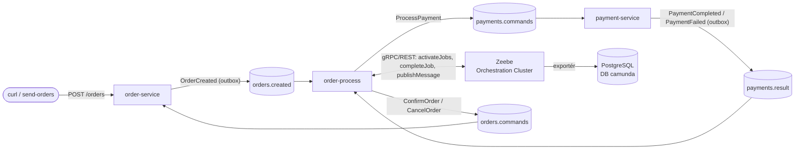

# Design: orchestrace objednávky přes Camundu 8 a Kafku

Datum: 2026-10-08

## Cíl

Výukové demo: tok objednávky už nebude choreografie, ale bude ho řídit BPMN proces v Camundě 8.
Proces posílá **příkazy** přes Kafku do obou doménových služeb a posouvá se na základě **událostí**,
které služby vrací (také přes Kafku). Chceme vidět spojení event-driven architektury a stavového
automatu. Stav každé objednávky (pozice tokenu, proměnné a historie) má být vidět v Operate.

Co nechceme: produkční robustnost, timeouty, kompenzace ani Connectors. Diagram má být minimální.

## Rozhodnutí

| Rozhodnutí | Volba | Proč |
|---|---|---|
| Verze Camundy | **Camunda 8.10** (Zeebe) | aktivně vyvíjená; Spring Boot Starter 8.10 je postavený na Spring Boot 4.1, stejně jako projekt |
| Kde žije proces | **nová služba `order-process`** | orchestrace je oddělená od domény a doménové služby o Camundě nevědí |
| Most Zeebe ↔ Kafka | vlastní Java kód (job workery a Kafka listenery) | mechanika je vidět v kódu; Connectors by ji schovaly do konfigurace |
| Rozsah BPMN | jen základ | jednoduché a srozumitelné |
| Choreografie | **nahrazena** | nesmí běžet obě současně, jinak by se objednávka zpracovala dvakrát |

Zachovává se: inbox a outbox v doménových službách, `eventId` a `correlationId` v každé zprávě,
**žádný sdílený kód** (kontraktem je JSON), JPA a deklarativní transakce, styl kódu dle globálních pravidel.

## Architektura



Zeebe sám nikoho nevolá. Všechna spojení otevírá `order-process` jako klient: joby si vyzvedává
(pull nebo job streaming) a zprávy do Zeebe publikuje.

## BPMN proces `order-fulfillment`

```
(OrderCreated) → [Request payment] → (Payment result) → <paymentStatus?> ─COMPLETED→ [Confirm order] → (End)
  message start     service task       message catch                    └─FAILED───→ [Cancel order]  → (End)
```

| Element | Typ | Konfigurace |
|---|---|---|
| `OrderCreated` | message start event | zpráva `OrderCreated` |
| `Request payment` | service task | job type `request-payment`, retries 3 |
| `Payment result` | intermediate message catch event | zpráva `PaymentResult`, correlation key `=orderId` |
| gateway | exclusive gateway | `=paymentStatus = "COMPLETED"`, jinak výchozí tok |
| `Confirm order` | service task | job type `confirm-order`, retries 3 |
| `Cancel order` | service task | job type `cancel-order`, retries 3 |

Proměnné procesu: `orderId`, `amount`, `currency`, `correlationId`, a po korelaci výsledku `paymentStatus`,
`paymentId` (při úspěchu) nebo `failureReason` (při zamítnutí).

Soubor: `order-process/src/main/resources/bpmn/order-fulfillment.bpmn`, modeluje se v Camunda Desktop
Modeleru. Nasazuje ho sama služba při startu přes `@Deployment(resources = "classpath*:bpmn/*.bpmn")`.

## Kafka kontrakt

| Topic | Partitions | Producent → konzument | Stav |
|---|---|---|---|
| `orders.created` | 3 | order-service → **order-process** | konzument se mění (dřív payment-service) |
| `payments.commands` | 3 | order-process → **payment-service** | nový |
| `payments.result` | 3 | payment-service → **order-process** | konzument se mění (dřív order-service) |
| `orders.commands` | 3 | order-process → **order-service** | nový |
| `*.DLT` | 1 | error handler konzumenta | pro každý konzumovaný topic |

Topic zakládá služba, která z něj čte (`KafkaConfig#edaTopics`). Klíč zprávy je vždy `orderId`.

Nové zprávy (formát jako dosud, bez Spring type hlaviček, `X-Correlation-Id` v hlavičce i v těle):

```json
// payments.commands
{"eventId":"…","timestamp":"…","correlationId":"demo-1","orderId":"9543…","amount":10.5,"currency":"CZK"}

// orders.commands – podtyp určuje pole "type"
{"type":"ConfirmOrder","eventId":"…","timestamp":"…","correlationId":"demo-1","orderId":"9543…","paymentId":"…"}
{"type":"CancelOrder","eventId":"…","timestamp":"…","correlationId":"demo-1","orderId":"9543…","reason":"…"}
```

`orders.created` a `payments.result` se nemění.

## Infrastruktura (k8s)

| Soubor | Obsah |
|---|---|
| `k8s/base/camunda/camunda.yaml` | `StatefulSet` s 1 replikou, image `camunda/camunda:8.10.x` (Zeebe + Operate + Tasklist v jednom kontejneru); PVC pro primární úložiště Zeebe; `Service` s porty `8080` (Operate/Tasklist/REST), `26500` (gRPC), `9600` (health/metriky); vedlejší úložiště = RDBMS (PostgreSQL); demo uživatel `demo/demo`; API pro klienty bez autentizace |
| `k8s/base/postgres/postgres.yaml` | init skript navíc založí databázi `camunda` a uživatele `camunda` a přidá nový Secret |
| `k8s/base/order-process/order-process.yaml` | `Deployment` a `Service` nové služby, stejný vzor jako u ostatních služeb |
| `k8s/base/kustomization.yaml` | přidat `camunda` a `order-process` |

Nepoužívá se: Elasticsearch, Connectors, Web Modeler, Identity/Keycloak, Optimize.

**Úložiště stavu:**
- **Primární** (zdroj pravdy): log událostí Zeebe a nad ním RocksDB, na PVC. Drží běžící instance, tokeny, proměnné, čekající zprávy a joby.
- **Vedlejší**: databáze `camunda` v PostgreSQL. Plní ji exportér asynchronně a čte ji Operate, Tasklist a vyhledávací REST API. Je proto eventually consistent.

Skripty: `build-images.*` sestaví i `order-process`, `port-forward.*` přidá Operate (`8080`), `deploy.*`
počká na rollout Camundy. Kořenový `pom.xml` dostane modul `order-process`.

## Služba `order-process`

Balíček `cz.demo.eda.process`. Spring Boot 4.1, `camunda-spring-boot-starter` 8.10, Spring Kafka, actuator a Prometheus.
Bez DB, bez JPA, bez inboxu a outboxu, protože stav drží Zeebe.

| Třída | Zodpovědnost |
|---|---|
| `messaging/OrderCreatedListener` | `orders.created` → `publishMessage("OrderCreated")` s `messageId = eventId` a proměnnými objednávky; spustí instanci |
| `messaging/PaymentResultListener` | `payments.result` → `publishMessage("PaymentResult")`, `correlationKey = orderId`, `messageId = eventId`, proměnné `paymentStatus` + `paymentId` / `failureReason` |
| `worker/RequestPaymentWorker` | `@JobWorker(type = "request-payment", autoComplete = false)` → `ProcessPayment`, po ack Kafky dokončí job |
| `worker/ConfirmOrderWorker` | `confirm-order` → `ConfirmOrder` |
| `worker/CancelOrderWorker` | `cancel-order` → `CancelOrder` |
| `messaging/CommandPublisher` | synchronní odeslání (čeká na ack), `eventId = UUID.nameUUIDFromBytes(jobKey)`, hlavička `X-Correlation-Id` |
| `event/*` | records zpráv (vlastní kopie) |
| `config/KafkaConfig` | topicy, error handler (`DefaultErrorHandler` + DLT), `AckMode.RECORD` |
| `support/*` | correlationId v MDC (record interceptor), `Topics` |

### Spolehlivost a idempotence

| Situace | Chování |
|---|---|
| Worker odešle příkaz, ale spadne před `completeJob` | Zeebe po timeoutu jobu rozdá job znovu; příkaz odejde se **stejným** `eventId` (z `jobKey`) a inbox cílové služby duplicitu zahodí |
| Odeslání do Kafky selže | worker job nedokončí a vyhodí výjimku; Zeebe sníží `retries`, při 0 vznikne v Operate **incident** |
| Duplicitní `OrderCreated` / `PaymentResult` z Kafky | `messageId = eventId` způsobí, že Zeebe zprávu se stejným ID v době její TTL odmítne (`ALREADY_EXISTS`); listener to bere jako úspěch |
| Zeebe nedostupné při korelaci | listener vyhodí výjimku; `DefaultErrorHandler` zkouší s backoffem, pak pošle zprávu do DLT; offset se potvrdí až po úspěchu |
| `PaymentResult` dorazí dřív, než proces čeká na catch eventu | zpráva má TTL (např. 1 min) a Zeebe ji zkoreluje, jakmile instance dojde na catch event |

## Změny v doménových službách

**payment-service**
- `OrderCreatedListener` a `OrderCreatedHandler` se nahradí `ProcessPaymentListener` a `ProcessPaymentHandler` nad `payments.commands`, event `OrderCreated` se nahradí `ProcessPayment`.
- Simulace platby, poison částka 666 → retry → DLT a outbox do `payments.result` zůstávají beze změny.
- `Topics`, `KafkaConfig#edaTopics` a DLT resolver se přepnou na `payments.commands`.

**order-service**
- `PaymentResultListener` a `PaymentResultHandler` se nahradí `OrderCommandListener` a `OrderCommandHandler` nad `orders.commands`.
- `ConfirmOrder` → `Order.markPaid(paymentId, now)`, `CancelOrder` → `Order.markPaymentFailed(reason, now)`.
- Eventy `PaymentResult`, `PaymentCompleted` a `PaymentFailed` se nahradí `OrderCommand`, `ConfirmOrder` a `CancelOrder`.
- REST API, `Order`, stavy a publikace `OrderCreated` přes outbox se nemění.

## Testování

Dle globálních pravidel: JUnit 5, Mockito, názvy `should_…_when…`, `@DisplayName` česky; každá nová public metoda má test.

- **order-process**
  - unit testy workerů, listenerů a `CommandPublisher` (mock `CamundaClient`, `KafkaTemplate`), včetně duplicitní zprávy (`ALREADY_EXISTS`) a selhání Kafky
  - test procesu přes **Camunda Process Test** (`camunda-process-test-spring`, engine v Testcontainers): větev COMPLETED → `confirm-order`, větev FAILED → `cancel-order`
  - test serializace zpráv proti JSON kontraktu
- **payment-service, order-service**: úprava stávajících testů listenerů a handlerů a serializace; integrační testy s Testcontainers (Kafka + PostgreSQL) na nové topicy.
- Ručně: `send-orders` → v Operate jsou vidět instance v obou větvích; objednávky skončí v `PAID` / `PAYMENT_FAILED`; částka 666 uvízne v DLT payment-service a instance zůstane čekat na `Payment result` (je to viditelné v Operate jako „zaseknutá“ objednávka, což je ukázka toho, proč by se hodil timeout).

## README

Nový diagram architektury (orchestrace místo choreografie), tabulka topiců, popis BPMN procesu, jak otevřít
Operate, vysvětlení primárního a vedlejšího úložiště Camundy, idempotence workerů a korelace, aktualizace
tabulky verzí (Camunda 8.10) a požadavků na RAM (Camunda zhruba 1–1,5 GiB navíc).
